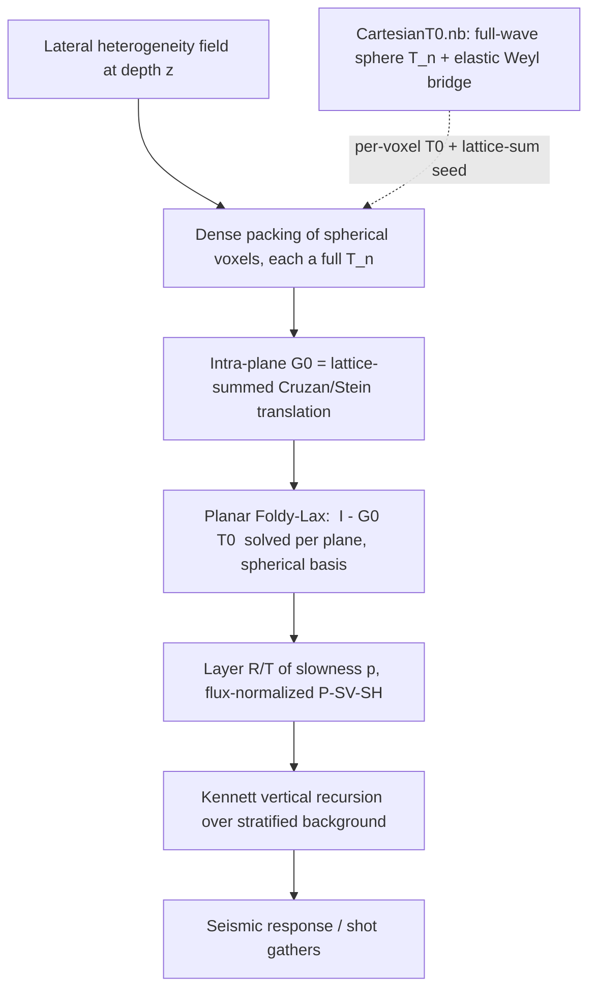

# Intra-Plane Foldy-Lax: Planar Multiple Scattering of Spherical Voxels into Layer R/T

**Pillar 2 of the lateral-heterogeneity program.** Status: Phases 0-1 DONE, Phase 2 in progress. Date: 2026-06-18.
**Representation: full spherical-multipole (Cruzan/Stein), all `n` (option B, DECIDED).**

> **Progress log (2026-06-18, branch `phase0-intraplane-translation`, 6 commits).** Each phase below
> is a self-verifying Mathematica `.wl` (with `.nb` twin) cross-checked against Python where possible;
> residuals are fresh-run.
> - **Phase 0 DONE** `212f84b` — elastic translation-addition operator.
> - **Phase 1 DONE** `e582c39` `470cb11` `ef10221` — Ewald planar lattice sum `G0(k_par)`.
> - **Phase 2 IN PROGRESS** `41557d1` `9044141` `49dfb9c` `bfbc6a6` — single-site `T0` + Foldy-Lax
>   scaffold + monopole collective; vector translation as an explicit `L/M/N` matrix `W(d)`;
>   two-voxel direct Foldy-Lax (items a); lattice-summed multi-channel vector `G0(k_par)` (item b).
> - **Phases 3-5 not started.**
>
> See the per-phase *Status* notes in Section 6 for residuals and the remaining Phase-2 items.

## 1. Purpose

Model lateral heterogeneity superimposed on a plane-stratified (1-D depth) background.
At each depth, the lateral heterogeneity is discretised as a dense planar packing of
spherical voxels. The voxels in a plane multiply-scatter (same-depth / intra-plane), which
produces an effective **layer reflection/transmission operator R/T(p)** as a function of
horizontal slowness `p`. The Kennett recursion then stacks these scattering layers onto the
stratified background. **No CPA / effective-medium homogenisation is used.**

## 2. Where this sits

| Pillar | Object | Status |
|---|---|---|
| 1 | Single-site `T0` (full-wave sphere scattering operator) | **DONE** `Mathematica/CartesianT0.nb`, reciprocity-verified 1e-18 |
| **2** | **Intra-plane `G0` + planar Foldy-Lax -> layer R/T(p)** | **IN PROGRESS** — Phases 0-1 done, Phase 2 underway (see Progress log) |
| 3 | Kennett vertical recursion on the stratified background | EXISTS `cubic_scattering/kennett_layers.py` |

## 3. Formulation

Per depth-plane (all voxels at common `z`, separations purely horizontal so `Delta z = 0`),
in the vector spherical wave (Hansen `L/M/N`) basis, retaining all multipoles `n`:

- **Foldy-Lax:** solve `(I - G0 . T0) b = a_incident` for the exciting/scattered multipole
  coefficients, where `T0` is the per-voxel full-wave T-matrix (`CartesianT0.nb`, all `n`) and
  `G0` is the intra-plane spherical-wave coupling between voxel centres.
- **Intra-plane `G0`:** the **elastic vector-spherical-wave translation-addition theorem**
  (Cruzan 1962 / Stein 1961, elastodynamic P-S form): re-expand an outgoing `L/M/N` multipole
  field centred at voxel A as regular `L/M/N` multipoles centred at voxel B. The **planar
  lattice sum** of these translation matrices over the dense packing (at fixed horizontal
  slowness `p` / Bloch vector) is the operative `G0`.
- **Lattice sum:** evaluated by the **Weyl / reciprocal-lattice angular spectrum** (the elastic
  Weyl bridge already in `CartesianT0.nb` is the seed), Ewald-accelerated for the conditionally
  convergent sum.
- **Projection to R/T(p):** the planar collective scattering is projected onto up/down P-SV-SH
  plane waves at slowness `p` in Kennett's flux-normalized basis (`sqrt(eta rho)`; `Rd, Ru, Td,
  Tu` 2x2 for P-SV plus scalar SH), and handed to `kennett_layers.py`.

## 4. Why option B (spherical-multipole) and not the 9x9 Cartesian path

- Dense near-field packing couples **high multipoles** (`n > 2`); the 9x9 (`n <= 2`) form would
  truncate exactly where the physics lives.
- It is the genuinely full-wave path and reuses `CartesianT0.nb` directly (full `T_n`).
- It delivers the **Cruzan/Stein vector-spherical-translation multiple-scattering solve** to
  benchmark against the existing Cartesian FFT / block-Toeplitz `G0`.

The existing Cartesian 9x9 `G0` / `slab_scattering` stack is **not** on this path; it is retained
as an independent **cross-check** in the Rayleigh / `n <= 2` limit (Phase 2 benchmark).

## 5. What exists to build on

| File | Provides | Use |
|---|---|---|
| `Mathematica/CartesianT0.nb` | full-wave sphere `T_n` (all `n`) + elastic Weyl angular-spectrum bridge | per-voxel `T0`; the Weyl bridge seeds the lattice sum and the R/T projection |
| `cubic_scattering/lattice_greens.py` | Ewald / screened-Coulomb + Hankel-transform lattice-sum infrastructure | adapt the acceleration to the spherical-translation lattice sum |
| `LatexPDFs/EwaldIntraPlanePropagator/` | same-depth lattice-sum / Ewald theory | derivation reference for the spherical lattice sum |
| `cubic_scattering/kennett_layers.py` | vertical R/T recursion, flux-normalized P-SV-SH | layer stacking (unchanged) |
| `cubic_scattering/horizontal_greens.py`, `slab_scattering.py` | Cartesian 9x9 `G0` + Foldy-Lax | independent Rayleigh-limit cross-check, not the primary path |

## 6. Phased implementation (tracer-bullet, each phase ends verified)

**Phase 0 - elastic translation-addition operator (Cruzan/Stein).**
Implement the elastodynamic vector-spherical-wave translation: outgoing `L/M/N` multipoles at A
-> regular `L/M/N` multipoles at B for a horizontal separation (`Delta z = 0`), with the P and S
parts. Most cleanly seeded from the Weyl/angular-spectrum representation already built.
*Accept:* re-expansion reconstructs the translated field (an outgoing multipole about A,
evaluated near B, equals the regular-multipole sum about B) to set tolerance; the translation is
reciprocal; reduces to the scalar Gegenbauer addition theorem on the L (P) part.
*Status:* **DONE** `212f84b`. `Mathematica/IntraPlaneTranslation.wl` + `.nb`; Python cross-check
`cubic_scattering/tests/test_intraplane_translation.py`. Built on the closed-form Gegenbauer/Gaunt
scalar separation matrix `beta^c(d)` (P at `k_P`, S at `k_S`), dressed by the translation-commuting
operators `L=(1/k)grad`, `M=curl((r-c).)`, `N=(1/k)curl` (plain Hansen). Residuals: scalar closed-form
vs projection integral **2.8e-11**, field reconstruction **6.7e-11**; vector L/M/N reconstruction
**6.7e-9 / 9.9e-10 / 6.0e-8** (the naive no-cross-term M FAILs by design, proving the cross-term);
reciprocity `beta_{nm,nu mu}(d) = (-1)^(n+nu+m+mu) beta_{nu,-mu,n,-m}(d)` **exact**. Python: projection
**9.6e-11**, Gaunt closed form **6.8e-13**.

**Phase 1 - planar lattice sum of the translation operator.**
Sum the pairwise translation over the dense planar packing at fixed slowness `p` (Bloch vector),
via the Weyl / reciprocal-lattice angular spectrum, Ewald-split for convergence.
*Accept:* convergence of the real + reciprocal-space split; reciprocity; agreement with a direct
real-space sum in regimes where the latter converges; the scalar limit matches a known planar
lattice Green's function.
*Status:* **DONE** `e582c39` `470cb11` `ef10221`. `Mathematica/IntraPlaneLatticeSum.wl` + `.nb`;
Python cross-check `cubic_scattering/tests/test_intraplane_lattice.py`. TB1: damped direct
`G0_{nm,nu mu}(k_par) = Sum_{R!=0} beta(R) e^{i k_par.R}` as a Gaunt contraction of the scalar
structure constants `D[q,s] = Sum_R h_q(kappa|R|) Y_q^s(^R) e^{i k_par.R}` — reciprocity **exact**,
structure constants reconstruct the lattice field **1.6e-10**. TB2: Ewald real+reciprocal split
(`EwaldIntraPlanePropagator.tex` Eqs.) — real-half-only is `eta`-dependent (RED), full split is
`eta`-independent to **2e-16** for the *undamped* conditionally-convergent sum and matches the damped
direct sum **2.4e-11**. TB3: Ewald <-> multipole-`G0` connection **1.4e-8**. Python: Ewald vs Mathematica
**1.6e-16**, `eta`-independence **1.4e-16**. **Deferred:** the strictly-undamped multipole structure
constants (full Kambe layer-KKR), not needed for the damped Foldy-Lax of Phase 2.

**Phase 2 - planar Foldy-Lax in the spherical basis.**
Solve `(I - G0 . T0) b = a` with the full `T_n` (`CartesianT0.nb`) and the lattice-summed `G0`.
*Accept:* single voxel returns `T0`; two voxels match a direct spherical two-body solve;
**convergence in multipole order `n`** and in packing density; reciprocity + energy of the
collective operator; reduces to the Cartesian 9x9 slab in the Rayleigh / `n <= 2` limit (the
cross-check benchmark from Section 4).
*Status:* **IN PROGRESS**.
- TB1 **DONE** `41557d1` (`Mathematica/IntraPlaneFoldyLax.wl`): single-site `T0` assembled in the
  `L/M/N` basis from the verified `CartesianT0.wl` (spheroidal L-N 2x2, toroidal M, n=0 monopole) —
  blocks reproduce `T_n` exactly; collective `T_coll = T0 (I - G0 T0)^{-1}`; single-voxel limit
  (`G0=0` => `T_coll = T0`) **exact**; closed monopole-channel collective solve with the Phase-1
  scalar `G0` (reduces to isolated as `G0->0`, shifts under coupling).
- TB2 **DONE** `9044141` (`Mathematica/IntraPlaneVectorTranslation.wl`): the Phase-0 vector translation
  as an explicit `L/M/N` matrix `W^{c'c}_{nu mu,n m}(d)` — `L->L` via `beta^P`; `M,N->M,N` by sign-safe
  projection onto the orthogonal P/B/C vector spherical harmonics (each coefficient normalised by the
  basis field's own projection). Extracted matrix reconstructs the translated field **6e-7**.
- **(a) DONE** `49dfb9c` (`Mathematica/IntraPlaneTwoBody.wl`): two-voxel direct Foldy-Lax. The pairwise
  `W(d)` is assembled (`L->L` closed-form `beta^P`, `M,N->M,N` by fast precomputed-quadrature projection)
  and the collective `T = T0blk (I - G T0blk)^{-1}` solved. Verified: W reconstructs the translated field
  **1.4e-9**; isolated limit `G=0 => T=diag(T0,T0)` **0**; the DIRECT Neumann/Born multiple-scattering
  series equals the matrix inverse **6.9e-18**; monopole 2-body matrix solve = closed-form geometric
  series **6.8e-21**; fixed-point residual **7.7e-18** (W-coupling active 0.79%).
- **(b) DONE** `bfbc6a6` (`Mathematica/IntraPlaneVectorLattice.wl`): lattice-summed multi-channel vector
  `G0^vec(k_par) = Sum_{R!=0} W(R) e^{i k_par.R}`. `L->L` closed form = Phase-1 scalar `G0` at `kappa_P`;
  `M,N` by damped direct Bloch sum (field built once at the quadrature nodes, then projected). Verified:
  L-block closed-form vs direct **1.4e-15**; vector field reconstruction (direct Bloch = multipole recon)
  **1.85e-6**; geometric Bloch-sum convergence (ratio 0.25); collective solve isolated-exact + finite +
  L-block reciprocity **0**. Dumps `IntraPlaneVectorLattice_reference.json`. *Deferred (cf. Phase 1):* the
  deep/undamped fast vector `G0` via the Ewald-accelerated Cruzan/Gaunt contraction of the structure
  constants; M/N strict reciprocity + energy are item (d) (need the flux metric).
- **Remaining:** (c) `n`-convergence + packing-density study; (d) collective reciprocity + energy (via the
  reciprocity-verified `CartesianT0` far-field bridge / flux metric); (e) Rayleigh / `n<=2` cross-check vs
  `slab_scattering.slab_reflection_matrix`; (f) Phase-2 `.nb` twins + Python cross-check.

**Phase 3 - layer R/T(p).**
Project the planar collective scattering onto Kennett's flux-normalized up/down P-SV-SH at
slowness `p` (`Rd, Ru, Td, Tu`, SH scalar), via the Weyl/far-field bridge.
*Accept:* `Tu = Td^T` and `Rd` symmetric (Kennett reciprocity); for a lossless plane the
flux-normalized `|R|^2 + |T|^2 = 1`.

**Phase 4 - Kennett coupling.**
Insert the planar R/T as a scattering layer in `kennett_layers` over the stratified background.
*Accept:* a transparent (zero-contrast) plane is the identity; a uniform-contrast plane matches
an independent analytic/interface result; full survey runs.

**Phase 5 - lateral-heterogeneity model.**
Map a lateral heterogeneity field to per-voxel contrasts across planes; full multi-plane survey.
*Accept:* physical trends (reflectivity vs contrast, density, frequency); convergence in packing
and multipole order; documented.

## 7. Global verification

Reciprocity and energy conservation (lossless background) at every level: single voxel
(reciprocity 1e-18, already), the translation operator (Phase 0), the collective plane
(Phase 2/3), and the stacked response. The exact `CartesianT0.nb` Mie operator is the
single-voxel ground truth; the existing Cartesian cube-slab is the Rayleigh-limit ground truth.

## 8. Risks and open questions

- **Lattice-sum convergence** was the central numerical risk: the planar sum of the
  translation operator is conditionally convergent; the Ewald / reciprocal-lattice split (Phase 1)
  must be done carefully. The `EwaldIntraPlanePropagator` note and `lattice_greens` Hankel/Ewald
  code are the starting points. **[Resolved, Phase 1]:** the scalar Ewald split is implemented and
  verified `eta`-independent to 2e-16 for the undamped sum, matching the direct sum 2.4e-11
  (`IntraPlaneLatticeSum.wl`, Python-cross-checked). The remaining sub-item is the strictly-undamped
  *multipole* structure constants (full Kambe), deferred — not needed for the damped Foldy-Lax.
- **Translation-theorem region of validity:** the addition theorem re-expansion converges for
  non-overlapping spheres; dense packing (near-touching) needs **high `n`** and possibly the
  near-neighbour terms handled separately. Phase 2's `n`-convergence study quantifies this.
- **Multipole order** is a convergence parameter (not a truncation fork): track `n_max` vs
  packing density and frequency.
- **RQ1 sub-fork:** fixed-depth-planes + Kennett-between (this plan) versus full 3-D near-field.
  This plan commits to fixed-depth-planes.
- **Self / near term:** the `r = 0` and nearest-neighbour translation terms (the `G0` diagonal /
  the Eshelby delta analogue); reuse the verified cube treatment where applicable.
- **Flux-normalisation match to Kennett** (`sqrt(eta rho)`): Phase 3 reciprocity/energy validates.

## 9. Conventions and repo notes

Coordinate system `z` (down, axis 0), `x` (axis 1), `y` (axis 2); horizontal slowness `p`; Voigt
order `(zz, xx, yy, xy, zy, zx)`; conda env `seismic`; time `e^{+i w t}`, outgoing `h_n^(1)`.
The verified `Mathematica/CartesianT0.nb` is the single-site `T0` source and the elastic Weyl
bridge that seeds the lattice sum. Mathematica via
`/Applications/Wolfram.app/Contents/MacOS/wolframscript`. Self-contained lualatex per `docs/`
subdirectory for any write-up.
