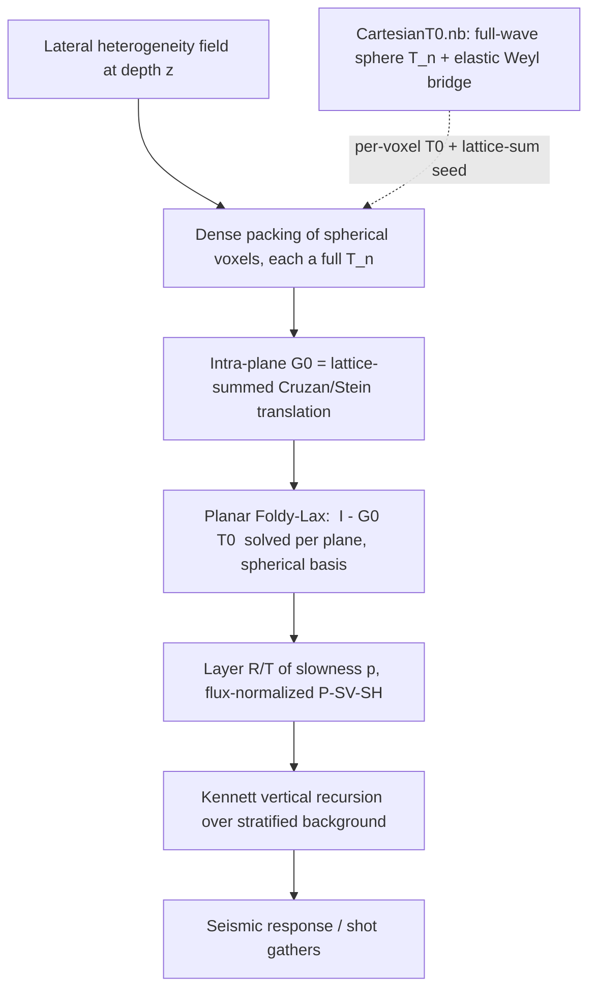

# Intra-Plane Foldy-Lax: Planar Multiple Scattering of Spherical Voxels into Layer R/T

**Pillar 2 of the lateral-heterogeneity program.** Status: Phases 0-1 DONE; **Phase 2 COMPLETE** items (a)-(f) DONE; **Phase 3a DONE**; **Phase 3b cycles 1-2 DONE** (undamped scalar D[q,s] + undamped vector G0^vec); Phase 3b cycle 3 (energy balance) next. Date: 2026-06-24.
**Representation: full spherical-multipole (Cruzan/Stein), all `n` (option B, DECIDED).**

> **Progress log (2026-06-18, branch `phase0-intraplane-translation`).** Each phase below
> is a self-verifying Mathematica `.wl` (with `.nb` twin) cross-checked against Python where possible;
> residuals are fresh-run.
> - **Phase 0 DONE** `212f84b` — elastic translation-addition operator.
> - **Phase 1 DONE** `e582c39` `470cb11` `ef10221` — Ewald planar lattice sum `G0(k_par)`.
> - **Phase 2 COMPLETE** `41557d1` `9044141` `49dfb9c` `bfbc6a6` `090ed5c` `78716e0` `6c52a7e` `81887c1` — single-site
>   `T0` + Foldy-Lax scaffold + monopole collective; vector translation as an explicit `L/M/N` matrix `W(d)`;
>   two-voxel direct Foldy-Lax (a); lattice-summed multi-channel vector `G0(k_par)` (b); collective reciprocity
>   via the symplectic-J metric reconciliation (d); Python cross-check + `.nb` twins (f); multipole-order +
>   packing-density convergence study (c); **sphere-packing discretisation error (e), closed 2026-06-23**.
> - **Phases 3-5 not started.**
>
> See the per-phase *Status* notes in Section 6 for residuals and the remaining Phase-2 items.

## 1. Purpose

Model lateral heterogeneity superimposed on a plane-stratified (1-D depth) background.
At each depth, the lateral heterogeneity is discretised as a dense planar packing of
spherical voxels. The voxels in a plane multiply-scatter (same-depth / intra-plane), which
produces an effective **layer reflection/transmission operator R/T(p)** as a function of
horizontal slowness `p`. The Kennett recursion then stacks these scattering layers onto the
stratified background. **No CPA / effective-medium homogenisation is used.**

## 2. Where this sits

| Pillar | Object | Status |
|---|---|---|
| 1 | Single-site `T0` (full-wave sphere scattering operator) | **DONE** `Mathematica/CartesianT0.nb`, reciprocity-verified 1e-18 |
| **2** | **Intra-plane `G0` + planar Foldy-Lax -> layer R/T(p)** | **Phases 0-1, 2(a)-(f), 3a, 3b(1-2) DONE**; **resume at Phase 3b cycle 3** (energy balance `\|R\|²+\|T\|²=1` on the undamped `G0^vec`) |
| 3 | Kennett vertical recursion on the stratified background | EXISTS `cubic_scattering/kennett_layers.py` |

## 3. Formulation

Per depth-plane (all voxels at common `z`, separations purely horizontal so `Delta z = 0`),
in the vector spherical wave (Hansen `L/M/N`) basis, retaining all multipoles `n`:

- **Foldy-Lax:** solve `(I - G0 . T0) b = a_incident` for the exciting/scattered multipole
  coefficients, where `T0` is the per-voxel full-wave T-matrix (`CartesianT0.nb`, all `n`) and
  `G0` is the intra-plane spherical-wave coupling between voxel centres.
- **Intra-plane `G0`:** the **elastic vector-spherical-wave translation-addition theorem**
  (Cruzan 1962 / Stein 1961, elastodynamic P-S form): re-expand an outgoing `L/M/N` multipole
  field centred at voxel A as regular `L/M/N` multipoles centred at voxel B. The **planar
  lattice sum** of these translation matrices over the dense packing (at fixed horizontal
  slowness `p` / Bloch vector) is the operative `G0`.
- **Lattice sum:** evaluated by the **Weyl / reciprocal-lattice angular spectrum** (the elastic
  Weyl bridge already in `CartesianT0.nb` is the seed), Ewald-accelerated for the conditionally
  convergent sum.
- **Projection to R/T(p):** the planar collective scattering is projected onto up/down P-SV-SH
  plane waves at slowness `p` in Kennett's flux-normalized basis (`sqrt(eta rho)`; `Rd, Ru, Td,
  Tu` 2x2 for P-SV plus scalar SH), and handed to `kennett_layers.py`.

## 4. Why option B (spherical-multipole) and not the 9x9 Cartesian path

- Dense near-field packing couples **high multipoles** (`n > 2`); the 9x9 (`n <= 2`) form would
  truncate exactly where the physics lives.
- It is the genuinely full-wave path and reuses `CartesianT0.nb` directly (full `T_n`).
- It delivers the **Cruzan/Stein vector-spherical-translation multiple-scattering solve** to
  benchmark against the existing Cartesian FFT / block-Toeplitz `G0`.

The existing Cartesian 9x9 `G0` / `slab_scattering` stack is **not** on this path; it is retained
as an independent **cross-check** in the Rayleigh / `n <= 2` limit (Phase 2 benchmark).

## 5. What exists to build on

| File | Provides | Use |
|---|---|---|
| `Mathematica/CartesianT0.nb` | full-wave sphere `T_n` (all `n`) + elastic Weyl angular-spectrum bridge | per-voxel `T0`; the Weyl bridge seeds the lattice sum and the R/T projection |
| `cubic_scattering/lattice_greens.py` | Ewald / screened-Coulomb + Hankel-transform lattice-sum infrastructure | adapt the acceleration to the spherical-translation lattice sum |
| `LatexPDFs/EwaldIntraPlanePropagator/` | same-depth lattice-sum / Ewald theory | derivation reference for the spherical lattice sum |
| `cubic_scattering/kennett_layers.py` | vertical R/T recursion, flux-normalized P-SV-SH | layer stacking (unchanged) |
| `cubic_scattering/horizontal_greens.py`, `slab_scattering.py` | Cartesian 9x9 `G0` + Foldy-Lax | independent Rayleigh-limit cross-check, not the primary path |

## 6. Phased implementation (tracer-bullet, each phase ends verified)

**Phase 0 - elastic translation-addition operator (Cruzan/Stein).**
Implement the elastodynamic vector-spherical-wave translation: outgoing `L/M/N` multipoles at A
-> regular `L/M/N` multipoles at B for a horizontal separation (`Delta z = 0`), with the P and S
parts. Most cleanly seeded from the Weyl/angular-spectrum representation already built.
*Accept:* re-expansion reconstructs the translated field (an outgoing multipole about A,
evaluated near B, equals the regular-multipole sum about B) to set tolerance; the translation is
reciprocal; reduces to the scalar Gegenbauer addition theorem on the L (P) part.
*Status:* **DONE** `212f84b`. `Mathematica/IntraPlaneTranslation.wl` + `.nb`; Python cross-check
`cubic_scattering/tests/test_intraplane_translation.py`. Built on the closed-form Gegenbauer/Gaunt
scalar separation matrix `beta^c(d)` (P at `k_P`, S at `k_S`), dressed by the translation-commuting
operators `L=(1/k)grad`, `M=curl((r-c).)`, `N=(1/k)curl` (plain Hansen). Residuals: scalar closed-form
vs projection integral **2.8e-11**, field reconstruction **6.7e-11**; vector L/M/N reconstruction
**6.7e-9 / 9.9e-10 / 6.0e-8** (the naive no-cross-term M FAILs by design, proving the cross-term);
reciprocity `beta_{nm,nu mu}(d) = (-1)^(n+nu+m+mu) beta_{nu,-mu,n,-m}(d)` **exact**. Python: projection
**9.6e-11**, Gaunt closed form **6.8e-13**.

**Phase 1 - planar lattice sum of the translation operator.**
Sum the pairwise translation over the dense planar packing at fixed slowness `p` (Bloch vector),
via the Weyl / reciprocal-lattice angular spectrum, Ewald-split for convergence.
*Accept:* convergence of the real + reciprocal-space split; reciprocity; agreement with a direct
real-space sum in regimes where the latter converges; the scalar limit matches a known planar
lattice Green's function.
*Status:* **DONE** `e582c39` `470cb11` `ef10221`. `Mathematica/IntraPlaneLatticeSum.wl` + `.nb`;
Python cross-check `cubic_scattering/tests/test_intraplane_lattice.py`. TB1: damped direct
`G0_{nm,nu mu}(k_par) = Sum_{R!=0} beta(R) e^{i k_par.R}` as a Gaunt contraction of the scalar
structure constants `D[q,s] = Sum_R h_q(kappa|R|) Y_q^s(^R) e^{i k_par.R}` — reciprocity **exact**,
structure constants reconstruct the lattice field **1.6e-10**. TB2: Ewald real+reciprocal split
(`EwaldIntraPlanePropagator.tex` Eqs.) — real-half-only is `eta`-dependent (RED), full split is
`eta`-independent to **2e-16** for the *undamped* conditionally-convergent sum and matches the damped
direct sum **2.4e-11**. TB3: Ewald <-> multipole-`G0` connection **1.4e-8**. Python: Ewald vs Mathematica
**1.6e-16**, `eta`-independence **1.4e-16**. **Deferred:** the strictly-undamped multipole structure
constants (full Kambe layer-KKR), not needed for the damped Foldy-Lax of Phase 2.

**Phase 2 - planar Foldy-Lax in the spherical basis.**
Solve `(I - G0 . T0) b = a` with the full `T_n` (`CartesianT0.nb`) and the lattice-summed `G0`.
*Accept:* single voxel returns `T0`; two voxels match a direct spherical two-body solve;
**convergence in multipole order `n`** and in packing density; reciprocity + energy of the
collective operator; reduces to the Cartesian 9x9 slab in the Rayleigh / `n <= 2` limit (the
cross-check benchmark from Section 4).
*Status:* **IN PROGRESS**.
- TB1 **DONE** `41557d1` (`Mathematica/IntraPlaneFoldyLax.wl`): single-site `T0` assembled in the
  `L/M/N` basis from the verified `CartesianT0.wl` (spheroidal L-N 2x2, toroidal M, n=0 monopole) —
  blocks reproduce `T_n` exactly; collective `T_coll = T0 (I - G0 T0)^{-1}`; single-voxel limit
  (`G0=0` => `T_coll = T0`) **exact**; closed monopole-channel collective solve with the Phase-1
  scalar `G0` (reduces to isolated as `G0->0`, shifts under coupling).
- TB2 **DONE** `9044141` (`Mathematica/IntraPlaneVectorTranslation.wl`): the Phase-0 vector translation
  as an explicit `L/M/N` matrix `W^{c'c}_{nu mu,n m}(d)` — `L->L` via `beta^P`; `M,N->M,N` by sign-safe
  projection onto the orthogonal P/B/C vector spherical harmonics (each coefficient normalised by the
  basis field's own projection). Extracted matrix reconstructs the translated field **6e-7**.
- **(a) DONE** `49dfb9c` (`Mathematica/IntraPlaneTwoBody.wl`): two-voxel direct Foldy-Lax. The pairwise
  `W(d)` is assembled (`L->L` closed-form `beta^P`, `M,N->M,N` by fast precomputed-quadrature projection)
  and the collective `T = T0blk (I - G T0blk)^{-1}` solved. Verified: W reconstructs the translated field
  **1.4e-9**; isolated limit `G=0 => T=diag(T0,T0)` **0**; the DIRECT Neumann/Born multiple-scattering
  series equals the matrix inverse **6.9e-18**; monopole 2-body matrix solve = closed-form geometric
  series **6.8e-21**; fixed-point residual **7.7e-18** (W-coupling active 0.79%).
- **(b) DONE** `bfbc6a6` (`Mathematica/IntraPlaneVectorLattice.wl`): lattice-summed multi-channel vector
  `G0^vec(k_par) = Sum_{R!=0} W(R) e^{i k_par.R}`. `L->L` closed form = Phase-1 scalar `G0` at `kappa_P`;
  `M,N` by damped direct Bloch sum (field built once at the quadrature nodes, then projected). Verified:
  L-block closed-form vs direct **1.4e-15**; vector field reconstruction (direct Bloch = multipole recon)
  **1.85e-6**; geometric Bloch-sum convergence (ratio 0.25); collective solve isolated-exact + finite +
  L-block reciprocity **0**. Dumps `IntraPlaneVectorLattice_reference.json`. *Deferred (cf. Phase 1):* the
  deep/undamped fast vector `G0` via the Ewald-accelerated Cruzan/Gaunt contraction of the structure
  constants; M/N strict reciprocity + energy are item (d) (need the flux metric).
- **(d) DONE** `090ed5c` (`Mathematica/IntraPlaneCollectiveReciprocity.wl`, `IntraPlaneSymplecticMetric.wl`):
  collective **reciprocity** via the **symplectic-J reconciliation**. A naive arbitrary-direction far-field
  test was the wrong statement for a lattice; the correct one is the σ-metric operator symmetry
  `J0 (D A D^{-1}) J0 = (D A D^{-1})^T`. A SINGLE symplectic channel metric makes BOTH T0 and G0 σ-symmetric
  (not a fit): `d_L=(kS/kP)^{3/2}`, `d_N=sqrt(n(n+1))` (Jspher weight; pinned by T0's L-N: `tLN/tNL=(kP/kS)^3 n(n+1)`),
  `d_M=I sqrt(n(n+1))` (the SH/SV I-phase; pinned by G0's M-N). Verified: D-conj T0 **4.3e-17**, D-conj G0
  **6.2e-13**, D-conj `T_coll` **4.4e-17** (coupling 1.6%). *Energy/flux* `|R|^2+|T|^2=1` deferred to Phase 3
  (needs the undamped G0 + Kennett flux norm; damping is artificial loss). See [[project_intraplane_reciprocity_metric]].
- **(f) DONE** `78716e0` `6c52a7e`: Python cross-check + `.nb` twins. `cubic_scattering/tests/test_intraplane_collective.py`
  (scipy/sympy) independently confirms the symplectic-J reciprocity of the dumped `G0^vec` (**6.2e-13** with the
  metric, 2.3 without) and recomputes the L-block values from the scalar structure constants (**1.7e-13**).
  `makeIntraPlaneNotebooks.wl` writes faithful `.nb` twins for the Phase-2 scripts (round-trip spot-verified).
- **(c) DONE** `81887c1` (`Mathematica/IntraPlaneConvergence.wl`): convergence in multipole order `n` +
  packing density. [A] the single-site Mie spectrum decays super-exponentially (`||T0(n)||_F`: n=1
  `2.0e-2` -> n=6 `1.5e-7` -> n=8 `3.0e-11`) -- why `n`-truncation converges. [B] the closed-form
  P-channel collective monopole converges to **<1e-5 relative at every density** (rel conv `1.2e-10` at
  `aL=6` -> `3.9e-7` at `aL=2.2`; truncation floor `4.0e-10`), while coupling, spectral radius and
  conditioning **grow as spheres approach touching** (specrad `9.8e-4` -> `5.8e-2`, cond@N5 `1.0` ->
  `6.8` over `aL=6..2.2`) -- the quantified region-of-validity boundary (see Risk §8). [C] one full-vector
  build (Nmax=3, aL=2.5) confirms the L/M/N collective is finite, isolated-exact, and converged in `n`
  (shared-block Cauchy `~1e-6`, `1.2e-4` rel) above the Lrad=8 lattice floor. Stable `h_n^(1)` via
  `SphericalHankelH1`. Python cross-check `cubic_scattering/tests/test_intraplane_convergence.py`:
  independent closed-form recompute matches the monopole to **8.7e-18**, plus the packing-density trend
  and the vector convergence. `.nb` twin via `makeIntraPlaneNotebooks.wl`.
- **(e) DONE** 2026-06-23 (`Mathematica/IntraPlaneDiscretisation.wl` + `.nb`,
  `cubic_scattering/tests/test_intraplane_discretisation.py`): **sphere-packing discretisation error**
  vs the space-filling cube slab, Rayleigh limit. Two stages. **Stage A (single-site shape factor):** a
  diluted sphere and a space-filling cube of the *same* contrast scatter nearly identically per unit
  volume (the effective-contrast extraction normalises by volume) -- the irreducible shape error is
  <=0.4% (moderate) to ~3.5% (negative -60%), growing with `ka` and contrast. **Stage B (layer R_PP):**
  the `Delta->Delta/phi` renormalisation is a *layer-level* correction (`layer ~ phi*single_site(Delta/phi)`);
  it collapses the raw ~48% dilution error (`1-phi`, phi=pi/6) to the irreducible shape + nonlinear-mixing
  residual -- **0.38% (weak), 3.95% (moderate)** vs `kennett_reference_rpp` for the cube layer. **The
  collective multiple-scattering correction is NEGLIGIBLE at Rayleigh** (`r_ms-1` <= 2e-4 for moderate
  even at touching; the renormalised error is aL-independent) -- the discretisation error is shape +
  dilution, NOT inter-sphere multiple scattering (cf. [[t27-lattice-verdict]]). **Renorm validity floor:**
  `Delta->Delta/phi` requires `|Delta| < phi*background`; the **-60% contrast is beyond it** (`Delta/phi ~ -115%`
  pushes the inner moduli/density negative, flagged unphysical in the dump) and is also ill-conditioned
  (`cond(I-G0 T0) ~ 57` at touching vs ~1.16 for moderate). See [[project_sphere_packing_discretisation]].

**Phase 3 - layer R/T(p).**
Project the planar collective scattering onto the up/down P-SV-SH plane waves at slowness `p`
(`Rd, Ru, Td, Tu`, SH scalar), via the Weyl/far-field bridge.

- **Phase 3a DONE** 2026-06-23 (`Mathematica/IntraPlaneRT.wl` + `.nb`,
  `cubic_scattering/tests/test_intraplane_rt.py`): project the Phase-2 collective `T_coll(k_par)` onto the
  **PhD thesis Section 3.1 energy-normalised eigenvectors** (Eqs. Peigen/SVeigen/SHeigen + epsdef; the
  authoritative `ε_P,ε_S,ε_H` energy normalisation, NOT the codebase `slab.to_modified` velocity-weighted
  D — see [[thesis-energy-normalisation]]). The incident IS the ε-eigenvector, the scattered field is
  projected onto the ε-eigenvectors; no slab D, no post-hoc factors. **Full symplectic reciprocity holds
  at normal / sub-critical / post-critical p:** `Rd=-Rd^T`, `Ru=-Ru^T` (quadrature floor ~1e-8) and
  `Tu=Σ·Td·Σ` with `Σ=diag(1,-1)` (the SV symplectic parity, exact to 1e-19). Key fixes en route: the
  incident-bridge **analytic continuation** for evanescent `k` (`Conjugate[Yv[n,m,k]] -> (-1)^m Yv[n,-m,k]`,
  the post-critical bug), the project-frame `(z,x,y)` + `toSph` permutation into the bridge, the `latSrc`
  memoisation, and `p=1e-6` for "normal" (polar-axis azimuth singularity). See [[project-intraplane-layer-rt]].
- **Phase 3b (cycles 1–2 DONE; cycle 3 is the resume point):** the lossless energy balance `|R|^2+|T|^2=1`
  — needs the **undamped** vector `G0` (Ewald/Kambe; the Phase-2 damping `Im κ=0.25` is artificial loss that
  preserves reciprocity but breaks energy). Symplectic reciprocity already holds; energy is the remaining
  acceptance criterion. Three cycles:
  - **cycle 1 DONE** 2026-06-23 (`Mathematica/IntraPlaneKambe.wl` + `.nb`,
    `cubic_scattering/tests/test_intraplane_kambe.py`): the undamped **scalar** multipole structure
    constants `D[q,s]` (`q=0..6`) via **multipole projection of the validated scalar Ewald field** —
    extend the Phase-1 TB2 Ewald to a general-`z` field point (general-`z` reciprocal half by Poisson
    summation, reducing to the TB2 `z=0` form), subtract the `R=0` self-term, and project the regular
    field `G = iκ Σ D̄[q,s] j_q(κr) Y_q^s` on a small sphere (`ρ₀=0.5`). Gates all PASS: `η`-independence
    (κ real) 1.4e-16, vs damped direct 2.1e-11, projection method (vs damped direct structure constant)
    5.8e-6, undamped `η`-independence 7.2e-11, undamped `G0` reciprocity exact (0). Reuses the Phase-1
    Gaunt `G0` contraction. Root-cause fix vs the spec code: the general-`z` reciprocal `erfc` pairing
    (the growing evanescent `e^{γ|z|}` term must pair with `erfc(+|z|η+·)`; the `z=0` reduction cannot
    detect this — only `η`-independence does) and the `R=0` self-term exclusion. See
    [[project-undamped-kambe-structure-constants]], [[kambe-validates-thesis-spectral]].
  - **cycle 2 DONE** 2026-06-24 (`Mathematica/IntraPlaneKambeVector.wl` + `.nb`,
    `Mathematica/IntraPlaneKambeVector_reference.json`,
    `cubic_scattering/tests/test_intraplane_kambe_vector.py`): the undamped **vector** `G0^vec(k_par)` in
    the `L/M/N` basis by **contracting the cycle-1 scalar `D[q,s]`**: `L->L` via scalar-Gaunt · `D(κ_P=0.9)`;
    `M,N` via `Σ_q coeff_q · D[q,m−μ](κ_S=1.5)`, where `coeff_q` are extracted numerically from the validated
    single-pair vector translation `W^{c'c}(d)` by angular projection over source directions (no literature
    transcription needed). `nDim=25` (`Nmax=2`). Gates all PASS: coeff reconstruction ~1e-8 `[3]`; M/N
    contraction == direct damped sum 1.6e-12 `[4]`; L-block == direct β^P sum 5.5e-15 `[5]`; collective
    iso-limit=0 / coupling=0.021 / finite `[6]`; undamped L-block reciprocity = 0 (exact) `[7]`; undamped
    `G0^vec` η-independence ~1.2e-14 `[8]`. Python cross-check: 2 tests PASS (independent L-block recompute +
    dump invariants). Two plan-code bugs fixed: (a) the damped-limit gate needs matched lattice radii
    `Ldir=LradB` (term-by-term algebraic identity requires identical truncation; mismatched radii → ~1e-2
    residual); (b) `T0LMN` must call `TsphClean[n,kPo,kSo,lamO,muO,kPi,kSi,lamI,muI,aa]` /
    `Ttoroidal[n,kSo,muO,kSi,muI,aa]` with the `CartesianT0.wl` globals (the plan had a short arg list).
    See [[project-undamped-vector-g0]], [[project-undamped-kambe-structure-constants]].
  - **cycle 3 — ◀ RESUME HERE** (unblocked by cycle 2): the lossless **energy balance** `|R|²+|T|²=1` for the
    Phase-3a layer R/T(p) built on the undamped `G0^vec` (with the thesis ε / Kennett flux normalisation).
    Requires replacing the Phase-2 damped `G0` with the cycle-2 undamped `G0^vec` (`Mathematica/IntraPlaneKambeVector.wl`
    / `IntraPlaneKambeVector_reference.json`) in the RT projection (`Mathematica/IntraPlaneRT.wl`) and verifying
    `|R|²+|T|²=1` across normal / sub-critical / post-critical `p`. Inputs ready: undamped scalar `D[q,s]`
    (cycle 1) and undamped vector `G0^vec` 25×25 at `Nmax=2` (cycle 2); thesis ε-eigenvector R/T(p) projection
    (Phase 3a, [[project-intraplane-layer-rt]]). Suggested entry: brainstorm → spec → plan → subagent-driven,
    same as cycles 1–2. **Open question to settle first:** whether energy balance holds at `Nmax=2` or needs a
    higher multipole truncation / more `p`-samples (cf. the Phase 3a up-down truncation note below).

*Original accept (revised):* reflection reciprocity in the thesis symplectic form (above) — the plain
`Tu=Td^T`/`Rd` symmetric is the codebase-Kennett (velocity-weighted) convention, which differs from the
thesis by the SV `i`. Lossless `|R|^2+|T|^2=1` deferred to Phase 3b.
*Up-down truncation (2026-06-18, per Tod).* Reflection surveys observe the specular up/down R/T, fed
by the monopole + low-order channels (the fastest-converging, best-conditioned ones per item (c)); the
numerically hard high-`n` near-field in-plane (side) coupling is subdominant for specular R/T. **Verify**
the specular R/T is converged at a low `n_max` even where the full operator is not, and quantify
`n_max(p)` (the order needed grows with slowness `p` and for P-SV-SH conversions). Keep the LOW-order
in-plane coupling (the layer-forming mechanism, not droppable). See [[project_sphere_packing_discretisation]].

**Phase 4 - Kennett coupling.**
Insert the planar R/T as a scattering layer in `kennett_layers` over the stratified background.
*Accept:* a transparent (zero-contrast) plane is the identity; a uniform-contrast plane matches
an independent analytic/interface result; full survey runs.

**Phase 5 - lateral-heterogeneity model.**
Map a lateral heterogeneity field to per-voxel contrasts across planes; full multi-plane survey.
*Accept:* physical trends (reflectivity vs contrast, density, frequency); convergence in packing
and multipole order; documented.

## 7. Global verification

Reciprocity and energy conservation (lossless background) at every level: single voxel
(reciprocity 1e-18, already), the translation operator (Phase 0), the collective plane
(Phase 2/3), and the stacked response. The exact `CartesianT0.nb` Mie operator is the
single-voxel ground truth; the existing Cartesian cube-slab is the Rayleigh-limit ground truth.

## 8. Risks and open questions

- **Lattice-sum convergence** was the central numerical risk: the planar sum of the
  translation operator is conditionally convergent; the Ewald / reciprocal-lattice split (Phase 1)
  must be done carefully. The `EwaldIntraPlanePropagator` note and `lattice_greens` Hankel/Ewald
  code are the starting points. **[Resolved, Phase 1]:** the scalar Ewald split is implemented and
  verified `eta`-independent to 2e-16 for the undamped sum, matching the direct sum 2.4e-11
  (`IntraPlaneLatticeSum.wl`, Python-cross-checked). The remaining sub-item is the strictly-undamped
  *multipole* structure constants (full Kambe), deferred — not needed for the damped Foldy-Lax.
- **Translation-theorem region of validity. [Quantified, item (c) `IntraPlaneConvergence.wl`]:** the
  addition-theorem re-expansion converges for non-overlapping spheres. Item (c) shows the collective
  monopole converges to <1e-5 relative at every tested density, while coupling, spectral radius and
  conditioning grow as spheres approach touching (`aa/aL -> 1/2`): `cond(I - G0 T0) ~ 1` at `aL>=3`,
  `~7` at `aL=2.2` (n_max=5), blowing up only at the physically-negligible high-`n` shells
  (`||T0(6)|| ~ 1.5e-7`). **Rule: conditioning-gated `n_max`** (stop when `||T0(n)||` < tol OR cond
  crosses a threshold). The huge structure constants (`g0LL ~ 1e6`) are an un-normalised "clean L/M/N"
  basis artifact, not physics; **escape hatches** for near-touching are extended precision
  (~`log10(cond)` guard digits) or an energy/flux-normalised vector-spherical basis (entries O(1)).
  *Numerical note:* evaluate `h_n^(1)` via `SphericalHankelH1`, never `j_n + i y_n` (which cancels
  catastrophically in the damped far field, where each piece ~ `e^{Im}` but the sum ~ `e^{-Im}`).
- **Sphere-packing discretisation error. [Quantified, item (e) `IntraPlaneDiscretisation.wl`].** The
  irreducible geometric error of the diluted (`phi = pi/6`) sphere packing vs the space-filling cube
  slab, Rayleigh limit. Single-site shape factor <=0.4%-3.5% (volume-normalised, so small); the
  `Delta->Delta/phi` renormalisation recovers the cube-layer `R_PP` to **0.38% (weak) / 3.95% (moderate)**
  from the raw ~48% dilution. The collective multiple-scattering term is **negligible at Rayleigh**
  (`r_ms-1` <= 2e-4), so the error is shape + dilution, not multiple scattering. **Validity floor:** the
  renorm needs `|Delta| < phi*background`; the -60% case exceeds it (unphysical + ill-conditioned).
  See [[project_sphere_packing_discretisation]].
- **Multipole order** is a convergence parameter (not a truncation fork): track `n_max` vs
  packing density and frequency.
- **RQ1 sub-fork:** fixed-depth-planes + Kennett-between (this plan) versus full 3-D near-field.
  This plan commits to fixed-depth-planes.
- **Self / near term:** the `r = 0` and nearest-neighbour translation terms (the `G0` diagonal /
  the Eshelby delta analogue); reuse the verified cube treatment where applicable.
- **Flux-normalisation / reciprocity metric.** **[Resolved for the multipole basis, item (d)]:** T0
  (CartesianT0 clean `L/M/N`) and `G0` (Phase-0/1) were reciprocal in *different* metrics, so the naive
  collective reciprocity failed. A single **symplectic channel metric** `D = diag((kS/kP)^{3/2}, I sqrt(n(n+1)),
  sqrt(n(n+1)))` makes BOTH σ-symmetric, so `T_coll` is reciprocal (`090ed5c`, Python-cross-checked `78716e0`);
  see [[project_intraplane_reciprocity_metric]]. The lesson: an arbitrary-direction far-field test is the wrong
  reciprocity statement for a lattice at fixed `k_par`. **Still open:** the Kennett `sqrt(eta rho)` flux-normalisation
  match and the energy balance `|R|^2+|T|^2=1` (needs the *undamped* `G0`; the damping is artificial loss) -> Phase 3.

## 9. Conventions and repo notes

Coordinate system `z` (down, axis 0), `x` (axis 1), `y` (axis 2); horizontal slowness `p`; Voigt
order `(zz, xx, yy, xy, zy, zx)`; conda env `seismic`; time `e^{+i w t}`, outgoing `h_n^(1)`.
The verified `Mathematica/CartesianT0.nb` is the single-site `T0` source and the elastic Weyl
bridge that seeds the lattice sum. Mathematica via
`/Applications/Wolfram.app/Contents/MacOS/wolframscript`. Self-contained lualatex per `docs/`
subdirectory for any write-up.
