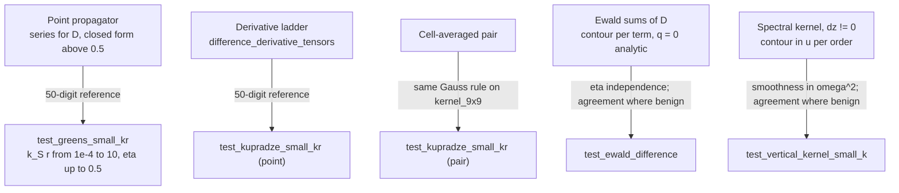

# The P and S mode difference in the propagators, and the Ewald lattice sums

*3 October 2026.*

This note states how the package evaluates the elastodynamic Green's tensor and its lattice sums
without the cancellation between the P and S modes that the textbook forms suffer at small $\kappa r$
or $\kappa a$. It covers the point propagator, the cell-averaged pair and near-shell sums, the
two-dimensional Ewald sums at equal depth (including the $q = 0$ order at $k_\parallel = 0$), and the
spectral plane-to-plane kernel between depths. Every result quoted is measured; the tests that
establish them are listed in the last section.

Conventions: coordinates $(z, x, y)$ with $z$ down; time $e^{-i\omega t}$; outgoing waves; $\kappa_P =
\omega/\alpha$, $\kappa_S = \omega/\beta$, so $\kappa_P/\kappa_S = \beta/\alpha$; the frequency may be
complex (attenuation), and every statement below holds for complex $\omega$.

## 1. Where the cancellation comes from

The Kupradze representation of the whole-space Green's tensor is

$$
G_{ij}(\mathbf r) = \frac{1}{\rho\omega^2}\Bigl[\delta_{ij}\,\kappa_S^2\, g_S(r)
  + \partial_i\partial_j\, D(r)\Bigr],
\qquad g_c(r) = \frac{e^{i\kappa_c r}}{4\pi r},
\qquad D = g_S - g_P .
$$

The 9-component propagator $[[G, C], [H, S]]$ needs $G_{ij}$, $\partial_k G_{ij}$ and $\partial_k\partial_l
G_{ij}$, so up to four derivatives of $D$.

$g_S$ and $g_P$ share the singular part $1/(4\pi r)$, and their derivatives share the corresponding
singular parts. In $D$ these cancel exactly, and what is left is smaller than either mode by a factor
of about $(\kappa r)^2$. Formed as a difference of two separately evaluated quantities, each correct
to the unit round-off $\varepsilon$ relative to its own size, $D$ therefore carries a relative error of
about

$$
\varepsilon\,/\,(\kappa r)^2 ,
$$

and the prefactor $1/(\rho\omega^2)$ multiplies that error back up to the size of $G$. The same
structure appears in every representation of $G$ that treats the modes separately: point values, cell
averages, lattice sums and their spectral forms. The fix is the same in each: never subtract the two
modes; evaluate $D$, or each piece of it, as one quantity.

Measured against a 50-digit evaluation (relative error of the $9\times9$ point block):

| $\kappa_S r$ | closed form, modes subtracted | $D$ as one function |
|---|---|---|
| $10^{-4}$ | $4.0\times10^{-7}$ | $4.6\times10^{-16}$ |
| $10^{-3}$ | $5.0\times10^{-10}$ | $6.5\times10^{-16}$ |
| $10^{-2}$ | $1.2\times10^{-11}$ | $7.9\times10^{-16}$ |
| $0.1$ | $2.9\times10^{-14}$ | $3.4\times10^{-16}$ |
| $1$ to $10$ | $\le 6\times10^{-16}$ | $\le 5\times10^{-16}$ |

## 2. The point propagator: $D$ by its power series

From $e^{i\kappa r}/r = \sum_t (i\kappa)^t r^{t-1}/t!$,

$$
D(r) = \frac{1}{4\pi}\sum_{t\ge 1} \frac{i^t\,(\kappa_S^t - \kappa_P^t)}{t!}\; r^{t-1}.
$$

The $t = 0$ term, the shared singularity, vanishes identically and is never formed. Each coefficient
carries $\kappa_S^t\bigl(1 - (\beta/\alpha)^t\bigr)$, and $\beta/\alpha$ is a fixed number (real even
when $\omega$ is complex), so no coefficient cancels. Derivatives act on powers through the ladder
$f_k = (r^{-1}\,d/dr)^k f$:

$$
\Bigl(\tfrac{1}{r}\tfrac{d}{dr}\Bigr)^{k} r^{m} = m(m-2)\cdots(m-2k+2)\; r^{m-2k},
$$

and the Cartesian tensors follow from the ladder by the standard pairing structures. The series is
used for $|\kappa_S| r \le 0.5$ (24 terms, truncation below $10^{-30}$); above that the closed forms
lose at most a factor of 4 and are used instead. The branch is chosen on $|\kappa_S| r$, so complex
$\kappa$ is handled, and the sympy closed forms carry no positivity assumption on $\kappa$.

Implementations: `graded_voxel.kernel.greens_tensors` and `kernel_9x9` (vectorised);
`resonance_tmatrix.elastodynamic_greens_deriv` and `_propagator_block_9x9` delegate to them, and the
pair-matrix builders evaluate each distinct lattice offset once, in one call;
`kupradze_derivatives.difference_radial_ladder` and `difference_derivative_tensors` give the same
object through the derivative ladder used by the lattice code.

## 3. Cell averages

Averaging is linear, so the average of $D$ equals the difference of the per-mode averages exactly.
Averaging $D$ directly therefore removes the cancellation at every quadrature node, including the
nodes of a contact cell that come within a small fraction of a pitch of the source
(`cell_averaged_pair.averaged_pair_difference_tensors`).

Where each mode carries its own factor, as in the $d^2$ tail $f_c = 1 - \kappa_c^2 a^2/24$, the
combination is rewritten so that nothing is subtracted:

$$
f_S\, g_S - f_P\, g_P = f_S\, D + (f_S - f_P)\, g_P,
\qquad f_S - f_P = -(\kappa_S^2 - \kappa_P^2)\,a^2/24 .
$$

The far tail of the averaged same-plane sum uses the same identity, with the far parts formed from
the Ewald mode difference of section 5 (`cell_averaged_lattice.averaged_origin_difference_tensors`).

## 4. The Ewald split at equal depth

For a square lattice of pitch $a$ (area $A = a^2$) in the plane $z = 0$ and a Bloch vector
$\mathbf k_\parallel$, the lattice sum $\sum_{\mathbf R} g(\mathbf r - \mathbf R)\, e^{i\mathbf
k_\parallel\cdot\mathbf R}$ diverges in its plain spectral form at $z = 0$ once four derivatives are
taken, so it is split with a parameter $\eta$ into

* a **real-space** sum of screened terms, each a radial function of $d = |\mathbf r - \mathbf R|$,

  $$
  \frac{1}{8\pi d}\sum_{s=\pm1} e^{s i\kappa d}\,
  \operatorname{erfc}\!\Bigl(d\eta + \frac{s i\kappa}{2\eta}\Bigr),
  $$

  which is **even in $\kappa$ and entire**: a function of $u = \kappa^2$ with no singularity;

* a **reciprocal** sum over $\mathbf q = \mathbf k_\parallel + \mathbf G$, each order

  $$
  T_{\mathbf q}(z;\kappa) = \frac{i}{4A\,k_z}\, e^{i\mathbf q\cdot\boldsymbol\rho}\,
  e^{k_z^2/4\eta^2} e^{-z^2\eta^2}\bigl[w(\zeta_+) + w(\zeta_-)\bigr],
  \qquad \zeta_\pm = \pm i z\eta + \frac{k_z}{2\eta},
  \qquad k_z = \sqrt{\kappa^2 - q^2},\ \operatorname{Im} k_z \ge 0,
  $$

  with $w$ the Faddeeva function. An **evanescent** order ($q > |\kappa|$) depends on $\kappa$ only
  through $k_z^2 = u - q^2$, and is analytic in $u$ for $|u| < q^2$ (the branch point is $u = q^2$);

* at the origin, a **regularised self term**, the $d \to 0$ limit of the screened $\mathbf R = 0$ term
  minus the free self-field. It is entire in $\kappa$ but **not even**: it carries the radiation term
  $i\kappa/4\pi$ of the free field.

The split is exact for every $\eta$. Independence of $\eta$ is therefore a test with a known answer,
and it is the main one used here.

## 5. The mode difference, term by term

Each term $f$ above is analytic in a disc about the two wavenumbers, in its own natural variable. Its
mode difference is then the Cauchy integral

$$
f(b) - f(c) = \frac{b - c}{2\pi i}\oint \frac{f(z)}{(z - b)(z - c)}\,dz ,
$$

on a circle enclosing $b$ and $c$, which subtracts nothing. The trapezoid rule on a circle of radius
$\varrho$ about the midpoint converges geometrically, as $\max(h/\varrho,\ \varrho/R)^N$, where $h$ is
the half-gap and $R$ is the distance from the midpoint to the nearest singularity of $f$ (or, for an
entire $f$, its scale of variation).

**The integration variable matters.** Each node's own round-off, $\varepsilon|f|$, enters the sum
amplified by about $|f| / (\varrho |f'|)$. For a term that is even in $\kappa$, $f' \propto \kappa$, so
in the variable $\kappa$ the amplification grows as $\kappa \to 0$, exactly where the method is needed.
In $u = \kappa^2$ the derivative is of order one. This was found by measurement: contouring a
real-space term in $\kappa$ gave $2.6\times10^{-11}$ against a 40-digit reference at $\kappa_S a =
10^{-3}$; contouring it in $u$ reaches round-off. So:

| term | variable | reach $R$ |
|---|---|---|
| screened real-space term at distance $d$ | $u = \kappa^2$ | $1/(d + 1/2\eta)^2$ |
| evanescent reciprocal order $\mathbf q$ | $u = \kappa^2$ | $q^2 - \lvert\bar u\rvert$ |
| regularised self term | $\kappa$ | $2\eta$ |
| propagating or near-anomaly order | none: plain subtraction | |

The radius is $\varrho = R/4$, which keeps the round-off amplification near one; the node count follows
from the convergence ratio (at most about 31). Where $h/R > 0.1$ the plain subtraction loses at most a
factor $R/h \le 10$ and is used directly. For a propagating order the two modes differ at order one,
so nothing cancels.

Implementation: `lattice_kupradze._mode_difference`, `ewald_real_difference`,
`ewald_recip_difference`, `lattice_difference_tensors`, `origin_difference_tensors`; the blocks
`lattice_block_9x9`, `bloch_kernel_hat_9x9` (at $dz = 0$) and `bloch_block_ewald_9x9` (at $dz = 0$)
assemble from $D$ and $g_S$ through `kupradze_derivatives.greens_from_difference`.

## 6. The $q = 0$ order at $k_\parallel = 0$

At $k_\parallel = 0$ the $\mathbf q = 0$ order has $k_z = \kappa$ and a pole at $\kappa = 0$, so it has
no disc to contour in. It also hides a second, larger cancellation, present in each mode separately
and in the original code.

Write $T_0(\kappa) = \dfrac{i}{4A\kappa}\, P(z;\kappa)$ with $P = e^{\kappa^2/4\eta^2} e^{-z^2\eta^2}
[w(\zeta_+) + w(\zeta_-)]$. At $\kappa = 0$, using $w(\zeta) = e^{-\zeta^2}\operatorname{erfc}(-i\zeta)$,

$$
P(z; 0) = \operatorname{erfc}(z\eta) + \operatorname{erfc}(-z\eta) = 2 \quad\text{for every } z,
$$

so

$$
T_0(\kappa) = \frac{i}{2A\kappa} + E(\kappa), \qquad E \text{ entire in } \kappa .
$$

* The singular part is the plane wave of the $q = 0$ order. It does not depend on $z$, so all its
  $z$-derivatives vanish, and its mode difference $\frac{i}{2A}\bigl(\kappa_S^{-1} - \kappa_P^{-1}\bigr)$
  cancels nothing.
* $E$ carries the $z$-derivatives. Each derivative brings a power of $\eta$ where the true answer has a
  power of $\kappa$, and the real-space half cancels that content. In each mode separately the $n$-th
  derivative therefore loses about $(\eta/\kappa)^{n-1}$. The $\kappa^0$ part of $E$ is the same for
  both modes, so in $D$ it drops out exactly, but only if $E$ is differenced as one quantity:
  subtracting the two modes' $T_0$ leaves its full size as round-off.
* $E(\kappa_S) - E(\kappa_P)$ is taken by the contour in $\kappa$ (E is not even). The nodes sit at
  $|\kappa| \sim \eta$, where forming $E = T_0 - i/(2A\kappa)$ costs nothing. On the contour $k_z =
  \kappa$, the analytic continuation of the physical branch; the rule $\operatorname{Im} k_z \ge 0$
  would jump across the real axis.

Implementation: `lattice_kupradze._q0_difference`.

The $\eta$-dependence of the assembled $9\times9$ block at $dz = 0$ (cutoff 6, $\eta$ from $0.75$ to
$1.3$ times $\sqrt\pi/a$), which is an error since the split is exact. The strain-strain block $S$ is
the one that suffered; $G$ is shown for comparison:

| $\kappa_S a$ | $S$, original, $k_\parallel = 0$ | $S$, now, $k_\parallel = 0$ | $S$, now, $k_\parallel = (0.2, 0.07)\pi/a$ | $G$, now, either |
|---|---|---|---|---|
| $10^{-3}$ | $7.3\times10^{-5}$ | $5.8\times10^{-12}$ | $2.1\times10^{-12}$ | $\le 6\times10^{-14}$ |
| $10^{-2}$ | $1.9\times10^{-7}$ | $1.5\times10^{-12}$ | $1.3\times10^{-13}$ | $\le 3\times10^{-15}$ |
| $0.03$ | $4.1\times10^{-9}$ | $3.1\times10^{-13}$ | $3.3\times10^{-13}$ | $\le 3\times10^{-15}$ |
| $0.1$ | $6.9\times10^{-11}$ | $2.6\times10^{-14}$ | $1.8\times10^{-13}$ | $\le 2\times10^{-15}$ |

(The original $G$ block at $k_\parallel = 0$ had $3\times10^{-9}$ at $\kappa_S a = 10^{-3}$. At
$k_\parallel = 0$ the coupling block $C$ vanishes by symmetry at $dz = 0$; with $k_\parallel \ne 0$ it is
below $4\times10^{-15}$.)

The lattice sums of $D$ themselves reach an $\eta$-spread of $4\times10^{-12}$ at $\kappa_S a =
10^{-3}$ and $3\times10^{-13}$ at $0.03$, for $k_\parallel = 0$ and $k_\parallel \ne 0$ alike; away
from $k_\parallel = 0$ the original subtraction gave $2\times10^{-9}$ at $10^{-3}$. The source of the
remaining floor has not been identified. The leading suspicion is the accuracy of the Faddeeva function
($w$ from `scipy.special.wofz`), amplified by the residual $\eta$-heavy ratio, but that has not been
tested.

## 7. The spectral kernel between depths ($dz \ne 0$)

Between planes the plain spectral sum converges exponentially and is exact, and production uses it
(`lattice_kupradze._spectral_bloch_block`, built from `sweep_kernels.vertical_kernel_9x9`). For each
order it combines an S isotropic term with two polarisation terms,

$$
\frac{1}{\omega^2}\Bigl[\Phi(\kappa_P^2) - \Phi(\kappa_S^2)\Bigr],
\qquad
\Phi(u) = \text{assembled}\Bigl[\tfrac{i}{2\rho}\,\mathbf k\mathbf k\,
\frac{e^{i k_z |dz|}\,\mathrm{ff}(k_z)}{k_z}\Bigr],\quad k_z = \sqrt{u - q^2},
$$

where $\mathbf k = (\pm k_z, k_x, k_y)$ and ff is the optional source-cell form factor. For an
evanescent order at small $\kappa$ each polarisation term is about $q^2/(\omega^2 q)$ while the
difference is of order one, so the original sum lost $\varepsilon (q/\kappa)^2$. At $dz = a$ the
expected error of the Bloch-summed strain block was $10^{-11}$ at $\kappa_S a = 0.03$ and $10^{-8}$ at
$10^{-3}$, with the coupling block up to $8\times10^{-10}$.

The difference is now taken by the same contour in $u$ (`sweep_kernels._pole_difference`), with the
$1/\omega^2$ cancelled exactly against the gap, $(\kappa_P^2 - \kappa_S^2)/\omega^2 = 1/\alpha^2 -
1/\beta^2$. One refinement was needed. For a high order, $e^{i k_z |dz|} = e^{-|dz|\sqrt{q^2 - u}}$
changes by a factor $e$ when $u$ moves by $2q/|dz|$, far less than the branch-point distance $q^2$.
Using $q^2$ alone let $\Phi$ vary by $e^{q|dz|/8}$ round the circle (a factor of 750 at $q a = 53$). The
reach is therefore $\min(q^2 - |\bar u|,\ 2q/|dz|)$.

The Ewald route at $dz \ne 0$ (`full_plane_scalar_tensors`, reachable through `bloch_block_ewald_9x9`)
is badly conditioned whichever form is used. It is kept per mode, as a cross-check only; nothing in
production takes it.

## 8. Cost

The contour evaluates each term at about 30 nodes in place of 2:

| path | before | after |
|---|---|---|
| Ewald origin sum, one Bloch point, cutoff 4, $\kappa_S a = 0.03$ | 41 ms (two modes) | 548 ms (13 times) |
| the same at $\kappa_S a = 0.5$ | 34 ms | 228 ms (7 times) |
| spectral kernel, 169 lateral nodes | 0.8 ms | 11 to 15 ms (15 to 20 times) |

`_spectral_bloch_block` now passes all $k_x$ orders of a row in one call, which recovers part of the
spectral cost. Possible further savings, none yet made or measured: fewer nodes with a smaller radius
(trading round-off amplification for node count), and the plain subtraction wherever its measured
amplification is acceptable.

## 9. Validation

* **50-digit references** (`tests/test_greens_small_kr.py`, `tests/test_kupradze_small_kr.py`): $G$,
  $\partial G$, $\partial\partial G$ and the $9\times9$ block for $|\kappa_S| r$ from $10^{-4}$ to $10$ and
  attenuation $\eta = 0, 0.05, 0.5$, against the closed form evaluated with mpmath.
* **An independent kernel** for the cell-averaged pair: the same Gauss rule applied to `kernel_9x9`,
  which shares no code with the derivative ladder, to $10^{-12}$ for $\kappa d$ from $10^{-3}$ to $0.3$.
* **$\eta$-independence** of the Ewald sums of $D$ and of the assembled block at $dz = 0$, for
  $k_\parallel = 0$ and $k_\parallel \ne 0$ and $\kappa_S a$ from $10^{-3}$ to $0.03$. A discrimination
  check confirms that the original subtraction fails the same test.
* **Smoothness in $\omega^2$** of the Bloch-summed spectral block with every order evanescent. The
  middle of three small frequencies must equal the $\omega^2$ interpolation of the outer two to
  $O(\omega^4)$. The residual was confirmed to be curvature: it falls 16-fold per halving of the
  frequencies. Again the original sum fails the same test.
* **Agreement where the cancellation is benign**, $\kappa_S a = 0.5$ and $2$, with the original
  routes, restricted to the orders whose original value is itself reliable.

What these checks do not cover: the remaining floor of about $4\times10^{-12}$ in the Ewald sums at
$\kappa_S a = 10^{-3}$ is measured but not explained, and the Ewald route at $dz \ne 0$ remains badly
conditioned (section 7). Neither the Ewald difference form nor the spectral fix has a Mathematica
cross-check yet; the point and pair results are checked against mpmath and against an independent
kernel only.
