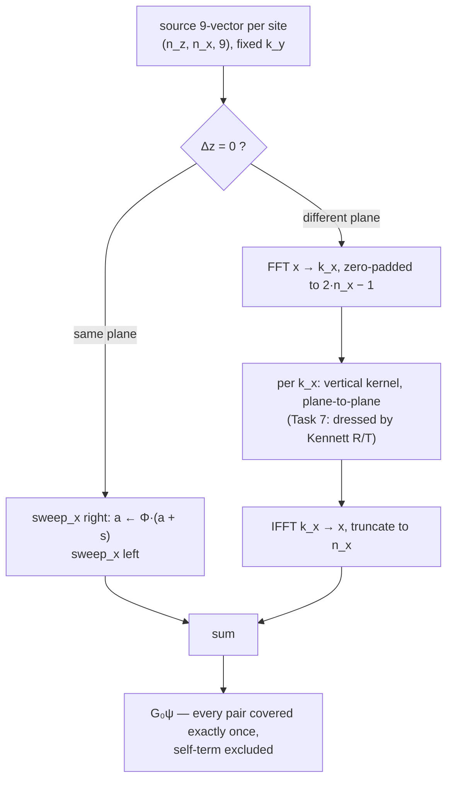

# Cartesian Directional Sweeps, Stage 1 — Implementation Plan

> **REWORKED 2026-09-13, after the plan's central premise was found false.**
>
> This plan asserted that the stratified vertical operator did not exist and had
> to be built — first as `kennett_layers` dressing (Task 4), then as a Kennett
> source-in-stack construction (Task 7). **It already existed, validated.**
>
> | Object | Where |
> |---|---|
> | stratified plane-to-plane 9×9, in the sweep's exact basis | `GlobalMatrix/layered_greens.py:838` |
> | the three wrapper corrections D1/D2/D3 | `cubic_scattering/layered_correction.py` |
> | `Q^∂ = (I − S_int E)⁻¹ S_int`, source-in-stack `V_inc` | thesis Ch.5 `GstratRep.tex`, Eq. `PstratDef`, `incdown`/`incup` |
>
> The root error was the spec's "no external-repository dependency" claim, since
> retracted. The whole 9×9 wrapper arc that preceded this plan existed to make
> that object usable for exactly this composition.
>
> **What changed:**
> - **Task 4's `vertical_kernel_9x9` is demoted** from production operator to
>   *homogeneous-limit arbiter* — a role it fills well, being an independent
>   construction gated against the closed-form Kupradze propagator.
> - **The production vertical operator** is
>   `directional_sweeps.build_vertical_stack_layered`, fed by the new
>   `layered_correction.corrected_layered_9x9`. Gated by
>   `scripts/gate_sweep_rung3_layered.py`: homogeneous reduction **1.1e-15**.
> - **Task 7b (Kennett dressing) is cancelled** — it was rebuilding `Q^∂`.
> - **Task 7a (`sweep_modes.py`) has no consumer.** It was built only to feed the
>   cancelled dressing. Retained for now; the rank-3 factorisation result in it
>   is sound and may serve stage 2.
> - **Task 8 (`FFTProp`) is unblocked**: its free surface is part of the layered
>   background, which the solver now carries.
>
> **A defect found during the rework.** `layered_greens_9x9` and
> `scripts/composed_matvec.resolved_9x9_grid` build their `(u,T)↔(u,ε)` operators
> from `_interface_elastic_properties`, which returns `float(model.alpha[j])` —
> the *undamped* velocity — while `G6` uses the complex attenuative slowness. At
> field Q (600–1000) that is ~0.1% and invisible; at the Q = 2 used to isolate
> the whole-space limit it is 100%, and the homogeneous reduction fails outright
> (measured 1.009). Symmetry gates cannot see it, being homogeneous of degree
> one. `corrected_layered_9x9` takes both media from `complex_slowness_p/s`;
> gate 3L-b keeps the old behaviour as an explicit failing control.


**Goal:** Build the Cartesian 2½-D directional-sweep `G₀` matvec and the GMRES
Foldy–Lax solve around it, validated at every rung against machinery that already
exists in this repository.

**Architecture:** `G₀` is applied as direction-pure partial-wave sweeps rather
than as a convolution kernel. Coupling *within* a depth plane (`Δz = 0`) is
summed on the `k_x` pole by a real-space running accumulation along `x` — two
passes, right-going and left-going. Coupling *between* depth planes (`Δz ≠ 0`) is
summed on the `k_z` pole in the lateral wavenumber domain, where it converges,
and is dressed by the background layering. `T₀` stays block-diagonal and local;
every order of multiple scattering is built by the Krylov iterations, never by
the propagator.

**Tech stack:** NumPy, SciPy (`scipy.sparse.linalg.gmres`), pytest. Conda
environment `seismic`. No new dependencies, and no dependency on any repository
outside this one.

**Spec:** `docs/specs/2026-09-13-cartesian-directional-sweeps-design.md` — read it
alongside this plan. The spec argues *why* these directions; this plan says what
to type.

---

## Global Constraints

- **Coordinate system: `z` = axis 0 (down), `x` = axis 1 (right), `y` = axis 2
  (out).** Right-handed. Every array index, every `k`-vector, every Voigt pair
  assumes it. `VOIGT_PAIRS` in `resonance_tmatrix.py` is the authority.
- **Voigt pairs, in order:** `(zz, xx, yy, xy, zy, zx)`. Engineering doubling on
  the last three.
- **Time convention `e^{−iωt}`** throughout. Outgoing = `e^{+ikr}`. Branch of
  every vertical/transverse wavenumber pinned to `Im ≥ 0`.
- **Seismic units** for anything that touches the thesis formulation: km/s,
  g/cm³, GPa. SI metres-and-pascals introduces a spurious ~1e10 conditioning
  artefact in the mode matrices that is a units effect, not a defect.
- **The real Earth is not horizontally periodic.** No construction in this stage
  may assume lateral periodicity. Where a discrete transform is used along `x`
  it must be zero-padded to a *linear* convolution and gated as such (Task 4,
  Step 6).
- **Fail fast with the four-element diagnostic** the project's engineering
  standards require: what is wrong, where to fix it (absolute path plus the
  parameter), what a valid value looks like, how to recover. No silent
  fallbacks, no inferred defaults.
- **Python 3.12 style:** `X | Y` unions, `pathlib.Path`, Google docstrings, max
  line length 108, `raise ... from None` inside `except`.
- **Two independent implementations agreeing is the evidence standard.** One
  implementation agreeing with itself is not. Every gate below names an arbiter
  that was written for a different purpose.
- **Every gate runs serially.** `frequency_sweep.sweep_frequencies` agrees with
  the serial path only to ~2e-16 relative, which is below these tolerances but
  not by a comfortable margin.
- Lint after every Python change:
  `conda run -n seismic ruff check cubic_scattering/ --fix --ignore ARG001,ARG002,F841,E741`
  then `ruff format`, then `mypy --ignore-missing-imports`.

---

## What already exists (do not rebuild)

Verified by grep and by reading the source on 2026-09-13.

| Piece | Where | Use it for |
|---|---|---|
| Bundled lateral kernel, 9×9, vectorised over `ky` | `horizontal_greens.post_kx_residue_kernel_9x9_vec(ky_arr, kz, dx_abs, …)` | The arbiter for Task 1. **Do not reimplement the physics** — Task 1 re-indexes and factorises it. |
| Exact real-space 9×9 propagator | `horizontal_greens.exact_propagator_9x9(x, y, z, omega, ref)` | Rung 2b and Task 4's pairwise arbiter |
| Direct 2-D quadrature, 3×3 | `horizontal_greens.horizontal_greens_direct(dx_abs, dy, kmax, nk, …)` | Rung 2b cross-check on the `G` block |
| Whole-space `k_z`-residue kernel, 3×3 | `baseline_kz_residue.post_residue_kernel(kx, ky, z, …)` | The *pattern* for Task 4's 9×9 vertical kernel |
| Kennett layered reflectivity | `kennett_layers.kennett_layers(stack, p, omega)`, `LayerStack`, `IsotropicLayer` | Rung 3 arbiter, and the layered dressing in Task 7 |
| Cube `T₀` | `effective_contrasts.compute_cube_tmatrix`, `voigt_tmatrix.voigt_tmatrix_from_result` | The local block in Task 6 |
| FFT-convolution Foldy–Lax solver | `slab_scattering.compute_slab_scattering(geometry, material, omega, k_hat, …)` | Rung 5 arbiter. **Leave it untouched.** |
| Cylindrical 2½-D sweeps | `FFTProp.py/propagation.py`: `upsweep`, `downsweep`, `right_sweep`, `left_sweep` | Rung 4 arbiter (convergence study only) |
| Sweep-resummation gate, with a non-vacuous control | `scripts/gate_lateral_sweep_alg52.py` | Copy its control design into Task 3 |
| Stratified 6×6 correction | `layered_correction.corrected_layered_6x6`, `strain_from_state` | **Not used in stage 1** — see Deferred |

**Genuinely missing:** everything Cartesian. `git grep -ril "sweep" -- cubic_scattering/`
returns nothing of this kind.

---

## Deferred, with the gap stated

**The intra-plane stratified correction is out of stage 1.** Tasks 1–6 use the
*whole-space* lateral kernel for same-depth coupling; the background layering
enters only through the vertical sweep (Task 7). The gap is physical and must be
stated whenever a stage-1 result is quoted: same-depth voxels separated laterally
couple through the whole-space Green's tensor, missing the layer reverberations
between them. For a plane in a layer interior with the nearest interface many
voxel pitches away, that term is small; for a plane adjacent to a strong
interface it is not. The machinery to close it exists
(`layered_correction.corrected_layered_6x6`, validated to 1.7e-15 on interior
planes) and is a stage 1c task, not a research question.

Also out of scope: the kernel-build vectorisation of `_propagator_block_9x9`
(it belongs to the architecture this supersedes); preconditioning for strong
contrast; GPU; any change to `slab_scattering.py`.

---

## File structure

| File | Responsibility |
|---|---|
| `cubic_scattering/sweep_kernels.py` *(new)* | Pure kernel algebra. The lateral amplitude/phase split, and the vertical plane-to-plane spectral kernel. No solver state, no grids, no I/O. |
| `cubic_scattering/directional_sweeps.py` *(new)* | The grid, the sweeps (`sweep_x`, `sweep_z`), and the ordered composition `apply_g0`. Owns the `G₀` cache. |
| `cubic_scattering/sweep_modes.py` *(new, Task 7)* | The `(u, ε)` ↔ P/SV/SH mode bridge and the Kennett dressing. Isolated because representation conversion is where this project's defects live. |
| `cubic_scattering/sweep_solver.py` *(new)* | GMRES around `apply_g0` with the local `T₀`. |
| `cubic_scattering/tests/test_sweep_kernels.py` *(new)* | Tasks 1–2, 4 |
| `cubic_scattering/tests/test_directional_sweeps.py` *(new)* | Tasks 3–5 |
| `cubic_scattering/tests/test_sweep_solver.py` *(new)* | Task 6 |
| `cubic_scattering/tests/test_sweep_modes.py` *(new, Task 7)* | Task 7 |
| `scripts/gate_sweep_rung2_lateral.py` *(new)* | Rung 2, with the mandatory control |
| `scripts/gate_sweep_rung3_vertical.py` *(new)* | Rung 3 |
| `scripts/gate_sweep_rung4_fftprop.py` *(new)* | Rung 4 — a convergence study, not a tolerance |
| `scripts/gate_sweep_rung5_gmres.py` *(new)* | Rung 5 |
| `cubic_scattering/horizontal_greens.py` *(modify)* | Nothing removed or renamed. Task 1 only *reads* it; the split lives in the new module so every existing caller and gate is untouched. |

---

## The decomposition of `G₀`



Every pair of distinct sites is reached by exactly one of the two branches, and
the self-term (same plane, same `x`) is reached by neither — it is closed inside
`T₀`. Task 5 gates that partition explicitly.

---

## The validation ladder

| Rung | Claim | Arbiter | Target | Task |
|---|---|---|---|---|
| 1 | `M_L Φ_L^n + M_T Φ_T^n` reproduces the bundled kernel at `Δx = n·p` | `post_kx_residue_kernel_9x9_vec` | 1e-15 rel | 1 |
| 1b | the left-going amplitude is the right-going one with the odd-`x`-derivative signs flipped | reflection identity `P(−Δx) = R P(Δx) R` | 1e-15 rel | 2 |
| 2 | lateral sweep == direct pairwise double sum, **distinct source at every site** | an O(N²) sum over the bundled kernel | 1e-14 rel | 3 |
| 2b | the summed lateral kernel is the real-space propagator | `exact_propagator_9x9`, `horizontal_greens_direct` | quadrature-limited, ~1e-8 | 3 |
| 3 | vertical plane-to-plane == direct pairwise sum of the exact propagator | `exact_propagator_9x9` | 1e-10 rel | 4 |
| 3b | the padded lateral transform is a **linear**, not circular, convolution | a deliberately non-periodic source | 1e-13 rel | 4 |
| 4 | partition: every off-diagonal pair once, self-term never | a boolean coverage count | exact | 5 |
| 5 | GMRES solve, homogeneous background | `slab_scattering.compute_slab_scattering` | ≤1% | 6 |
| 6 | mode round trip, and layered vertical == Kennett | identity; `kennett_layers` | 1e-14; 1e-12 | 7 |
| 7 | full 2½-D `G₀` vs the cylindrical solver | `FFTProp` | **convergence under refinement** | 8 |

**Rungs 1, 1b, 2, 3, 3b, 4 and 6 are exact** — the same physics through two code
paths. Anything above the stated target is a defect, not a discretisation
difference.

**Numbering, because it differs from the spec's.** This plan inserts three rungs
the spec did not number (1b, 3b, and the partition rung 4), so the tails do not
line up. The map: spec rung 4 (`FFTProp`) is **rung 7 here**; spec rung 5
(GMRES vs `slab_scattering`) is **rung 5 here**; spec rung 6, the stage-2 in-out
`k_y` sweep, is not in stage 1 at all. Quote a rung by what it claims, not by its
number.

**Rung 7 is not exact and must not be written as though it were.** `FFTProp`
discretises the heterogeneity as cylinders with a cylinder Mie `T₀`; this
implementation uses cubic voxels with the cube `T₀`. They disagree by a genuine
shape-and-scatterer difference even when both are correct. The rung passes by
demonstrating that the discrepancy *falls under refinement* toward the known
equal-volume shape difference — not by hitting a tolerance. One run at one pitch
proves nothing.

---

## Task 1: The lateral amplitude/phase split

The single most dangerous item in the design. The bundled kernel returns
amplitude × phase at one separation; a sweep needs them apart, so that the phase
accumulates along the line and the amplitude does not. Accumulating a factor that
should not accumulate yields a plausible field wrong by a distance-dependent
factor — and a reciprocity or symmetry check will pass it, because such checks
are homogeneous of degree one and blind to exactly this. Rung 1 exists solely to
pin it.

Reading `horizontal_greens.post_kx_residue_kernel_9x9_vec`, the only `Δx`
dependence anywhere in the function is in `eL = exp(i·kx_L·dx_abs)` and
`eT = exp(i·kx_T·dx_abs)`. Everything else — `kL_vec`, `kT_vec`, the Voigt
contractions, the half-weighting of the off-diagonal stress columns — is
`Δx`-independent. So the kernel factorises exactly:

```
P(ky, kz; Δx) = M_L(ky, kz) · e^{i kx_L Δx}  +  M_T(ky, kz) · e^{i kx_T Δx}
```

with `M_T` the sum of the T-isotropic and T-polarisation amplitudes, which share
a pole and therefore share a phase. Two accumulators per direction, not three.

The new function vectorises over **`kz` at fixed `ky`**, the transpose of the
existing one's axis, because stage 1 fixes `k_y` as a 2½-D parameter and the
surviving integral is over `k_z`. The two are *not* interchangeable by relabelling:
`kz` sits at index 0 of the `k`-vector and `ky` at index 2.

**Files:**
- Create: `cubic_scattering/sweep_kernels.py`
- Test: `cubic_scattering/tests/test_sweep_kernels.py`

**Interfaces:**
- Consumes: `horizontal_greens.post_kx_residue_kernel_9x9_vec` (arbiter only),
  `resonance_tmatrix.VOIGT_PAIRS`, `effective_contrasts.ReferenceMedium`.
- Produces:
  ```python
  @dataclass(frozen=True)
  class LateralSplit:
      amp_p: NDArray    # (9, 9, n_kz) complex — P-pole amplitude
      amp_s: NDArray    # (9, 9, n_kz) complex — S-pole amplitude
      phase_p: NDArray  # (n_kz,) complex — e^{i kx_P · pitch}
      phase_s: NDArray  # (n_kz,) complex — e^{i kx_S · pitch}

  def lateral_split_9x9(
      ky: float, kz_arr: NDArray, pitch: float, omega: complex,
      ref: ReferenceMedium, *, direction: str = "right",
  ) -> LateralSplit
  ```

---

- [ ] **Step 1: Write the failing test**

Add to `cubic_scattering/tests/test_sweep_kernels.py`:

```python
"""Tests for the directional-sweep kernel algebra."""

import numpy as np
import pytest

from cubic_scattering.effective_contrasts import ReferenceMedium
from cubic_scattering.horizontal_greens import post_kx_residue_kernel_9x9_vec
from cubic_scattering.sweep_kernels import LateralSplit, lateral_split_9x9

# Seismic units: km/s, g/cm3. Slight damping keeps the branch unambiguous.
REF = ReferenceMedium(alpha=5.0, beta=3.0, rho=2.5)
OMEGA = 2 * np.pi * (1.0 + 0.03j)
PITCH = 0.25


def _bundled(ky: float, kz: float, dx: float) -> np.ndarray:
    """The existing bundled kernel at one (ky, kz), as a 9x9."""
    return post_kx_residue_kernel_9x9_vec(
        np.array([ky]), kz, dx,
        omega=OMEGA, rho=REF.rho, alpha=REF.alpha, beta=REF.beta,
    )[:, :, 0]


@pytest.mark.parametrize("n", [1, 2, 3, 7])
@pytest.mark.parametrize("ky", [0.0, 0.4, 1.7])
def test_split_reproduces_bundled_kernel(ky: float, n: int) -> None:
    """RUNG 1: amp x phase**n == the bundled kernel at separation n*pitch."""
    kz_arr = np.array([0.0, 0.3, 1.1, 2.6, 5.0])
    split = lateral_split_9x9(ky, kz_arr, PITCH, OMEGA, REF, direction="right")

    for m, kz in enumerate(kz_arr):
        got = (
            split.amp_p[:, :, m] * split.phase_p[m] ** n
            + split.amp_s[:, :, m] * split.phase_s[m] ** n
        )
        want = _bundled(ky, kz, n * PITCH)
        scale = np.abs(want).max()
        assert np.abs(got - want).max() / scale < 1e-15


def test_amplitude_is_separation_independent() -> None:
    """The amplitude must NOT depend on separation -- the accumulation trap."""
    ky = 0.4
    kz_arr = np.array([0.0, 1.1, 5.0])
    a = lateral_split_9x9(ky, kz_arr, PITCH, OMEGA, REF, direction="right")
    b = lateral_split_9x9(ky, kz_arr, 4.0 * PITCH, OMEGA, REF, direction="right")
    assert np.abs(a.amp_p - b.amp_p).max() == 0.0
    assert np.abs(a.amp_s - b.amp_s).max() == 0.0
    # ...and the phase must be exactly the pitch-th power relation.
    assert np.abs(b.phase_p - a.phase_p**4).max() < 1e-14


def test_rejects_zero_pitch() -> None:
    with pytest.raises(ValueError, match="pitch"):
        lateral_split_9x9(0.4, np.array([0.0]), 0.0, OMEGA, REF)


def test_rejects_zero_frequency() -> None:
    with pytest.raises(ValueError, match="omega"):
        lateral_split_9x9(0.4, np.array([0.0]), PITCH, 0.0, REF)


def test_rejects_unknown_direction() -> None:
    with pytest.raises(ValueError, match="direction"):
        lateral_split_9x9(0.4, np.array([0.0]), PITCH, OMEGA, REF, direction="up")
```

- [ ] **Step 2: Run it and watch it fail**

```bash
conda run -n seismic python -m pytest cubic_scattering/tests/test_sweep_kernels.py -v
```

Expected: collection error, `ModuleNotFoundError: No module named
'cubic_scattering.sweep_kernels'`.

- [ ] **Step 3: Write `sweep_kernels.py`**

Create `cubic_scattering/sweep_kernels.py`. The structure mirrors
`post_kx_residue_kernel_9x9_vec` block for block — G, C, H, S, then the
half-weighting of the off-diagonal stress columns — but carries the `Δx`-free
amplitudes only, and vectorises over `kz` instead of `ky`.

```python
#!/usr/bin/env python3
"""Kernel algebra for the Cartesian directional-sweep propagator.

The lateral (k_x-pole) propagator factorises exactly into a
separation-independent 9x9 amplitude and a scalar one-pitch phase, one pair per
pole:

    P(ky, kz; dx) = M_P(ky, kz) e^{i kx_P dx} + M_S(ky, kz) e^{i kx_S dx}

A sweep applies the amplitude once, at readout, and accumulates only the phase.
Getting that division wrong produces a field that is wrong by a
distance-dependent factor and that every reciprocity check will still pass,
because those checks are homogeneous of degree one. See the rung-1 test.

Coordinates: z = axis 0 (down), x = axis 1 (right), y = axis 2 (out).
Time convention e^{-i omega t}; every transverse wavenumber pinned to Im >= 0.
"""

import numpy as np
from numpy.typing import NDArray

from dataclasses import dataclass

from .effective_contrasts import ReferenceMedium
from .resonance_tmatrix import VOIGT_PAIRS

_DIRECTIONS = ("right", "left")


@dataclass(frozen=True)
class LateralSplit:
    """Separation-independent amplitudes and one-pitch phases, per pole.

    Attributes:
        amp_p: P-pole amplitude, shape (9, 9, n_kz).
        amp_s: S-pole amplitude (isotropic plus polarisation), shape (9, 9, n_kz).
        phase_p: e^{i kx_P pitch}, shape (n_kz,).
        phase_s: e^{i kx_S pitch}, shape (n_kz,).
        pitch: The voxel pitch these phases were built for.
        direction: 'right' (+x) or 'left' (-x).
    """

    amp_p: NDArray
    amp_s: NDArray
    phase_p: NDArray
    phase_s: NDArray
    pitch: float
    direction: str


def _branch(k2: NDArray) -> NDArray:
    """Square root with the outgoing branch pinned to Im >= 0."""
    k = np.sqrt(k2 + 0j)
    return np.where(np.imag(k) < 0, -k, k)


def lateral_split_9x9(
    ky: float,
    kz_arr: NDArray,
    pitch: float,
    omega: complex,
    ref: ReferenceMedium,
    *,
    direction: str = "right",
) -> LateralSplit:
    """Split the post-k_x-residue 9x9 kernel into amplitude and one-pitch phase.

    Vectorised over k_z at fixed k_y -- the transpose of
    ``horizontal_greens.post_kx_residue_kernel_9x9_vec``, because stage 1 holds
    k_y fixed as the 2.5-D parameter and integrates over k_z.

    Args:
        ky: Lateral wavenumber out of the plane (the 2.5-D parameter), 1/km.
        kz_arr: Quadrature nodes in k_z, shape (n_kz,), 1/km.
        pitch: Voxel pitch along x, km. Must be > 0.
        omega: Angular complex frequency, rad/s.
        ref: Background medium (seismic units).
        direction: 'right' for +x propagation, 'left' for -x.

    Returns:
        A LateralSplit.

    Raises:
        ValueError: On a non-positive pitch, a zero frequency, or an unknown
            direction -- each with the file, the parameter, a valid example and
            a recovery step.
    """
    if pitch <= 0.0:
        msg = (
            f"pitch must be > 0, got {pitch!r}.\n"
            "  Where: cubic_scattering/sweep_kernels.py, lateral_split_9x9(pitch=...)\n"
            "  Valid: a positive voxel pitch in km, e.g. pitch=0.25\n"
            "  Fix:   pass the SweepGrid's pitch (grid.pitch), not a difference of centres."
        )
        raise ValueError(msg) from None
    if omega == 0:
        msg = (
            "omega must be non-zero: the partial-wave decomposition is undefined at\n"
            "  zero frequency (both poles collapse to k=0).\n"
            "  Where: cubic_scattering/sweep_kernels.py, lateral_split_9x9(omega=...)\n"
            "  Valid: a complex angular frequency, e.g. omega=2*np.pi*(1+0.03j)\n"
            "  Fix:   drop omega=0 from the frequency list; the static limit needs the\n"
            "         Eshelby route (cube_eshelby.py), not this propagator."
        )
        raise ValueError(msg) from None
    if direction not in _DIRECTIONS:
        msg = (
            f"direction must be one of {_DIRECTIONS}, got {direction!r}.\n"
            "  Where: cubic_scattering/sweep_kernels.py, lateral_split_9x9(direction=...)\n"
            "  Valid: direction='right' (+x) or direction='left' (-x)\n"
            "  Fix:   vertical coupling is not a lateral split -- use vertical_kernel_9x9."
        )
        raise ValueError(msg) from None

    kz = np.asarray(kz_arr, dtype=float)
    n_kz = kz.size
    rho, alpha, beta = ref.rho, ref.alpha, ref.beta
    kp2 = (omega / alpha) ** 2
    ks2 = (omega / beta) ** 2

    kx_p = _branch(kp2 - ky**2 - kz**2)
    kx_s = _branch(ks2 - ky**2 - kz**2)

    sign = 1.0 if direction == "right" else -1.0

    # k-vectors in seismological order (z, x, y). The x component carries the
    # propagation sign: every odd x-derivative in the C and H blocks flips with
    # it, which is exactly what distinguishes the left sweep from the right.
    kvec_p = [kz.astype(complex), sign * kx_p, np.full(n_kz, ky, dtype=complex)]
    kvec_s = [kz.astype(complex), sign * kx_s, np.full(n_kz, ky, dtype=complex)]

    # Scalar coefficients with the exponential REMOVED -- that is the whole point.
    c_s_iso = (1j / (2 * rho)) / (beta**2 * kx_s)
    c_p_pol = (1j / (2 * rho)) / (omega**2 * kx_p)
    c_s_pol = -(1j / (2 * rho)) / (omega**2 * kx_s)

    g_p = np.zeros((3, 3, n_kz), dtype=complex)
    g_s_iso = np.zeros((3, 3, n_kz), dtype=complex)
    g_s_pol = np.zeros((3, 3, n_kz), dtype=complex)
    for i in range(3):
        g_s_iso[i, i, :] = c_s_iso
        for j in range(3):
            g_p[i, j, :] = kvec_p[i] * kvec_p[j] * c_p_pol
            g_s_pol[i, j, :] = kvec_s[i] * kvec_s[j] * c_s_pol

    amp_p = _assemble_9x9(g_p, [g_p], [kvec_p])
    amp_s = _assemble_9x9(g_s_iso + g_s_pol, [g_s_iso, g_s_pol], [kvec_s, kvec_s])

    phase_p = np.exp(1j * kx_p * pitch)
    phase_s = np.exp(1j * kx_s * pitch)

    return LateralSplit(
        amp_p=amp_p, amp_s=amp_s, phase_p=phase_p, phase_s=phase_s,
        pitch=float(pitch), direction=direction,
    )


def _assemble_9x9(
    g_total: NDArray, g_parts: list[NDArray], k_parts: list[list[NDArray]]
) -> NDArray:
    """Build [[G, C], [H, S]] from per-pole 3x3 blocks and their k-vectors.

    Each part carries its OWN k-vector, because the x-derivative of a P-pole term
    uses kx_P and of an S-pole term uses kx_S. Collapsing them to a single
    k-vector is the classic defect here.

    Args:
        g_total: Summed 3x3 G block for this pole, shape (3, 3, n).
        g_parts: The individual 3x3 contributions, each shape (3, 3, n).
        k_parts: One k-vector list [kz, kx, ky] per entry of g_parts.

    Returns:
        P of shape (9, 9, n).
    """
    n = g_total.shape[2]
    p = np.zeros((9, 9, n), dtype=complex)
    p[:3, :3, :] = g_total

    for a, (pp, qq) in enumerate(VOIGT_PAIRS):
        for i in range(3):
            c_val = np.zeros(n, dtype=complex)
            h_val = np.zeros(n, dtype=complex)
            for gpart, kvec in zip(g_parts, k_parts, strict=True):
                if pp == qq:
                    c_val += 1j * kvec[pp] * gpart[i, pp, :]
                    h_val += 1j * kvec[pp] * gpart[pp, i, :]
                else:
                    c_val += 1j * kvec[qq] * gpart[i, pp, :] + 1j * kvec[pp] * gpart[i, qq, :]
                    h_val += 1j * kvec[qq] * gpart[pp, i, :] + 1j * kvec[pp] * gpart[qq, i, :]
            p[i, 3 + a, :] = c_val
            p[3 + a, i, :] = h_val

    for a, (pp, qq) in enumerate(VOIGT_PAIRS):
        for b, (mm, nn) in enumerate(VOIGT_PAIRS):
            val = np.zeros(n, dtype=complex)
            for gpart, kvec in zip(g_parts, k_parts, strict=True):
                _add_s_block(val, gpart, kvec, pp, qq, mm, nn)
            p[3 + a, 3 + b, :] = val

    # Engineering doubling: halve the off-diagonal stress columns, matching
    # horizontal_greens._voigt_contract.
    for b in range(3, 6):
        p[:, 3 + b, :] *= 0.5

    return p
```

Port `_add_s_block` directly from `horizontal_greens._add_S_block_pole`
(`cubic_scattering/horizontal_greens.py:342`) — same body, renamed to the
package's snake_case. Do not re-derive it.

- [ ] **Step 4: Run the tests and make them pass**

```bash
conda run -n seismic python -m pytest cubic_scattering/tests/test_sweep_kernels.py -v
```

Expected: 14 passed (4 `n` × 3 `ky` parametrisations plus 4 scalar tests).

If rung 1 fails at a level like 1e-3 rather than 1e-16, the likely cause in
order of probability: (a) the `kz`/`ky` index transposition — `kz` is index 0 of
the `k`-vector and `ky` index 2; (b) the half-weighting loop applied to rows
instead of columns; (c) `_add_s_block` handed the summed `g_total` instead of the
per-pole parts. **Do not widen the tolerance.** These are exact identities.

- [ ] **Step 5: Lint, type-check, commit**

```bash
conda run -n seismic ruff check cubic_scattering/ --fix --ignore ARG001,ARG002,F841,E741 && \
conda run -n seismic ruff format cubic_scattering/sweep_kernels.py cubic_scattering/tests/test_sweep_kernels.py && \
conda run -n seismic mypy cubic_scattering/sweep_kernels.py --ignore-missing-imports
GIT_PAGER=cat git add cubic_scattering/sweep_kernels.py cubic_scattering/tests/test_sweep_kernels.py && \
GIT_PAGER=cat git commit -m "✨ feat: split the lateral 9x9 kernel into amplitude and one-pitch phase" < /dev/null
```

---

## Task 2: The left-going amplitude, and why it is not the right-going one

A sweep to the left carries `e^{−i k_x Δx}`, and the odd `x`-derivatives in the
`C` and `H` blocks flip sign with it. The `S` block, carrying two derivatives,
flips only where exactly one of them is an `x`. Task 1 already implements this
through `sign`; this task **gates** it, because getting it wrong produces a field
that is symmetric in `Δx` when it should be antisymmetric in half its
components — and the resulting error is invisible to any check that only ever
looks one way along the row.

The knowable answer is the reflection identity. Let `R = diag(1, −1, 1)` on the
displacement indices, extended to the Voigt block by the sign each pair picks up
under `x → −x`: `zz, yy, zy` are even; `xx` is even (two `x` derivatives);
`xy, zx` are odd. So

```
R9 = diag(1, −1, 1,   1, 1, 1, −1, 1, −1)
```

and the claim is `P_left(Δx) = R9 · P_right(Δx) · R9`.

**Files:**
- Modify: `cubic_scattering/sweep_kernels.py` (add `R9` as a module constant)
- Test: `cubic_scattering/tests/test_sweep_kernels.py`

**Interfaces:**
- Produces: `sweep_kernels.R9` — `NDArray` of shape `(9,)`, the parity signature
  under `x → −x`. Task 3 uses it to assemble the left readout; Task 5's partition
  gate uses it as a cross-check.

---

- [ ] **Step 1: Write the failing test**

```python
from cubic_scattering.sweep_kernels import R9


def test_left_amplitude_is_the_x_reflection_of_the_right() -> None:
    """RUNG 1b: P_left = R9 P_right R9, with R9 the parity under x -> -x."""
    kz_arr = np.array([0.0, 0.7, 2.2, 6.0])
    ky = 0.9
    right = lateral_split_9x9(ky, kz_arr, PITCH, OMEGA, REF, direction="right")
    left = lateral_split_9x9(ky, kz_arr, PITCH, OMEGA, REF, direction="left")

    # The phase is even in the x-component: same pole, same pitch.
    assert np.abs(left.phase_p - right.phase_p).max() == 0.0
    assert np.abs(left.phase_s - right.phase_s).max() == 0.0

    refl = np.outer(R9, R9)
    for pole_l, pole_r in ((left.amp_p, right.amp_p), (left.amp_s, right.amp_s)):
        for m in range(kz_arr.size):
            want = refl * pole_r[:, :, m]
            scale = np.abs(want).max()
            assert np.abs(pole_l[:, :, m] - want).max() / scale < 1e-15


def test_parity_signature_is_not_all_ones() -> None:
    """A guard against a silently-identity R9, which would make the test vacuous."""
    assert int(np.sum(R9 == -1)) == 3
```

- [ ] **Step 2: Run it and watch it fail**

```bash
conda run -n seismic python -m pytest cubic_scattering/tests/test_sweep_kernels.py -k "reflection or parity" -v
```

Expected: `ImportError: cannot import name 'R9'`.

- [ ] **Step 3: Add the constant**

In `cubic_scattering/sweep_kernels.py`, after `_DIRECTIONS`:

```python
# Parity of each of the nine state components under x -> -x, with the state
# ordered (u_z, u_x, u_y, e_zz, e_xx, e_yy, 2e_xy, 2e_zy, 2e_zx). A component
# is odd iff it carries an odd number of x indices: u_x, e_xy and e_zx.
R9 = np.array([1.0, -1.0, 1.0, 1.0, 1.0, 1.0, -1.0, 1.0, -1.0])
```

- [ ] **Step 4: Run and confirm green**

```bash
conda run -n seismic python -m pytest cubic_scattering/tests/test_sweep_kernels.py -v
```

Expected: all pass. If the reflection test fails on the `S` block only, the
parity of `e_xx` is the suspect — it carries *two* `x` indices and is therefore
**even**, which is easy to get wrong by pattern-matching on the letter `x`.

- [ ] **Step 5: Commit**

```bash
GIT_PAGER=cat git add cubic_scattering/sweep_kernels.py cubic_scattering/tests/test_sweep_kernels.py && \
GIT_PAGER=cat git commit -m "✅ test: gate the left-going lateral amplitude by the x-reflection identity" < /dev/null
```

---

## Task 3: `sweep_x` — the intra-plane running accumulation

The recursion, from thesis Alg 5.2 and from the closed forms already extracted in
`scripts/gate_lateral_sweep_alg52.py`:

```
right:  a ← 0;  for i ascending:   out[i] += readout(a);  a ← Φ · (a + s[i])
left:   a ← 0;  for i descending:  out[i] += readout(a);  a ← Φ · (a + s[i])
```

Reading *before* accumulating is what keeps the self-term out: unrolled, the
right pass gives `out[i] = Σ_{j<i} Φ^{i−j} s[j]`, so every separation is at least
one pitch and `Δx = 0` is never formed. That is the structural reason the
same-depth sum, which diverges as an integral at `Δx = 0`, is finite here.

The accumulator is carried **per `k_z` node, per pole**; the amplitude and the
`k_z` quadrature are applied together at readout:

```
out[i] = Σ_kz w[kz] · ( M_P[:, :, kz] · a_P[kz]  +  M_S[:, :, kz] · a_S[kz] )
```

**Choosing the `k_z` grid.** The integrand carries `e^{i kx pitch}` which, for
`|kz| ≫ kS`, is `e^{−|kz|·pitch}`. The amplitude grows only polynomially (at
worst `k³` in the `S` block), so the cutoff is set by the exponential at the
*nearest-neighbour* separation: take `kz_max ≈ 30 / pitch`, and refine until the
rung-2 residual stops moving. This is the same lesson as the wrapper work, where
a `k`-grid truncated at 8 against `kS ≈ 34` produced a "reference" wrong by 33%.
The grid must be validated, not assumed.

**Files:**
- Create: `cubic_scattering/directional_sweeps.py`
- Create: `cubic_scattering/tests/test_directional_sweeps.py`
- Create: `scripts/gate_sweep_rung2_lateral.py`

**Interfaces:**
- Consumes: `sweep_kernels.lateral_split_9x9`, `sweep_kernels.LateralSplit`.
- Produces:
  ```python
  @dataclass(frozen=True)
  class SweepGrid:
      n_z: int
      n_x: int
      pitch: float
      ky: float
      kz_nodes: NDArray    # (n_kz,)
      kz_weights: NDArray  # (n_kz,)

  def make_sweep_grid(n_z, n_x, pitch, ky, *, kz_max=None, n_kz=2048) -> SweepGrid
  def sweep_x(sources, grid, split_right, split_left) -> NDArray  # (n_z, n_x, 9)
  ```
  `sources` has shape `(n_z, n_x, 9)`; the return has the same shape.

---

- [ ] **Step 1: Write the failing test**

Create `cubic_scattering/tests/test_directional_sweeps.py`:

```python
"""Tests for the Cartesian directional sweeps."""

import numpy as np
import pytest

from cubic_scattering.directional_sweeps import make_sweep_grid, sweep_x
from cubic_scattering.effective_contrasts import ReferenceMedium
from cubic_scattering.horizontal_greens import exact_propagator_9x9
from cubic_scattering.sweep_kernels import lateral_split_9x9

REF = ReferenceMedium(alpha=5.0, beta=3.0, rho=2.5)
OMEGA = 2 * np.pi * (1.0 + 0.03j)
PITCH = 0.25


def _pairwise_lateral(sources, grid, split_right, split_left):
    """O(N^2) reference: sum the split kernel over every ordered pair.

    Deliberately a different algorithm from the sweep -- a double loop over
    pairs, not a running accumulation -- so agreement is evidence.
    """
    n_z, n_x, _ = sources.shape
    out = np.zeros_like(sources)
    w = grid.kz_weights
    for i in range(n_x):
        for j in range(n_x):
            if i == j:
                continue
            n = abs(i - j)
            split = split_right if j < i else split_left
            kern = (
                np.einsum("abk,k->abk", split.amp_p, split.phase_p**n)
                + np.einsum("abk,k->abk", split.amp_s, split.phase_s**n)
            )
            block = np.einsum("k,abk->ab", w, kern)
            out[:, i, :] += sources[:, j, :] @ block.T
    return out


def test_sweep_x_equals_pairwise_sum_distinct_sources() -> None:
    """RUNG 2: the running sweep resums the pairwise double sum exactly.

    DISTINCT source at every site -- that is the disorder-resolved property
    being claimed. See test_uniform_source_control_would_be_vacuous.
    """
    rng = np.random.default_rng(20260913)
    n_z, n_x = 2, 9
    grid = make_sweep_grid(n_z, n_x, PITCH, ky=0.6, n_kz=512)
    right = lateral_split_9x9(grid.ky, grid.kz_nodes, PITCH, OMEGA, REF, direction="right")
    left = lateral_split_9x9(grid.ky, grid.kz_nodes, PITCH, OMEGA, REF, direction="left")

    sources = rng.standard_normal((n_z, n_x, 9)) + 1j * rng.standard_normal((n_z, n_x, 9))

    got = sweep_x(sources, grid, right, left)
    want = _pairwise_lateral(sources, grid, right, left)
    assert np.abs(got - want).max() / np.abs(want).max() < 1e-14


def test_uniform_source_control_would_be_vacuous() -> None:
    """MANDATORY CONTROL: show the uniform-source version cannot discriminate.

    An implementation that averaged the sites before sweeping still matches the
    pairwise sum when every source is identical. This test asserts that the
    weak version of rung 2 passes for a deliberately WRONG implementation, so a
    future edit cannot quietly downgrade the real test to the weak one.
    """
    n_z, n_x = 1, 6
    grid = make_sweep_grid(n_z, n_x, PITCH, ky=0.6, n_kz=256)
    right = lateral_split_9x9(grid.ky, grid.kz_nodes, PITCH, OMEGA, REF, direction="right")
    left = lateral_split_9x9(grid.ky, grid.kz_nodes, PITCH, OMEGA, REF, direction="left")

    uniform = np.ones((n_z, n_x, 9), dtype=complex)
    averaged = np.broadcast_to(uniform.mean(axis=1, keepdims=True), uniform.shape).copy()

    a = sweep_x(uniform, grid, right, left)
    b = sweep_x(averaged, grid, right, left)
    assert np.abs(a - b).max() == 0.0  # indistinguishable -- hence vacuous

    rng = np.random.default_rng(7)
    varied = rng.standard_normal((n_z, n_x, 9)) + 0j
    v_avg = np.broadcast_to(varied.mean(axis=1, keepdims=True), varied.shape).copy()
    c = sweep_x(varied, grid, right, left)
    d = sweep_x(v_avg, grid, right, left)
    assert np.abs(c - d).max() / np.abs(c).max() > 1e-2  # the real test discriminates


def test_self_term_is_never_formed() -> None:
    """A source at one site alone must produce no field AT that site."""
    n_z, n_x = 1, 5
    grid = make_sweep_grid(n_z, n_x, PITCH, ky=0.6, n_kz=256)
    right = lateral_split_9x9(grid.ky, grid.kz_nodes, PITCH, OMEGA, REF, direction="right")
    left = lateral_split_9x9(grid.ky, grid.kz_nodes, PITCH, OMEGA, REF, direction="left")

    sources = np.zeros((n_z, n_x, 9), dtype=complex)
    sources[0, 2, :] = 1.0
    out = sweep_x(sources, grid, right, left)
    assert np.abs(out[0, 2, :]).max() == 0.0
    assert np.abs(out[0, 1, :]).max() > 0.0  # neighbours DO see it


def test_grid_rejects_single_site_row() -> None:
    with pytest.raises(ValueError, match="n_x"):
        make_sweep_grid(2, 1, PITCH, ky=0.6)


def test_sweep_rejects_mismatched_pitch() -> None:
    grid = make_sweep_grid(1, 4, PITCH, ky=0.6, n_kz=64)
    wrong = lateral_split_9x9(grid.ky, grid.kz_nodes, 2 * PITCH, OMEGA, REF)
    with pytest.raises(ValueError, match="pitch"):
        sweep_x(np.zeros((1, 4, 9), dtype=complex), grid, wrong, wrong)
```

- [ ] **Step 2: Run it and watch it fail**

```bash
conda run -n seismic python -m pytest cubic_scattering/tests/test_directional_sweeps.py -v
```

Expected: `ModuleNotFoundError: No module named 'cubic_scattering.directional_sweeps'`.

- [ ] **Step 3: Write the module**

Create `cubic_scattering/directional_sweeps.py`:

```python
#!/usr/bin/env python3
"""Direction-pure partial-wave sweeps for the Cartesian G0 matvec.

Coupling within a depth plane is summed on the k_x pole by a running
accumulation along x; coupling between depth planes is summed on the k_z pole in
the lateral wavenumber domain (see sweep_z, Task 4). Every sweep marches along an
axis of nonzero separation, so the same-depth sum that diverges in the
conventional k_z-pole construction is never the one evaluated.

The state is the 9-component (u_z, u_x, u_y, e_zz, e_xx, e_yy, 2e_xy, 2e_zy,
2e_zx) vector throughout. There is no representation conversion at any sweep
boundary.

Coordinates: z = axis 0 (down), x = axis 1 (right), y = axis 2 (out).
"""

from dataclasses import dataclass

import numpy as np
from numpy.typing import NDArray

from .sweep_kernels import LateralSplit


@dataclass(frozen=True)
class SweepGrid:
    """Lattice and quadrature for a 2.5-D sweep at one k_y.

    Attributes:
        n_z: Number of depth planes.
        n_x: Number of sites along x per plane. Must be >= 2.
        pitch: Voxel pitch, km.
        ky: The 2.5-D lateral parameter, 1/km.
        kz_nodes: k_z quadrature nodes, shape (n_kz,).
        kz_weights: k_z quadrature weights INCLUDING the 1/(2 pi), shape (n_kz,).
    """

    n_z: int
    n_x: int
    pitch: float
    ky: float
    kz_nodes: NDArray
    kz_weights: NDArray


def make_sweep_grid(
    n_z: int,
    n_x: int,
    pitch: float,
    ky: float,
    *,
    kz_max: float | None = None,
    n_kz: int = 2048,
) -> SweepGrid:
    """Build the lattice and the k_z quadrature.

    The k_z integrand decays as e^{-|kz| pitch} at the nearest-neighbour
    separation, so the default cutoff is 30/pitch -- about thirteen e-foldings.
    Always confirm by refinement: an undersized k-grid is this project's most
    expensive recurring numerical error.

    Args:
        n_z: Number of depth planes (>= 1).
        n_x: Sites along x (>= 2).
        pitch: Voxel pitch in km (> 0).
        ky: The 2.5-D lateral wavenumber, 1/km.
        kz_max: Quadrature cutoff. Defaults to 30/pitch.
        n_kz: Number of nodes.

    Returns:
        A SweepGrid.

    Raises:
        ValueError: with the file, parameter, a valid example and a fix.
    """
    if n_x < 2:
        msg = (
            f"n_x must be >= 2 for a lateral sweep, got {n_x}.\n"
            "  Where: cubic_scattering/directional_sweeps.py, make_sweep_grid(n_x=...)\n"
            "  Valid: n_x=2 or more, e.g. n_x=32\n"
            "  Fix:   a single-site row has no lateral coupling at all -- drop the\n"
            "         lateral sweep for that model rather than running it on one site."
        )
        raise ValueError(msg) from None
    if n_z < 1:
        msg = (
            f"n_z must be >= 1, got {n_z}.\n"
            "  Where: cubic_scattering/directional_sweeps.py, make_sweep_grid(n_z=...)\n"
            "  Valid: n_z=1 or more, e.g. n_z=4\n"
            "  Fix:   pass the number of depth planes in the model."
        )
        raise ValueError(msg) from None
    if pitch <= 0.0:
        msg = (
            f"pitch must be > 0, got {pitch!r}.\n"
            "  Where: cubic_scattering/directional_sweeps.py, make_sweep_grid(pitch=...)\n"
            "  Valid: a positive voxel pitch in km, e.g. pitch=0.25\n"
            "  Fix:   use the cube side length d = 2a, not the half-width a."
        )
        raise ValueError(msg) from None

    cutoff = 30.0 / pitch if kz_max is None else float(kz_max)
    nodes = np.linspace(-cutoff, cutoff, n_kz)
    dk = nodes[1] - nodes[0]
    weights = np.full(n_kz, dk / (2.0 * np.pi))
    weights[0] *= 0.5
    weights[-1] *= 0.5

    return SweepGrid(
        n_z=n_z, n_x=n_x, pitch=float(pitch), ky=float(ky),
        kz_nodes=nodes, kz_weights=weights,
    )


def _check_split(grid: SweepGrid, split: LateralSplit, name: str) -> None:
    if abs(split.pitch - grid.pitch) > 1e-12 * max(1.0, grid.pitch):
        msg = (
            f"{name} was built for pitch={split.pitch!r} but the grid has "
            f"pitch={grid.pitch!r}.\n"
            "  Where: cubic_scattering/directional_sweeps.py, sweep_x\n"
            "  Valid: the split and the grid must share one pitch, e.g. both 0.25\n"
            "  Fix:   build the split with lateral_split_9x9(..., grid.pitch, ...)."
        )
        raise ValueError(msg) from None
    if split.amp_p.shape[2] != grid.kz_nodes.size:
        msg = (
            f"{name} has {split.amp_p.shape[2]} k_z nodes, the grid has "
            f"{grid.kz_nodes.size}.\n"
            "  Where: cubic_scattering/directional_sweeps.py, sweep_x\n"
            "  Valid: identical node counts, e.g. both 2048\n"
            "  Fix:   build the split with lateral_split_9x9(grid.ky, grid.kz_nodes, ...)."
        )
        raise ValueError(msg) from None


def sweep_x(
    sources: NDArray,
    grid: SweepGrid,
    split_right: LateralSplit,
    split_left: LateralSplit,
) -> NDArray:
    """Accumulate intra-plane lateral coupling by two running sweeps.

    Reads the accumulator BEFORE adding the local source, so the minimum
    separation is one pitch and the self-term is never formed.

    Args:
        sources: Source 9-vectors, shape (n_z, n_x, 9).
        grid: The lattice and k_z quadrature.
        split_right: Amplitude/phase split for +x, direction='right'.
        split_left: Amplitude/phase split for -x, direction='left'.

    Returns:
        The accumulated field, shape (n_z, n_x, 9).

    Raises:
        ValueError: on a grid/split mismatch, or a wrong source shape.
    """
    _check_split(grid, split_right, "split_right")
    _check_split(grid, split_left, "split_left")
    if split_right.direction != "right" or split_left.direction != "left":
        msg = (
            f"split directions are ({split_right.direction!r}, {split_left.direction!r}), "
            "expected ('right', 'left').\n"
            "  Where: cubic_scattering/directional_sweeps.py, sweep_x\n"
            "  Valid: lateral_split_9x9(..., direction='right') and '...left'\n"
            "  Fix:   passing the same split twice silently symmetrises the field."
        )
        raise ValueError(msg) from None

    expect = (grid.n_z, grid.n_x, 9)
    if sources.shape != expect:
        msg = (
            f"sources has shape {sources.shape}, expected {expect}.\n"
            "  Where: cubic_scattering/directional_sweeps.py, sweep_x(sources=...)\n"
            "  Valid: a complex array of shape (n_z, n_x, 9)\n"
            "  Fix:   reshape the solver state before the matvec; the trailing axis is\n"
            "         the 9-component (u, e_Voigt) state, not 3 or 6."
        )
        raise ValueError(msg) from None

    out = np.zeros_like(sources, dtype=complex)
    w = grid.kz_weights

    for split, order in ((split_right, range(grid.n_x)), (split_left, reversed(range(grid.n_x)))):
        acc_p = np.zeros((grid.n_z, grid.kz_nodes.size, 9), dtype=complex)
        acc_s = np.zeros_like(acc_p)
        for i in order:
            out[:, i, :] += np.einsum("k,abk,zkb->za", w, split.amp_p, acc_p)
            out[:, i, :] += np.einsum("k,abk,zkb->za", w, split.amp_s, acc_s)
            acc_p = (acc_p + sources[:, i, None, :]) * split.phase_p[None, :, None]
            acc_s = (acc_s + sources[:, i, None, :]) * split.phase_s[None, :, None]

    return out
```

- [ ] **Step 4: Run the tests and make them pass**

```bash
conda run -n seismic python -m pytest cubic_scattering/tests/test_directional_sweeps.py -v
```

Expected: 5 passed.

- [ ] **Step 5: Write the rung-2 gate script**

Create `scripts/gate_sweep_rung2_lateral.py`. It must do three things and print
each residual: (a) the sweep-vs-pairwise identity with distinct sources, at
`n_x = 24`; (b) the vacuity control from the test, printed so a reader can see
the weak version is weak; (c) **rung 2b** — the physics check. For 2b, integrate
the summed lateral kernel over `k_y` and compare a single nearest-neighbour pair
against `horizontal_greens.exact_propagator_9x9(x=pitch, y=0.0, z=0.0, omega,
ref)`, and the `G` block additionally against
`horizontal_greens.horizontal_greens_direct(pitch, 0.0, kmax, nk, ...)`.

```python
ky_nodes = np.linspace(-KY_MAX, KY_MAX, N_KY)
dky = ky_nodes[1] - ky_nodes[0]
total = np.zeros((9, 9), dtype=complex)
for ky in ky_nodes:
    split = lateral_split_9x9(ky, grid.kz_nodes, PITCH, OMEGA, REF, direction="right")
    kern = (
        np.einsum("abk,k->abk", split.amp_p, split.phase_p)
        + np.einsum("abk,k->abk", split.amp_s, split.phase_s)
    )
    total += np.einsum("k,abk->ab", grid.kz_weights, kern) * dky / (2 * np.pi)

want = exact_propagator_9x9(x=PITCH, y=0.0, z=0.0, omega=OMEGA, ref=REF)
```

Report `‖total − want‖ / ‖want‖`. **This is quadrature-limited, not exact** —
target ~1e-8, and the gate must print the residual at two `(KY_MAX, N_KY)` pairs
so the reader sees it *falling*. A single number here would be
indistinguishable from a converged wrong answer. If 2b sits at 1e-2 while 2 sits
at 1e-15, the sweep resummation is right and the kernel is wrong; if both are
bad, suspect the grid before the algebra.

- [ ] **Step 6: Run the gate**

```bash
conda run -n seismic python scripts/gate_sweep_rung2_lateral.py
```

Expected: rung 2 below 1e-14, the control showing >1e-2 discrimination, rung 2b
falling between the two `k_y` grids toward ~1e-8.

- [ ] **Step 7: Commit**

```bash
GIT_PAGER=cat git add cubic_scattering/directional_sweeps.py \
  cubic_scattering/tests/test_directional_sweeps.py scripts/gate_sweep_rung2_lateral.py && \
GIT_PAGER=cat git commit -m "✨ feat: intra-plane lateral sweep, gated against the pairwise sum" < /dev/null
```

---

## Task 4: `sweep_z` — inter-plane coupling, and the non-periodicity gate

Between planes, `Δz ≠ 0`, so the `k_z`-pole construction converges: its
`(k_x, k_y)` integral keeps the factor `e^{−κ_⊥|Δz|}` that vanishes at equal
depth. Build the 9×9 version of the whole-space kernel whose 3×3 form already
exists at `baseline_kz_residue.post_residue_kernel`:

```
Ĝ_ij(kx, ky; Δz) = i/(2ρ) [ δ_ij e_S/(β² kzS) + k^P_i k^P_j e_P/(ω² kzP)
                                                − k^S_i k^S_j e_S/(ω² kzS) ]
```

with `k^P = (kzP·sgn(Δz), kx, ky)` in `(z, x, y)` order — the `z` component
carries the propagation sign, exactly as the `x` component did in Task 1. Lift to
9×9 with the same `_assemble_9x9` helper.

**The periodicity question, settled explicitly.** At fixed `Δz` this is a
convolution along `x`, and a plain FFT of length `n_x` would make it *circular* —
the lateral periodicity the real Earth does not have. So the transform is
zero-padded to `n_fft ≥ 2·n_x − 1`, which makes it a **linear** convolution,
identical to the direct pairwise sum. This is not a tolerance question; it is an
identity, and Step 6 gates it with a deliberately non-periodic source. Padding
below `2·n_x − 1` raises rather than wrapping.

**Files:**
- Modify: `cubic_scattering/sweep_kernels.py` (add `vertical_kernel_9x9`)
- Modify: `cubic_scattering/directional_sweeps.py` (add `sweep_z`, extend `SweepGrid`)
- Test: `cubic_scattering/tests/test_sweep_kernels.py`, `test_directional_sweeps.py`
- Create: `scripts/gate_sweep_rung3_vertical.py`

**Interfaces:**
- Produces:
  ```python
  def vertical_kernel_9x9(
      kx_arr: NDArray, ky: float, dz: float, omega: complex, ref: ReferenceMedium,
  ) -> NDArray  # (9, 9, n_kx)

  # SweepGrid gains:
  #     n_fft: int          # >= 2*n_x - 1
  #     kx_nodes: NDArray   # (n_fft,), the FFT wavenumber grid for pitch/n_fft
  def sweep_z(sources: NDArray, grid: SweepGrid, vertical: NDArray) -> NDArray
  # vertical has shape (n_z, n_z, 9, 9, n_fft): [receiver plane, source plane]
  ```

---

- [ ] **Step 1: Write the failing kernel test**

In `test_sweep_kernels.py`:

```python
from cubic_scattering.horizontal_greens import exact_propagator_9x9
from cubic_scattering.sweep_kernels import vertical_kernel_9x9


@pytest.mark.parametrize("dz", [0.25, -0.5, 1.0])
def test_vertical_kernel_integrates_to_the_exact_propagator(dz: float) -> None:
    """RUNG 3: the k_z-residue kernel, integrated over (kx, ky), is the real-space
    propagator. Quadrature-limited; the gate script shows it converging."""
    kmax, nk = 400.0, 1024
    k1d = np.linspace(-kmax, kmax, nk)
    dk = k1d[1] - k1d[0]

    total = np.zeros((9, 9), dtype=complex)
    for ky in k1d:
        kern = vertical_kernel_9x9(k1d, ky, dz, OMEGA, REF)
        total += np.einsum("abk->ab", kern) * dk**2 / (2 * np.pi) ** 2

    want = exact_propagator_9x9(x=0.0, y=0.0, z=dz, omega=OMEGA, ref=REF)
    assert np.abs(total - want).max() / np.abs(want).max() < 1e-6


def test_vertical_kernel_rejects_zero_dz() -> None:
    with pytest.raises(ValueError, match="dz"):
        vertical_kernel_9x9(np.array([0.0]), 0.0, 0.0, OMEGA, REF)
```

The `dz = 0` rejection is load-bearing, not defensive tidiness: that integral
genuinely diverges, and a silent evaluation would return a large finite number
from the truncated grid, which is the failure mode the whole architecture exists
to avoid.

- [ ] **Step 2: Run and watch it fail**

```bash
conda run -n seismic python -m pytest cubic_scattering/tests/test_sweep_kernels.py -k vertical -v
```

Expected: `ImportError: cannot import name 'vertical_kernel_9x9'`.

- [ ] **Step 3: Implement `vertical_kernel_9x9`**

In `sweep_kernels.py`:

```python
def vertical_kernel_9x9(
    kx_arr: NDArray, ky: float, dz: float, omega: complex, ref: ReferenceMedium
) -> NDArray:
    """Whole-space 9x9 plane-to-plane kernel, k_z integral done by residue.

    Args:
        kx_arr: Lateral wavenumber nodes along x, shape (n_kx,), 1/km.
        ky: The 2.5-D lateral parameter, 1/km.
        dz: Signed depth separation, km. Must be non-zero.
        omega: Complex angular frequency.
        ref: Background medium.

    Returns:
        P of shape (9, 9, n_kx).

    Raises:
        ValueError: if dz is zero -- the (kx, ky) integral loses its e^{-kappa|dz|}
            convergence factor there and diverges.
    """
    if dz == 0.0:
        msg = (
            "dz must be non-zero: at equal depth the (kx, ky) integral loses its\n"
            "  e^{-kappa|dz|} convergence factor and diverges.\n"
            "  Where: cubic_scattering/sweep_kernels.py, vertical_kernel_9x9(dz=...)\n"
            "  Valid: a signed plane separation in km, e.g. dz=0.25 or dz=-0.5\n"
            "  Fix:   same-depth coupling is the LATERAL sweep's job -- call\n"
            "         directional_sweeps.sweep_x for it, not sweep_z."
        )
        raise ValueError(msg) from None

    kx = np.asarray(kx_arr, dtype=float)
    n = kx.size
    rho, alpha, beta = ref.rho, ref.alpha, ref.beta
    kh2 = kx**2 + ky**2
    kz_p = _branch((omega / alpha) ** 2 - kh2)
    kz_s = _branch((omega / beta) ** 2 - kh2)

    sign = 1.0 if dz > 0 else -1.0
    e_p = np.exp(1j * kz_p * abs(dz))
    e_s = np.exp(1j * kz_s * abs(dz))

    kvec_p = [sign * kz_p, kx.astype(complex), np.full(n, ky, dtype=complex)]
    kvec_s = [sign * kz_s, kx.astype(complex), np.full(n, ky, dtype=complex)]

    c_s_iso = (1j / (2 * rho)) * e_s / (beta**2 * kz_s)
    c_p_pol = (1j / (2 * rho)) * e_p / (omega**2 * kz_p)
    c_s_pol = -(1j / (2 * rho)) * e_s / (omega**2 * kz_s)

    g_p = np.zeros((3, 3, n), dtype=complex)
    g_s_iso = np.zeros((3, 3, n), dtype=complex)
    g_s_pol = np.zeros((3, 3, n), dtype=complex)
    for i in range(3):
        g_s_iso[i, i, :] = c_s_iso
        for j in range(3):
            g_p[i, j, :] = kvec_p[i] * kvec_p[j] * c_p_pol
            g_s_pol[i, j, :] = kvec_s[i] * kvec_s[j] * c_s_pol

    total = g_p + g_s_iso + g_s_pol
    return _assemble_9x9(total, [g_p, g_s_iso, g_s_pol], [kvec_p, kvec_s, kvec_s])
```

- [ ] **Step 4: Run the kernel tests**

```bash
conda run -n seismic python -m pytest cubic_scattering/tests/test_sweep_kernels.py -v
```

Expected: all pass. The `dz` parametrisation is slow (three 1024² loops); if it
exceeds a minute, drop to `nk = 512` and relax to 1e-5 — the tight version lives
in the gate script, not the test suite.

- [ ] **Step 5: Write the failing `sweep_z` test**

In `test_directional_sweeps.py`:

```python
from cubic_scattering.directional_sweeps import build_vertical_stack, sweep_z


def _pairwise_vertical(sources, grid, ref, omega):
    """O(N^2) reference: exact real-space propagator over every inter-plane pair."""
    n_z, n_x, _ = sources.shape
    out = np.zeros_like(sources)
    for lz in range(n_z):
        for mz in range(n_z):
            if lz == mz:
                continue
            for i in range(n_x):
                for j in range(n_x):
                    p = exact_propagator_9x9(
                        x=(i - j) * grid.pitch, y=0.0,
                        z=(lz - mz) * grid.pitch, omega=omega, ref=ref,
                    )
                    out[lz, i, :] += p @ sources[mz, j, :]
    return out
```

`_pairwise_vertical` lives in the test module and is imported from there by
`scripts/gate_sweep_rung3_vertical.py` (Step 8) — one reference implementation,
not two. It is 3-D, integrating over all `k_y` implicitly, so it arbitrates only
the `k_y`-integrated sweep, which is what the gate script builds.

The *unit test* compares `sweep_z` at fixed `k_y` against a direct
`(n_x × n_x)` double sum over the same `vertical_kernel_9x9` — the
linear-convolution identity:

```python
def test_sweep_z_is_a_linear_convolution() -> None:
    """RUNG 3b: the padded transform equals the direct pairwise sum exactly.

    A plain length-n_x FFT would wrap, imposing lateral periodicity. The source
    below is deliberately non-periodic -- all the weight at one edge -- which is
    the configuration a circular convolution gets most wrong.
    """
    rng = np.random.default_rng(4242)
    n_z, n_x = 3, 8
    grid = make_sweep_grid(n_z, n_x, PITCH, ky=0.6, n_kz=64)
    vertical = build_vertical_stack(grid, REF, OMEGA)

    sources = np.zeros((n_z, n_x, 9), dtype=complex)
    sources[0, 0, :] = rng.standard_normal(9) + 1j * rng.standard_normal(9)
    sources[2, -1, :] = rng.standard_normal(9) + 1j * rng.standard_normal(9)

    got = sweep_z(sources, grid, vertical)

    want = np.zeros_like(sources)
    for lz in range(n_z):
        for mz in range(n_z):
            if lz == mz:
                continue
            for i in range(n_x):
                for j in range(n_x):
                    block = np.einsum(
                        "k,abk->ab",
                        np.exp(1j * grid.kx_nodes * (i - j) * grid.pitch) * grid.kx_weights,
                        vertical[lz, mz],
                    )
                    want[lz, i, :] += block @ sources[mz, j, :]
    assert np.abs(got - want).max() / np.abs(want).max() < 1e-13


def test_sweep_z_excludes_the_same_plane() -> None:
    n_z, n_x = 2, 4
    grid = make_sweep_grid(n_z, n_x, PITCH, ky=0.6, n_kz=64)
    vertical = build_vertical_stack(grid, REF, OMEGA)
    sources = np.zeros((n_z, n_x, 9), dtype=complex)
    sources[0, :, :] = 1.0
    out = sweep_z(sources, grid, vertical)
    assert np.abs(out[0]).max() == 0.0
    assert np.abs(out[1]).max() > 0.0


def test_padding_below_linear_length_is_rejected() -> None:
    with pytest.raises(ValueError, match="n_fft"):
        make_sweep_grid(2, 8, PITCH, ky=0.6, n_kz=64, n_fft=8)
```

- [ ] **Step 6: Implement `sweep_z`, `build_vertical_stack`, and the padding guard**

Extend `SweepGrid` with `n_fft: int`, `kx_nodes: NDArray`, `kx_weights: NDArray`,
and add to `make_sweep_grid` an `n_fft: int | None = None` parameter defaulting to
`2 * n_x - 1` rounded up to the next power of two, with:

```python
    if n_fft is not None and n_fft < 2 * n_x - 1:
        msg = (
            f"n_fft={n_fft} is shorter than the linear-convolution length "
            f"2*n_x-1={2 * n_x - 1}.\n"
            "  Where: cubic_scattering/directional_sweeps.py, make_sweep_grid(n_fft=...)\n"
            f"  Valid: n_fft >= {2 * n_x - 1}, e.g. n_fft={1 << (2 * n_x - 2).bit_length()}\n"
            "  Fix:   a shorter transform wraps the lateral coupling round the grid,\n"
            "         which imposes horizontal periodicity. The real Earth is not\n"
            "         horizontally periodic. Leave n_fft=None to get the safe default."
        )
        raise ValueError(msg) from None
```

Then:

```python
def build_vertical_stack(grid: SweepGrid, ref: ReferenceMedium, omega: complex) -> NDArray:
    """Precompute the plane-to-plane kernels once, outside the Krylov loop.

    Returns:
        Array of shape (n_z, n_z, 9, 9, n_fft); [lz, lz] is left zero because
        same-plane coupling belongs to sweep_x.
    """
    out = np.zeros((grid.n_z, grid.n_z, 9, 9, grid.n_fft), dtype=complex)
    for lz in range(grid.n_z):
        for mz in range(grid.n_z):
            if lz == mz:
                continue
            out[lz, mz] = vertical_kernel_9x9(
                grid.kx_nodes, grid.ky, (lz - mz) * grid.pitch, omega, ref
            )
    return out


def sweep_z(sources: NDArray, grid: SweepGrid, vertical: NDArray) -> NDArray:
    """Accumulate inter-plane coupling through the zero-padded lateral transform."""
    expect = (grid.n_z, grid.n_x, 9)
    if sources.shape != expect:
        msg = (
            f"sources has shape {sources.shape}, expected {expect}.\n"
            "  Where: cubic_scattering/directional_sweeps.py, sweep_z(sources=...)\n"
            "  Valid: a complex array of shape (n_z, n_x, 9)\n"
            "  Fix:   reshape the solver state before the matvec."
        )
        raise ValueError(msg) from None

    padded = np.zeros((grid.n_z, grid.n_fft, 9), dtype=complex)
    padded[:, : grid.n_x, :] = sources
    spec = np.fft.fft(padded, axis=1)

    acc = np.zeros_like(spec)
    for lz in range(grid.n_z):
        for mz in range(grid.n_z):
            if lz == mz:
                continue
            acc[lz] += np.einsum("abk,kb->ka", vertical[lz, mz], spec[mz])

    return np.fft.ifft(acc, axis=1)[:, : grid.n_x, :]
```

**Consistency note the implementer must resolve, not paper over.** The
`kx_nodes`/`kx_weights` stored on the grid and the FFT phase convention must be
the *same* discretisation, or rung 3b will fail at the 1e-1 level. Use
`grid.kx_nodes = 2*np.pi*np.fft.fftfreq(n_fft, d=pitch)` and
`grid.kx_weights = np.full(n_fft, 1.0/(n_fft*pitch))`, and check the sign of the
FFT phase against the test's explicit `exp(1j*kx*(i-j)*pitch)` sum before
touching anything else.

- [ ] **Step 7: Run the tests**

```bash
conda run -n seismic python -m pytest cubic_scattering/tests/test_directional_sweeps.py -v
```

Expected: 8 passed.

- [ ] **Step 8: Write and run the rung-3 gate**

`scripts/gate_sweep_rung3_vertical.py`: integrate `sweep_z` over `k_y` for a
single unit source and compare against `_pairwise_vertical` built from
`exact_propagator_9x9`. Print the residual at two `k_y` grids so convergence is
visible. Target ~1e-6, quadrature-limited — state that in the output, do not
present it as exact.

```bash
conda run -n seismic python scripts/gate_sweep_rung3_vertical.py
```

- [ ] **Step 9: Commit**

```bash
GIT_PAGER=cat git add cubic_scattering/sweep_kernels.py cubic_scattering/directional_sweeps.py \
  cubic_scattering/tests/ scripts/gate_sweep_rung3_vertical.py && \
GIT_PAGER=cat git commit -m "✨ feat: inter-plane vertical sweep with a zero-padded, non-periodic lateral transform" < /dev/null
```

---

## Task 5: `apply_g0` — the composition, and the partition gate

`G₀ = sweep_x + sweep_z`. The only thing that can go wrong at this level is the
partition: a pair counted twice, a pair missed, or the self-term leaking in. That
is a *combinatorial* property, so gate it combinatorially — run the operator on
unit sources and count which pairs light up, rather than comparing magnitudes.
This is the one gate in the ladder that a scale error cannot slip past, because
it asserts on the support of the operator rather than its values.

**Files:**
- Modify: `cubic_scattering/directional_sweeps.py`
- Test: `cubic_scattering/tests/test_directional_sweeps.py`

**Interfaces:**
- Produces:
  ```python
  @dataclass(frozen=True)
  class G0Cache:
      grid: SweepGrid
      split_right: LateralSplit
      split_left: LateralSplit
      vertical: NDArray

  def build_g0_cache(grid: SweepGrid, ref: ReferenceMedium, omega: complex) -> G0Cache
  def apply_g0(sources: NDArray, cache: G0Cache) -> NDArray
  ```
  Task 6 consumes `apply_g0` and `G0Cache` and nothing else from this module.

---

- [ ] **Step 1: Write the failing test**

```python
from cubic_scattering.directional_sweeps import G0Cache, apply_g0, build_g0_cache


def test_g0_covers_every_off_diagonal_pair_exactly_once() -> None:
    """RUNG 4: partition. Support-level, so an overall scale error cannot hide."""
    n_z, n_x = 3, 5
    grid = make_sweep_grid(n_z, n_x, PITCH, ky=0.6, n_kz=64)
    cache = build_g0_cache(grid, REF, OMEGA)

    for mz in range(n_z):
        for j in range(n_x):
            src = np.zeros((n_z, n_x, 9), dtype=complex)
            src[mz, j, 0] = 1.0
            out = apply_g0(src, cache)
            lit = np.abs(out).max(axis=2) > 0.0
            assert not lit[mz, j], f"self-term leaked at ({mz}, {j})"
            expected = np.ones((n_z, n_x), dtype=bool)
            expected[mz, j] = False
            np.testing.assert_array_equal(lit, expected)


def test_g0_is_the_sum_of_its_two_sweeps() -> None:
    rng = np.random.default_rng(11)
    n_z, n_x = 2, 6
    grid = make_sweep_grid(n_z, n_x, PITCH, ky=0.6, n_kz=64)
    cache = build_g0_cache(grid, REF, OMEGA)
    src = rng.standard_normal((n_z, n_x, 9)) + 1j * rng.standard_normal((n_z, n_x, 9))

    want = sweep_x(src, grid, cache.split_right, cache.split_left) + sweep_z(
        src, grid, cache.vertical
    )
    assert np.abs(apply_g0(src, cache) - want).max() == 0.0
```

- [ ] **Step 2: Run and watch it fail**

```bash
conda run -n seismic python -m pytest cubic_scattering/tests/test_directional_sweeps.py -k g0 -v
```

Expected: `ImportError: cannot import name 'apply_g0'`.

- [ ] **Step 3: Implement**

```python
@dataclass(frozen=True)
class G0Cache:
    """Everything G0 needs that does not change across Krylov iterations.

    Attributes:
        grid: The lattice and both quadratures.
        split_right: Lateral amplitude/phase split, +x.
        split_left: Lateral amplitude/phase split, -x.
        vertical: Plane-to-plane kernels, shape (n_z, n_z, 9, 9, n_fft).
    """

    grid: SweepGrid
    split_right: LateralSplit
    split_left: LateralSplit
    vertical: NDArray


def build_g0_cache(grid: SweepGrid, ref: ReferenceMedium, omega: complex) -> G0Cache:
    """Build every direction's kernels once, outside the Krylov loop."""
    return G0Cache(
        grid=grid,
        split_right=lateral_split_9x9(
            grid.ky, grid.kz_nodes, grid.pitch, omega, ref, direction="right"
        ),
        split_left=lateral_split_9x9(
            grid.ky, grid.kz_nodes, grid.pitch, omega, ref, direction="left"
        ),
        vertical=build_vertical_stack(grid, ref, omega),
    )


def apply_g0(sources: NDArray, cache: G0Cache) -> NDArray:
    """Apply the full G0: intra-plane lateral plus inter-plane vertical.

    A pure forward summation -- no inversion, no embedding, no reverberation.
    Every order of multiple scattering is built by the Krylov iterations.

    Args:
        sources: Source 9-vectors, shape (n_z, n_x, 9).
        cache: Precomputed kernels from build_g0_cache.

    Returns:
        The field at every site, shape (n_z, n_x, 9), excluding the self-term.
    """
    return sweep_x(sources, cache.grid, cache.split_right, cache.split_left) + sweep_z(
        sources, cache.grid, cache.vertical
    )
```

- [ ] **Step 4: Add the stage-2 guard**

Spec §8 requires that a request for the in-out sweep fail loudly rather than
silently omitting a coupling term. Add to `directional_sweeps.py`:

```python
def sweep_y(sources: NDArray, grid: SweepGrid, cache: G0Cache) -> NDArray:
    """In-out (k_y) sweep. Stage 2 -- not implemented in stage 1."""
    msg = (
        "sweep_y is stage 2 of the directional-sweep design and is not implemented.\n"
        "  Where: cubic_scattering/directional_sweeps.py, sweep_y\n"
        "  Valid: stage 1 is 2.5-D -- heterogeneity in (z, x), y invariant, with k_y\n"
        "         held fixed on the SweepGrid and integrated over afterwards.\n"
        "  Fix:   solve once per k_y with solve_sweep_foldy_lax and integrate, or\n"
        "         implement the in-out pair (spec section 6, stage 2). Do NOT drop\n"
        "         the term: omitting it silently discards all out-of-plane coupling."
    )
    raise NotImplementedError(msg) from None
```

with a test asserting `pytest.raises(NotImplementedError, match="stage 2")`.

- [ ] **Step 5: Run and confirm green**

```bash
conda run -n seismic python -m pytest cubic_scattering/tests/test_directional_sweeps.py -v
```

Expected: 11 passed.

- [ ] **Step 6: Commit**

```bash
GIT_PAGER=cat git add cubic_scattering/directional_sweeps.py cubic_scattering/tests/test_directional_sweeps.py && \
GIT_PAGER=cat git commit -m "✨ feat: compose G0 from the directional sweeps, with a support-level partition gate" < /dev/null
```

---

## Task 6: `sweep_solver` — GMRES, and rung 5 against `slab_scattering`

`(I − G₀T₀)ψ = ψ^inc`. `T₀` is block-diagonal: one 9×9 per site, from the cube
T-matrix. One GMRES iteration is one local `T₀` apply followed by one `apply_g0`.

Rung 5 compares against `slab_scattering.compute_slab_scattering`, which is a
genuinely different architecture (FFT convolution kernel, 3-D, `M×M×N_z`) and is
itself validated against Kennett at 0.5–1%. To make the comparison meaningful,
configure a 2½-D-compatible case: a homogeneous background, a slab one voxel deep
in `y` is *not* available, so instead compare the `k_y`-integrated sweep solution
against the slab solver on a `y`-invariant material with `M` large enough that the
`y` truncation does not dominate. **Target ≤1%, and the discrepancy must be
reported alongside the two solvers' own error bars**, not quoted bare.

**Files:**
- Create: `cubic_scattering/sweep_solver.py`
- Create: `cubic_scattering/tests/test_sweep_solver.py`
- Create: `scripts/gate_sweep_rung5_gmres.py`

**Interfaces:**
- Consumes: `directional_sweeps.apply_g0`, `G0Cache`;
  `voigt_tmatrix.voigt_tmatrix_from_result`; `effective_contrasts.compute_cube_tmatrix`.
- Produces:
  ```python
  @dataclass(frozen=True)
  class SweepSolveResult:
      psi: NDArray        # (n_z, n_x, 9) exciting field
      n_matvec: int
      residual: float

  def solve_sweep_foldy_lax(
      cache: G0Cache, t0_blocks: NDArray, psi_inc: NDArray,
      *, tol: float = 1e-8, max_iter: int = 500,
  ) -> SweepSolveResult
  ```
  `t0_blocks` has shape `(n_z, n_x, 9, 9)`.

---

- [ ] **Step 1: Write the failing test**

Create `cubic_scattering/tests/test_sweep_solver.py`:

```python
"""Tests for the directional-sweep Foldy-Lax solver."""

import numpy as np
import pytest

from cubic_scattering.directional_sweeps import apply_g0, build_g0_cache, make_sweep_grid
from cubic_scattering.effective_contrasts import ReferenceMedium
from cubic_scattering.sweep_solver import SweepSolveResult, solve_sweep_foldy_lax

REF = ReferenceMedium(alpha=5.0, beta=3.0, rho=2.5)
OMEGA = 2 * np.pi * (1.0 + 0.03j)
PITCH = 0.25


def _cache(n_z: int = 2, n_x: int = 6):
    return build_g0_cache(make_sweep_grid(n_z, n_x, PITCH, ky=0.6, n_kz=128), REF, OMEGA)


def test_zero_t0_returns_the_incident_field() -> None:
    """With T0 = 0 the system is the identity: psi == psi_inc, exactly."""
    cache = _cache()
    n_z, n_x = cache.grid.n_z, cache.grid.n_x
    rng = np.random.default_rng(3)
    psi_inc = rng.standard_normal((n_z, n_x, 9)) + 1j * rng.standard_normal((n_z, n_x, 9))
    t0 = np.zeros((n_z, n_x, 9, 9), dtype=complex)

    res = solve_sweep_foldy_lax(cache, t0, psi_inc)
    assert isinstance(res, SweepSolveResult)
    assert np.abs(res.psi - psi_inc).max() < 1e-12


def test_born_limit_matches_one_forward_application() -> None:
    """At weak contrast, psi - psi_inc == G0 T0 psi_inc to first order.

    A knowable answer that does NOT go through the solver's own machinery.
    """
    cache = _cache()
    n_z, n_x = cache.grid.n_z, cache.grid.n_x
    rng = np.random.default_rng(5)
    psi_inc = rng.standard_normal((n_z, n_x, 9)) + 0j
    t0 = 1e-7 * (rng.standard_normal((n_z, n_x, 9, 9)) + 0j)

    res = solve_sweep_foldy_lax(cache, t0, psi_inc, tol=1e-12)
    born = apply_g0(np.einsum("zxab,zxb->zxa", t0, psi_inc), cache)
    err = np.abs(res.psi - psi_inc - born).max() / np.abs(born).max()
    assert err < 1e-5  # second order in a 1e-7 contrast


def test_rejects_mismatched_t0_shape() -> None:
    cache = _cache()
    bad = np.zeros((cache.grid.n_z, cache.grid.n_x, 6, 6), dtype=complex)
    psi_inc = np.zeros((cache.grid.n_z, cache.grid.n_x, 9), dtype=complex)
    with pytest.raises(ValueError, match="t0_blocks"):
        solve_sweep_foldy_lax(cache, bad, psi_inc)


def test_reports_non_convergence_rather_than_returning_silently() -> None:
    cache = _cache()
    n_z, n_x = cache.grid.n_z, cache.grid.n_x
    huge = 1e12 * np.ones((n_z, n_x, 9, 9), dtype=complex)
    psi_inc = np.ones((n_z, n_x, 9), dtype=complex)
    with pytest.raises(RuntimeError, match="did not converge"):
        solve_sweep_foldy_lax(cache, huge, psi_inc, max_iter=5)
```

- [ ] **Step 2: Run and watch it fail**

```bash
conda run -n seismic python -m pytest cubic_scattering/tests/test_sweep_solver.py -v
```

Expected: `ModuleNotFoundError: No module named 'cubic_scattering.sweep_solver'`.

- [ ] **Step 3: Implement**

Create `cubic_scattering/sweep_solver.py`:

```python
#!/usr/bin/env python3
"""GMRES Foldy-Lax solve around the directional-sweep G0.

Solves (I - G0 T0) psi = psi_inc for the exciting field. T0 is block-diagonal
and local; all the cost is one apply_g0 per iteration.
"""

from dataclasses import dataclass

import numpy as np
from numpy.typing import NDArray
from scipy.sparse.linalg import LinearOperator, gmres

from .directional_sweeps import G0Cache, apply_g0


@dataclass(frozen=True)
class SweepSolveResult:
    """Outcome of the Foldy-Lax solve.

    Attributes:
        psi: Exciting field, shape (n_z, n_x, 9).
        n_matvec: Number of apply_g0 calls -- the honest cost measure. GMRES
            restarts make this larger than the outer iteration count.
        residual: Final relative residual.
    """

    psi: NDArray
    n_matvec: int
    residual: float


def solve_sweep_foldy_lax(
    cache: G0Cache,
    t0_blocks: NDArray,
    psi_inc: NDArray,
    *,
    tol: float = 1e-8,
    max_iter: int = 500,
) -> SweepSolveResult:
    """Solve (I - G0 T0) psi = psi_inc by GMRES.

    Args:
        cache: Precomputed sweep kernels.
        t0_blocks: Local T-matrices, shape (n_z, n_x, 9, 9).
        psi_inc: Incident field, shape (n_z, n_x, 9).
        tol: Relative residual tolerance.
        max_iter: Iteration cap.

    Returns:
        A SweepSolveResult.

    Raises:
        ValueError: on a shape mismatch.
        RuntimeError: if GMRES does not converge -- never a silent partial answer.
    """
    n_z, n_x = cache.grid.n_z, cache.grid.n_x
    shape = (n_z, n_x, 9)
    if t0_blocks.shape != (n_z, n_x, 9, 9):
        msg = (
            f"t0_blocks has shape {t0_blocks.shape}, expected {(n_z, n_x, 9, 9)}.\n"
            "  Where: cubic_scattering/sweep_solver.py, solve_sweep_foldy_lax(t0_blocks=...)\n"
            "  Valid: one 9x9 block per site, e.g. np.zeros((n_z, n_x, 9, 9), complex)\n"
            "  Fix:   the 6x6 Voigt T-matrix must be embedded in the 9-component state\n"
            "         first -- see voigt_tmatrix.voigt_tmatrix_from_result."
        )
        raise ValueError(msg) from None
    if psi_inc.shape != shape:
        msg = (
            f"psi_inc has shape {psi_inc.shape}, expected {shape}.\n"
            "  Where: cubic_scattering/sweep_solver.py, solve_sweep_foldy_lax(psi_inc=...)\n"
            "  Valid: a complex array of shape (n_z, n_x, 9)\n"
            "  Fix:   evaluate the incident field on the same grid as the cache."
        )
        raise ValueError(msg) from None

    size = n_z * n_x * 9
    count = {"n": 0}

    def matvec(v: NDArray) -> NDArray:
        count["n"] += 1
        psi = v.reshape(shape)
        return (psi - apply_g0(np.einsum("zxab,zxb->zxa", t0_blocks, psi), cache)).ravel()

    op = LinearOperator((size, size), matvec=matvec, dtype=complex)
    b = psi_inc.ravel()
    sol, info = gmres(op, b, rtol=tol, maxiter=max_iter)

    residual = float(np.linalg.norm(op.matvec(sol) - b) / np.linalg.norm(b))
    if info != 0 or residual > max(tol, 1e-6):
        msg = (
            f"GMRES did not converge: info={info}, relative residual={residual:.3e} "
            f"after {count['n']} matvecs.\n"
            "  Where: cubic_scattering/sweep_solver.py, solve_sweep_foldy_lax\n"
            f"  Valid: a residual below tol={tol:g}\n"
            "  Fix:   reduce the contrast, refine the pitch, or raise max_iter. A\n"
            "         partially converged field is not a physical answer and is not\n"
            "         returned."
        )
        raise RuntimeError(msg) from None

    return SweepSolveResult(psi=sol.reshape(shape), n_matvec=count["n"], residual=residual)
```

- [ ] **Step 4: Run and confirm green**

```bash
conda run -n seismic python -m pytest cubic_scattering/tests/test_sweep_solver.py -v
```

Expected: 4 passed. If `test_born_limit` fails at ~1e-2 rather than ~1e-10, the
sign of `G₀T₀` in the matvec is the first suspect: `(I − G₀T₀)`, not `(I + G₀T₀)`.

- [ ] **Step 5: Write and run the rung-5 gate**

`scripts/gate_sweep_rung5_gmres.py`: a homogeneous background, a `y`-invariant
material, moderate contrast (Δλ = +2 GPa, Δμ = +1 GPa, Δρ = +0.1 g/cm³ in seismic
units), `ka ≈ 0.1`. Solve with `solve_sweep_foldy_lax` integrated over `k_y`, and
with `compute_slab_scattering` on the matching `M×M×N_z` lattice. Compare the
far-field P amplitude and print:

- the sweep-vs-slab relative difference,
- the slab solver's own Kennett error at the same parameters (from
  `kennett_reference_rpp`), so the reader can see whether the discrepancy is
  inside the arbiter's error bar,
- the GMRES iteration count for both.

**Do not report the first number alone.** A 0.8% discrepancy against an arbiter
that is itself 1% from Kennett says nothing about which one is right.

```bash
conda run -n seismic python scripts/gate_sweep_rung5_gmres.py
```

- [ ] **Step 6: Full suite, lint, commit**

```bash
conda run -n seismic python -m pytest cubic_scattering/tests/ -q && \
conda run -n seismic ruff check cubic_scattering/ --fix --ignore ARG001,ARG002,F841,E741 && \
conda run -n seismic ruff format cubic_scattering/ && \
conda run -n seismic mypy cubic_scattering/ --ignore-missing-imports
GIT_PAGER=cat git add cubic_scattering/sweep_solver.py cubic_scattering/tests/test_sweep_solver.py \
  scripts/gate_sweep_rung5_gmres.py && \
GIT_PAGER=cat git commit -m "✨ feat: GMRES Foldy-Lax solve on the directional-sweep G0" < /dev/null
```

**At this point stage 1 has a working, validated homogeneous-background solver.**
Tasks 7 and 8 add the layering and the cross-architecture study.

---

## Task 7: The layered background — mode bridge and Kennett dressing

The vertical sweep so far carries the whole-space kernel. The layering enters as
`R`/`T` on **mode amplitudes**, which means one representation conversion:
9-component `(u, ε)` → P/SV/SH up- and down-going amplitudes → Kennett recursion
→ back. That conversion is isolated in its own module precisely because every one
of the three defects resolved in the 9×9 wrapper work was a conversion-convention
error, and one survived months because a symmetry gate passed it.

**Two standing facts that must be honoured here, both established and both easy
to get wrong:**

1. **Use the thesis §3.1 energy-normalised eigenvectors** (`ε_P`, `ε_S`, `ε_H`
   and the symplectic eigenvector set in
   `Thesis_Recompiled_2026/GRepresentations.tex`, Eq. `epsdef`), **not**
   `slab_scattering`'s velocity-weighted `D`. `Mathematica/ThesisInterfaceRT.wl`
   contains the validated construction — port it, do not re-derive it.
2. **Seismic units.** In SI the eigenvector matrix appears ill-conditioned at
   ~1e10; that is a metres-versus-pascals artefact that vanishes in km/s, g/cm³,
   GPa. It is not a defect and must not be "fixed" by regularisation.

**Files:**
- Create: `cubic_scattering/sweep_modes.py`
- Create: `cubic_scattering/tests/test_sweep_modes.py`
- Modify: `cubic_scattering/directional_sweeps.py` (`build_vertical_stack` gains
  an optional `stack: LayerStack | None`)
- Create: `scripts/gate_sweep_rung3_layered.py`

**Interfaces:**
- Produces:
  ```python
  def state_to_modes(kx: float, ky: float, omega: complex, ref: ReferenceMedium) -> NDArray
  # (6, 9): rows are (P down, SV down, SH down, P up, SV up, SH up)
  def modes_to_state(kx: float, ky: float, omega: complex, ref: ReferenceMedium) -> NDArray
  # (9, 6)
  def kennett_dressing(stack: LayerStack, p: float, omega: complex) -> NDArray  # (6, 6)
  ```

---

- [ ] **Step 1: Write the failing round-trip test**

```python
def test_mode_round_trip_is_the_identity_on_the_propagating_subspace() -> None:
    """RUNG 6a: modes_to_state @ state_to_modes projects, and is idempotent.

    The nine-component state has more components than the six modes -- three are
    determined by the other six through the equations of motion -- so the round
    trip is a PROJECTOR, not the identity on all of R^9. Assert idempotence and
    rank 6; asserting identity would be wrong and would send the implementer
    hunting a defect that is not there.
    """
    kx, ky = 0.7, 0.3
    to_m = state_to_modes(kx, ky, OMEGA, REF)
    to_s = modes_to_state(kx, ky, OMEGA, REF)

    assert np.abs(to_m @ to_s - np.eye(6)).max() < 1e-12  # exact on modes
    proj = to_s @ to_m
    assert np.abs(proj @ proj - proj).max() < 1e-12
    assert np.linalg.matrix_rank(proj, tol=1e-9) == 6
```

- [ ] **Step 2: Run and watch it fail**

```bash
conda run -n seismic python -m pytest cubic_scattering/tests/test_sweep_modes.py -v
```

Expected: `ModuleNotFoundError: No module named 'cubic_scattering.sweep_modes'`.

- [ ] **Step 3: Port the eigenbasis from the validated Mathematica**

```bash
sed -n '1,120p' Mathematica/ThesisInterfaceRT.wl
```

Write `state_to_modes` / `modes_to_state` from the `epsdef` eigenvectors: for
each mode, the displacement 3-vector and the strain Voigt 6-vector are both
determined by the polarisation and the wavevector, so the `(9,)` column is
`[u; ε]` with `ε_ab = (i/2)(k_a u_b + k_b u_a)` in Voigt order and the
engineering doubling applied to the last three. `state_to_modes` is the
pseudo-inverse of the `(9, 6)` matrix — use `np.linalg.pinv`, and assert the
conditioning is below 1e4 in seismic units (if it is not, the units are wrong,
not the algebra).

- [ ] **Step 4: Run and confirm the round trip**

```bash
conda run -n seismic python -m pytest cubic_scattering/tests/test_sweep_modes.py -v
```

- [ ] **Step 5: Write the failing Kennett test**

`IsotropicLayer` takes **flat scalars**, not a `ReferenceMedium`:
`IsotropicLayer(alpha, beta, rho, thickness, Q_alpha=inf, Q_beta=inf)`. Its
docstring says m/s and kg/m³, but Kennett's `R` is dimensionless and invariant
under a consistent rescaling of velocity and density, so km/s and g/cm³ are
correct here and keep the mode matrices well conditioned. The reflection matrix
is `KennettResult.RD_psv`, shape `(nfreq, 2, 2)`, index 0 = P and 1 = S — there
is no `.psv.rd`.

```python
from cubic_scattering.kennett_layers import IsotropicLayer, LayerStack, kennett_layers
from cubic_scattering.sweep_modes import kennett_dressing, modes_to_state, state_to_modes


def test_layered_dressing_reproduces_kennett_reflection() -> None:
    """RUNG 6b: the dressing's down-to-up P-SV block IS Kennett's RD_psv at the same p."""
    stack = LayerStack([
        IsotropicLayer(5.0, 3.0, 2.5, 1.0),
        IsotropicLayer(6.0, 3.5, 2.8, 0.5),
        IsotropicLayer(5.0, 3.0, 2.5, np.inf),
    ])
    p = 0.1
    want = kennett_layers(stack, p, np.array([OMEGA]))
    dressing = kennett_dressing(stack, p, OMEGA)
    # Mode order: (P down, SV down, SH down, P up, SV up, SH up). The block
    # mapping the two downgoing P-SV modes to the two upgoing ones is RD_psv.
    got = dressing[np.ix_([3, 4], [0, 1])]
    assert np.abs(got - want.RD_psv[0]).max() < 1e-12
```

Confirm the `LayerStack` constructor signature at
`cubic_scattering/kennett_layers.py:106` before writing this — if it takes a
keyword rather than a positional list, use the real spelling.

- [ ] **Step 6: Implement `kennett_dressing`, wire it into `build_vertical_stack`**

`build_vertical_stack(grid, ref, omega, *, stack=None)`: when `stack` is given,
for each `kx` node convert the whole-space kernel to modes, apply the dressing,
and convert back — `modes_to_state @ dressing @ state_to_modes @ kernel`. When
`stack is None` the behaviour is exactly as before, so every earlier test stays
valid unchanged.

- [ ] **Step 7: Run the whole suite, then the layered gate**

```bash
conda run -n seismic python -m pytest cubic_scattering/tests/ -q && \
conda run -n seismic python scripts/gate_sweep_rung3_layered.py
```

- [ ] **Step 8: Commit**

```bash
GIT_PAGER=cat git add cubic_scattering/sweep_modes.py cubic_scattering/directional_sweeps.py \
  cubic_scattering/tests/test_sweep_modes.py scripts/gate_sweep_rung3_layered.py && \
GIT_PAGER=cat git commit -m "✨ feat: dress the vertical sweep with the layered Kennett response" < /dev/null
```

---

## Task 8: Rung 7 — the convergence study against `FFTProp`

Not a tolerance. `FFTProp` uses cylinders with a cylinder Mie `T₀`; this solver
uses cubic voxels with the cube `T₀`. They differ by a genuine
shape-and-scatterer difference even when both are correct, so the claim being
tested is that the difference **falls under refinement** toward the known
equal-volume shape difference — rather than plateauing at an arbitrary level or
growing.

**Files:**
- Create: `scripts/gate_sweep_rung4_fftprop.py`
- Create: `docs/2026-09-13-sweep-convergence-study.md`

---

- [ ] **Step 1: Load `FFTProp` the way the existing gate does**

The package directory is literally named `FFTProp.py`, so `import FFTProp`
cannot reach it. Copy the loader from `scripts/gate_lateral_sweep_alg52.py`
(lines 38–55) verbatim — `importlib.util.spec_from_file_location` with
`submodule_search_locations` — rather than inventing a second mechanism.

- [ ] **Step 2: Build one physical model at four pitches**

Fix the physical contrast, the physical slab thickness and the frequency; vary
the pitch over `p, p/2, p/3, p/4`, with the voxel count rising to keep the
physical extent constant. Equal-volume match the cylinders to the cubes.

- [ ] **Step 3: Run both solvers at each pitch, tabulate**

Report, per pitch: the relative difference in the far-field P amplitude, the
GMRES iteration count for each solver, and the wall time. Four rows minimum.

- [ ] **Step 4: Read the table honestly and write it up**

Write `docs/2026-09-13-sweep-convergence-study.md` stating (a) the difference at
each pitch, (b) whether it is falling and at what rate, (c) the independently
estimated equal-volume cube-versus-cylinder shape difference, and (d) the
verdict. **If the difference does not fall, the rung fails and the cause is the
sweeps, not the shape** — say so plainly and stop; do not reach for a tolerance
that the single largest pitch happens to satisfy.

- [ ] **Step 5: Commit**

```bash
GIT_PAGER=cat git add scripts/gate_sweep_rung4_fftprop.py docs/2026-09-13-sweep-convergence-study.md && \
GIT_PAGER=cat git commit -m "📝 docs: convergence study of the Cartesian sweeps against the cylindrical solver" < /dev/null
```

---

## Closing the stage

- [ ] Full suite green: `conda run -n seismic python -m pytest cubic_scattering/tests/ -q`
- [ ] Every gate script exits 0 and prints its residual
- [ ] Run the repository's pre-push tooling-trace scan (the two `git grep` /
      `git log --grep` commands in the project's engineering standards) and
      confirm it returns nothing but legitimate package names
- [ ] Update `docs/specs/2026-09-13-cartesian-directional-sweeps-design.md` §6 to
      record what stage 1 actually delivered, including the deferred intra-plane
      stratified correction. **This is part of this task, not a follow-up** — the
      standing failure mode of this repository is documents left behind the
      validated code.
- [ ] The `.tex` deliverable: fold the validated rung results into
      `LatexPDFs/DirectionalSweepSolver/DirectionalSweepSolver.tex`, which
      currently states the design with no numbers behind it. Anything still
      unvalidated at that point must be labelled unvalidated rather than
      presented as established.
