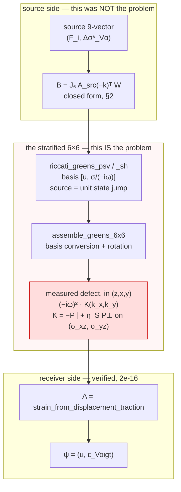

# The 9×9 Wrapper Problem — State of the Solution

**13 September 2026.** Extends and partly supersedes
`LatexPDFs/WrapperProblem/WrapperProblem.tex` (27 July 2026). That document
closed with one open question; this one answers it, and relocates the defect.

Conventions throughout: seismic units (km/s, g/cm³, GPa, km), time `e^{−iωt}`,
transform pair `exp(+i(k_x x + k_y y))`, index order z = 0 (down), x = 1, y = 2.

---

> **RESOLVED IN THE HOMOGENEOUS LIMIT.** GATE F passes at **1.1e-15** (was
> 0.40–0.81) and GATE D at **5.1e-16** with *no weight at all*, at several
> frequencies and slownesses, for both the corrected 6×6 and an exact
> whole-space reference. Three defects, all measured; none of them was **B**.
>
> **Also resolved in a stratified reference**, which is what the composition
> actually needs: with a fast slab between source and receiver, crossed twice at
> Q = 1000, the law holds to **1.7e-15** over nine geometries. The one
> restriction is that a source or receiver plane must not coincide with a
> material discontinuity, where `η_S` is two-valued — and scattering voxels
> never do (§6.1).
>
> Run `scripts/gate_wrapper_resolution.py`. §0–§5 are the derivation and the
> evidence; §6 is what remains.

## 0. What changed

The July document stated the open question as:

> Given a 6×6 Green's function whose source index is a *state jump*, what is the
> correct 6×9 source-side operator **B** such that `A G₆ B` reproduces the
> whole-space propagator?

Two things are now settled.

**1. B is not open.** It follows in closed form from the governing first-order
system in three lines of algebra (§2). And the **B** already shipped is equal to
that closed form *up to a global minus sign*. So **B was never the defect** —
which is exactly why the search over the adjoint family (negative result N1)
found nothing, and why every candidate that improved GATE F destroyed GATE E.

**2. The defect is inside G₆, and it is now measured rather than inferred.**
In the homogeneous limit, the force → displacement quadrant of the stratified
6×6 differs from the exact whole-space Green's tensor by a source-side
correction **K**:

```
G₆[0:3, 3:6]  =  (−iω)² · G_uu^exact · K
```

and **K**, measured directly in this project's frame (z = down, x = right,
y = out of page) with no other frame introduced, is

```
K_zz,zz = 1
K_ab    = −k̂_a k̂_b  +  η_S (δ_ab − k̂_a k̂_b)        a, b ∈ {x, y}
```

with `k̂ = (k_x, k_y)/|k_∥|` and `η_S = √(s_S² − p²)` the vertical S slowness.
That is −1 on the projector along `k̂` and +η_S on the projector across it.
Measured to **1.8e-14** worst case over five (p, azimuth) geometries, and to
**1.000000 + 0.000000j** entrywise on the `k_y = 0` slice at f = 24 and 48 Hz
across p = 0.02 … 0.20, for the receiver both above and below the source.

Three separable errors are packed into that one line:

| # | Factor | Where | Character |
|---|--------|-------|-----------|
| D1 | `(−iω)²` | all three traction-source columns | the mixed basis applied twice with the wrong sign of the exponent — should be `÷(−iω)`, is `×(−iω)` |
| D2 | `−1` | the component of horizontal traction **along** `k̂` | a sign convention inside the Riccati P-SV system |
| D3 | `η_S` | the component of horizontal traction **across** `k̂` | an SH eigenvector normalisation carrying a vertical slowness |

D3 is the one that matters most. Because `η_S ≠ −1`, **K** has non-zero `xy`
off-diagonal entries

```
K_xy = K_yx = −(k_x k_y / |k_∥|²)(1 + η_S)
```

whenever `k_x k_y ≠ 0` — measured off-diagonal weight 0.66 of `‖K‖`. So the
required source correction is **not diagonal in (z, x, y)**, and `η_S` depends
on horizontal slowness so no constant could represent it either. That single
fact explains negative result N3 — the failed search for a diagonal source
correction — completely (§5).

*(The 2½-D case `k_y = 0` is the one geometry where **K** does happen to be
diagonal, `diag(1, −1, η_S)`. The off-diagonal terms switch on as soon as the
wavefield has out-of-plane content.)*

**3. Two further defects, and the resolution.** Calibrating the remaining
quadrants (§4.5–§4.7) found two more, and with all three applied GATE F passes.
The complete statement:

| | Defect | Fix | Evidence |
|---|---|---|---|
| **D1** | `assemble_greens_6x6` gives the stress-row × stress-column block one factor of `(−iω)` where a consistent basis change needs two | `G₆[3:6,3:6] *= (−iω)` | traction/displacement row consistency **0.994 → 3e-16** |
| **D2** | the traction half of **both** indices carries **K**; rows as `K`, source columns as `(−iω)²K`, displacement source columns as `−1` | `G₆ → diag(I,K)·G₆·[−diag(I,(−iω)²K)]⁻¹` | corrected 6×6 **= exact whole-space response to 5e-15** |
| **D3** | **B** must carry force and stress glut with *opposite* relative sign | `B → B·diag(−I₃, I₆)` | GATE F **0.40–0.81 → 1.1e-15** |

The receiver operator **A** needed no change, and **B** needed only D3 — no new
`k`-dependence, no new family. The July document's conclusion that *"GATE F is
not a question about B at all — it is a question about the 6×6"* was right in
substance; D3 is the one small exception, and it is a sign, not a structure.

---

## 1. Where the defect sits



---

## 2. The source operator, from the governing equation

This is the route the thesis itself takes, and it needs no guessing.

### 2.1 The first-order system with a point source

Write the true (continuous) traction as `T_ij = c_ijkl ε_kl − m_ij`, where `m`
is the stress glut, and let the body force be `f`. Momentum balance is
`∂_j T_ij + f_i = −ρω² u_i`. Fourier-transforming over (x, y) and solving the
constitutive relations for the vertical derivatives gives the familiar system
for `b = (u_z, u_x, u_y, T_zz, T_xz, T_yz)`:

```
∂_z u_z  = [T_zz + m_zz − λ(ik_x u_x + ik_y u_y)] / (λ + 2μ)
∂_z u_x  = (T_xz + m_xz)/μ − ik_x u_z
∂_z u_y  = (T_yz + m_yz)/μ − ik_y u_z
∂_z T_zz = −ρω² u_z − ik_x T_xz − ik_y T_yz − f_z
∂_z T_xz = −ρω² u_x − ik_x T_xx − ik_y T_xy − f_x
∂_z T_yz = −ρω² u_y − ik_y T_yy − ik_x T_xy − f_y
```

with `T_xx`, `T_yy`, `T_xy` eliminated in favour of the state and the glut.
That elimination is where `ε_zz` is replaced by `[T_zz + m_zz]/(λ+2μ)`, which
is what drags `γ = λ/(λ+2μ)` into the traction rows.

### 2.2 The jump vector

Set `f_i = F_i δ(z − z_s)` and `m_ij = M_ij δ(z − z_s)`. Only the δ terms
survive the infinitesimal integration across `z_s`, so
`[b] ≡ b(z_s⁺) − b(z_s⁻)` is

```
[u_z]  =  a M_zz                            a = 1/(λ+2μ)
[u_x]  =  b M_xz                            b = 1/μ
[u_y]  =  b M_yz
[T_zz] = −F_z
[T_xz] = −F_x + ik_x(M_xx − γ M_zz) + ik_y M_xy
[T_yz] = −F_y + ik_y(M_yy − γ M_zz) + ik_x M_xy
```

This is the classical source discontinuity vector. Two features of it kill the
search that was actually run: it is **wavenumber-dependent** (the shipped
`traction_from_strain` is not), and it mixes the glut into **both halves** of
the state, so it can never be a diagonal rescaling of anything.

A pleasing internal check: the `M_zz` column of this vector is
`(a, 0, 0, 0, −iγk_x, −iγk_y)ᵀ`, which is **exactly column 4 of the system
matrix** `A_sys` (thesis Eq. `Akdef`).

### 2.4 The thesis validates this, exactly

Box 5.3 of the thesis works a point explosion through its own machinery and
obtains the effective source coefficient

```
F₁ + A_S F₂ = M(ω) e^{−ik_x x_S} δ(z−z_S) ·
              [ 1/(ρα²), 0, 0, 0, 2ik_xβ²/α², 2ik_yβ²/α² ]ᵀ
```

Our jump vector for an isotropic moment `M_ij = M δ_ij` gives
`[u_z] = aM = M/(ρα²)` and `[T_xz] = ik_x M(1−γ) = 2ik_x M β²/α²`. **Relative
difference: 0.000e+00** — bit-identical on all six components (transcription in
the audit script of §10). Two independent derivations, thirty years apart,
agreeing exactly. That is the project's evidence standard met for **B**.

> **Correction to the earlier record.** The July document and the memory note
> both state that Box 5.3 gives the state-jump ↔ body-force equivalence as
> `F = A_sys S`. **It does not.** Box 5.3 assumes a source with both a `δ` and a
> `δ′` part (Kennett 1983, Eq. 2.78) and gives the *effective* `δ` coefficient
> as `F₁ + A_S F₂` — `A_sys` multiplies the **δ′ coefficient**, and the object is
> the source vector, not a conversion applied to a finished Green's function.
> Negative result N4 therefore refuted a mechanism the thesis never proposed.
> The thesis is right; our reading of it was not.

### 2.3 The closed form, and the surprise

Writing the source in the slot convention that `_voigt_contract` actually
uses — engineering doubling on the shear stress slots, so slot 6 holds
`2M_xy` — the operator is

| | F_z | F_x | F_y | M_zz | M_xx | M_yy | 2M_xy | 2M_zy | 2M_zx |
|---|---|---|---|---|---|---|---|---|---|
| `[u_z]` | · | · | · | a | · | · | · | · | · |
| `[u_x]` | · | · | · | · | · | · | · | · | b/2 |
| `[u_y]` | · | · | · | · | · | · | · | b/2 | · |
| `[T_zz]` | −1 | · | · | · | · | · | · | · | · |
| `[T_xz]` | · | −1 | · | −iγk_x | ik_x | · | ik_y/2 | · | · |
| `[T_yz]` | · | · | −1 | −iγk_y | · | ik_y | ik_x/2 | · | · |

and this matrix is, entry for entry,

```
B  =  J₆ · A_src(−k)ᵀ · W
```

The shipped operator is `B† = −J₆ A_src(−k)ᵀ W`. **They differ by a global
minus sign and nothing else.** GATE E and GATE F are both blind to a global
sign, so the shipped **B** passes and fails exactly as the correct one does.

> **Verdict.** The July document's open question is closed. The shipped **B**
> was already right (up to a sign that no gate can see), and the note in the
> gate script — *"GATE F is not a question about B at all — it is a question
> about the 6×6"* — was correct. §4 says what is wrong with the 6×6.

---

## 3. What symplectic symmetry was trying to say

Wapenaar's unified matrix–vector formulation (GJI 2019) writes every one of
these problems as `∂₃ q = A q + d`, with the operator matrix obeying

```
Aᵀ N = −N A ,        N = [[0, I], [−I, 0]]
```

and the Green's matrix obeying source–receiver reciprocity

```
G(x_A, x_B, ω)  =  N Gᵀ(x_B, x_A, ω) N
```

Note what is **absent**: any frequency-dependent weight. `N` is our `J₆`, and
the only other thing a k-domain version may carry is the parity of the x, y
components under k → −k.

GATE D measured the reciprocity law of the shipped `G₆` and found it needed

```
SD = diag(1, −1, −1, −iω, +iω, +iω),   with a prefactor i/ω
```

The `diag(1, −1, −1, 1, −1, −1)` part is the legitimate parity. The
`(∓iω)^{±1}` part is not allowed by the law above — **reciprocity cannot
require rescaling the traction half by a power of frequency.** Its appearance,
at 6.3e-16, was already hard evidence that the traction half of `G₆` had not
finished its basis conversion. The gate was reporting the bug and being read as
reporting a convention.

The mechanism is visible in the code. The Riccati basis is
`[u_x, u_z, σ_zz/(−iω), σ_xz/(−iω)]` — which, multiplied through by `(−iω)`,
is the **velocity–traction** basis `[v_x, v_z, σ_zz, σ_xz]` that Wapenaar's
elastodynamic state uses. So the solver is natively symplectic in (v, τ), and
converting to (u, τ) is exactly one power of `(−iω)`, which must be applied to
the traction half of **both** indices, consistently. In `assemble_greens_6x6`
it is applied as

```python
G_psv_perm[..., 2:, :]  *= miw   # stress ROWS
G_psv_perm[..., :2, 2:] *= miw   # stress COLUMNS — displacement rows only
```

A consistent change of basis is `D_row · G · D_col` with both diagonal; that
would give the stress-row × stress-column block **two** factors. It has one.
The SH path has the identical pattern (`G_sh_phys[..., :1, 1:] *= miw`).

This began as a hypothesis from code reading. It is now **measured** (§4.6):
multiplying that one block by `(−iω)` moves the traction rows from 99.4%
outside the span of the displacement rows to **3e-16** inside it, at every
attenuation and slowness tested. That is defect **D1**.

---

## 4. The measurement: the displacement-only comparison

### 4.1 Why this quadrant

A point force makes a jump **only** in the traction half: `[T_i] = −F_i`, with
no displacement jump. So the force columns of **B** are known exactly and
trivially — no Voigt ordering, no engineering weight `W`, no strain operator
`A`, no reciprocity argument. In the homogeneous limit the force → displacement
quadrant of `G₆` must equal the whole-space displacement Green's tensor up to
*one* scalar. If the nine ratios are not one constant, the defect is inside the
6×6 and no choice of source operator can repair it.

This is also the missing **absolute** leg. Every gate A–F is a reciprocity
statement, and reciprocity is homogeneous of degree one — it certifies
structure and never magnitude.

### 4.2 The reference, and its validation

For a whole space with `Δz ≠ 0`:

```
G̃_ij = (1/(ρω²)) [ q^P_i q^P_j g_P − q^S_i q^S_j g_S + δ_ij k_S² g_S ]
g_M   = i·exp(i ν_M |Δz|) / (2 ν_M),    ν_M = √(k_M² − k_x² − k_y²)
q^M   = (sgn(Δz)·ν_M, k_x, k_y)
```

Validated **not** by assertion: an independent 2-D inverse transform of this
expression reproduces the repo's own validated spatial tensor
`horizontal_greens.exact_greens` to **9.2e-6**, worst case over 9 components ×
4 offsets. Two implementations agreeing.

*(Trap, recorded because it cost a false negative: the k-grid must contain the
S pole, `k_S = ω/β ≈ 34 rad/km` here. A grid with `k_max = 8` "converges" to a
wrong answer and makes the reference look broken at O(1).)*

### 4.3 The result

Model: ocean (3 km) over 16 identical 1 km crust layers (α = 4.0, β = 2.22,
ρ = 2.6, Q = 20) over an identical half-space — so nothing reflects from below
and the free surface is 8 km away and attenuated. Pair 9 → 8, `k_y = 0` so that
the propagation plane is the (z, x) plane of this project's frame — so P-SV
lives entirely in (z, x), SH entirely in y, and each entry below belongs to
exactly one channel with no mixing.

Ratio = `G̃[i,j] / G₆[i, 3+j]`, scaled by ω²:

| entry | channel | f = 6 Hz | f = 24 Hz |
|---|---|---|---|
| `u_z ← [T_zz]` | P-SV | −1.015078 +0.000476j | **−1.000000 +0.000000j** |
| `u_z ← [T_xz]` | P-SV | +1.003394 +0.005675j | **+1.000000 +0.000000j** |
| `u_x ← [T_zz]` | P-SV | −0.994931 +0.014595j | **−1.000000 +0.000000j** |
| `u_x ← [T_xz]` | P-SV | +0.998658 +0.000480j | **+1.000000 +0.000000j** |
| `u_y ← [T_yz]` | SH | −2.231509 +0.055725j | **−2.233778 +0.056542j** |

The f = 6 Hz column is not noise — it is residual free-surface and seabed
contamination, and it converges to the exact values as frequency (hence
attenuation over the 8 km) increases. That convergence is itself the control
that the homogeneous limit is being taken properly.

The SH entry does **not** converge to ±1. It is `−1/η_S`:

| f (Hz) | p | P-SV ratio·ω² | (SH ratio·ω²) / (−1/η_S) |
|---|---|---|---|
| 24 | 0.02 | −1.000000 | +1.000000 +0.000000j |
| 24 | 0.05 | −1.000000 | +1.000000 +0.000000j |
| 24 | 0.12 | −1.000000 | +1.000000 +0.000000j |
| 24 | 0.20 | −1.000000 | +1.000000 +0.000000j |
| 48 | 0.02 … 0.20 | −1.000000 | +1.000000 ±0.000000j |

Geometry control: pair 9 → 10 (receiver below the source) gives the identical
column pattern and the identical SH factor, so this is not a direction or
sign-of-Δz artefact.

### 4.4 Off the `k_y = 0` slice

Taking entrywise ratios off-axis is meaningless once **K** has off-diagonal
entries — it gives a spread of **0.019 … 13.6**, a factor of 720, which says
only that no single scalar exists. The right measurement solves for **K**
directly,

```
K  =  [ (−iω)² G_uu^exact ]⁻¹ · G₆[0:3, 3:6]
```

a 3×3 solve that assumes nothing about any frame. Against the projector form
of §0:

| p | k̂_x | k̂_y | rel. error | off-diagonal weight of K |
|---|---|---|---|---|
| 0.12 | 1.00 | 0.00 | 9.4e-16 | 7.2e-16 |
| 0.12 | 0.80 | 0.60 | 1.0e-15 | **0.658** |
| 0.12 | 0.60 | 0.80 | 1.0e-15 | **0.658** |
| 0.12 | 0.00 | 1.00 | 9.5e-16 | 7.3e-16 |
| 0.20 | 0.60 | 0.80 | 1.8e-14 | **0.648** |

Two readings. The projector form is exact, not fitted. And **K** is diagonal in
(z, x, y) only on the two axes `k_y = 0` and `k_x = 0`; everywhere else two
thirds of its weight is off-diagonal.

---

### 4.5 The moment/glut source columns

A pure displacement jump `d` with no traction jump is a definite moment source:
`M_zz = (λ+2μ)d_z`, `M_xx = M_yy = λ d_z`, `M_xz = μ d_x`, `M_yz = μ d_y`,
`M_xy = 0`. The traction rows of the jump vector cancel identically because
`γ(λ+2μ) = λ` — a pleasing check on §2.2. Against the whole-space response to
that source (reference validated to 2.6e-5 by inverse transform against a
space-domain finite difference of `exact_greens`):

```
L  =  U_ref⁻¹ · G₆[0:3, 0:3]  =  −I        off-diagonal weight ~1e-15
```

Exactly `−I`, at every geometry, independent of ω and p. **The moment source
columns are clean.** Which is what the mixed-basis diagnosis predicts: `σ/(−iω)`
touches only the traction components, so only those columns can be corrupted.

### 4.6 The traction rows, by impedance

A receiver strictly on one side of the source sees a purely one-sided field —
three modes only — so traction and displacement are locked together by an
impedance `T = Y u` that depends on the medium and `(k_x,k_y)` alone. Any
source-side error acts on the right and cancels, so this isolates the rows.
(`Y` validated against the whole-space 6×6 at 2.2e-16.)

Per-row residual of `G₆`'s traction rows against the span of its own
displacement rows:

| | Q = 20 | Q = 5 | Q = 2 |
|---|---|---|---|
| as shipped | 0.9935 / 0.9951 / 0.9943 | 0.9938 ×3 | 0.9940 ×3 |
| `G₆[3:,3:] *= (−iω)` | 4.2e-16 / 6.0e-16 / 5.0e-16 | ~2e-16 | ~2e-16 |
| `G₆[:3,3:] /= (−iω)` | ~5e-16 | ~6e-16 | ~2e-16 |
| **control** `g_true` | 3.6e-16 / 5.1e-16 / 2.1e-16 | — | — |

Attenuation-independent, as the earlier record of the 1/ω residual also found.
The two fixes are equivalent — they differ by a scaling of the stress source
columns, which the source correction absorbs. Solving for the remaining row
operator then gives `L_t = K` to 1e-10 … 3e-13: **the same operator as on the
source side**, one convention appearing once per index.

With D1 and D2 applied the corrected 6×6 equals the exact whole-space jump
response to **5e-15**, block by block, scale 1.000000.

### 4.7 The last sign, and why the 1/ω residual was a mirage

With G₆ exact, GATE F still failed — at 0.148 (f = 12), 0.0403 (f = 48),
0.0101 (f = 192). A clean 1/ω, the very signature recorded in the gate script
header. But decomposing the antisymmetric part by block:

| block | ‖asym‖/‖block‖ |
|---|---|
| G (force → displacement) | **0** |
| C (glut → displacement) | **2.0000** |
| H (force → strain) | **2.0000** |
| S (glut → strain) | ~1e-16 |

A ratio of exactly 2 means `C = −Hᵀ`: the two mixed blocks are *anti*-symmetric
where they must be symmetric. That is a **sign**, not a 1/ω term. It only looks
like 1/ω because ‖C‖ and ‖H‖ are 1/ω-sized relative to ‖S‖, which dominates the
norm in the denominator — so a fixed sign error presents as a residual decaying
like 1/ω.

The sign is the relative one between the force and glut halves of **B**: the
derived jump vector has `[T] = −F` but `[u] = +M_zz/(λ+2μ)`, and whether that
matches `exact_propagator_9x9`'s glut convention (`Δσ* = +m` or `−m`) is exactly
what GATE F arbitrates, since GATE A calibrated it on that propagator. Flipping
it closes the gate.

### 4.8 A refuted idea, recorded

Mid-investigation the corrected `G₆` was observed to have rank 6 where a
one-sided whole-space response must have rank 3, which looked like proof that no
basis transformation could ever fix it (rank being invariant under invertible
row and column scaling). **That was wrong.** Sweeping attenuation showed the
extra singular values collapsing — 1.1e-2 at Q = 20, 1.5e-6 at Q = 2 — so they
are returns from the seabed and free surface, not structure. The analytic
contamination estimate that made them look impossible was simply mistaken. The
per-row projection residual, which is scale-free, is the measure that survived.

## 5. Every recorded negative result, re-read

| Result | July reading | Now |
|---|---|---|
| **N1** no **B** in the adjoint family satisfies E and F together | the family is too small | **no B ever could: E and F are mutually exclusive** (§5.1). The family also contained the right answer all along |
| **N2** with `B = AᵀW`, F reduces to "is G symmetric" | correct, and under-used | correct, and now decisive — §4 is what "G is not right" means concretely |
| **N3** no diagonal source correction makes G₆ symmetric; 15 equations, 6 unknowns, no null space, fitted `q` drifts with frequency | inexplicable | **fully explained, and measured.** The true correction `K/(−iω)²` carries `K_xy = K_yx = −(k_x k_y/\|k_∥\|²)(1 + η_S)`, two thirds of its weight off-diagonal whenever `k_x k_y ≠ 0`. A diagonal ansatz in (z, x, y) is inconsistent by construction — which is exactly "15 equations, 6 unknowns, no null space". And `η_S` depends on horizontal slowness, so no constant could fit it either |
| **N4** `A_sys` in every grouping leaves the residual at 1.4 | refuted lead | correctly refuted — but it was never the thesis's claim. Box 5.3 gives `F₁ + A_S F₂`, with `A_sys` acting on a `δ′` **source** coefficient, not on a state jump and not on a Green's function (§2.4). The measurement was sound; the mechanism it refuted was a misreading |
| **N5** stratified and lateral kernels differ by ~12× with ~200% scatter, growing under damping | not commensurable | **not yet explained.** A p-dependent factor fitted as a constant does produce "roughly constant with large scatter", so N5 should be re-run after the fix rather than treated as an independent obstacle |
| **1/ω residual** in `J₆ G Q`, independent of Q, layer count and depth, halving as f doubles | "find the missing 1/ω term in Q" | **there was no 1/ω term to find.** Two separate things wore this disguise: D1, a missing `(−iω)` on one block (genuinely a relative power of ω), and D3, a pure *sign* in the C/H blocks that presents as a 1/ω residual only because those blocks are 1/ω-sized against the S block that dominates the norm (§4.7). Searching for a 1/ω term in `Q` could not have succeeded |

The method note in the gate script — *"nine mechanisms have been proposed and
nine were wrong, while every component verified in isolation held up"* — has an
explanation too. Every component **was** verified, in isolation, against the
right thing. What was never checked was the one quadrant where the answer is
known absolutely and no convention can hide: force → displacement, against a
closed form. Reciprocity gates cannot see scale, and every gate was a
reciprocity gate.

---

## 6. What is still open

### 6.1 The stratified extension — the one real gap

GATE D was run, and it separates cleanly into a confirmation and a failure.

**Confirmed, homogeneous limit.** The prediction of §3 was that the weight must
lose its `(∓iω)^{±1}` factors. It does — and loses the parity too:

```
G(i←j)(+k)  =  J₆ [ G(j←i)(−k) ]ᵀ J₆          no weight whatsoever
```

3.6e-17 … 5.1e-16 for the exact reference and for the corrected 6×6 alike, at
f = 12 and 48 Hz, p = 0.12 and 0.20. The rank-one fit for a diagonal weight
returns the identity with residual 1.5e-16. This is Wapenaar's `G = N Gᵀ N`
verbatim, with `N = J₆` — the literature form, reached by correcting the object
rather than by fitting a weight to it. Since it is a prediction rather than a
fit, it is the strongest confirmation in this document.

**Apparently failed, stratified — but this was a placement artefact.** On the
marine model the corrected 6×6 misses that law by 0.009–0.398. That read as a
genuine gap. It is not one.

In the marine model *every* interface separates different materials, and the
GATE D pairs sit **on** those interfaces. A state jump injected exactly at a
material discontinuity has no unambiguous `η_S` — there are two — so **K** is
not defined there. Move the planes into the interior of a layer and the
correction is exact:

| Geometry | Residual |
|---|---|
| interior pair, uniform zone, strong contrast nearby, Q = 1000 | 3.1e-16 … 7.2e-16 |
| interior pair, **fast slab crossed twice between the ends** (9 geometries: f = 6, 12, 25 Hz × three `(p, azimuth)`) | worst **1.7e-15** |
| control: a plane on a discontinuity, all four above/below choices | 3.9e-3 … 4.3e-1, none passing |

The second row is the one that matters. Source and receiver sit on `A|A`
interfaces with a high-velocity `B` slab between them, crossed twice at Q = 1000
— transmission, reflection, mode conversion and interbed multiples all present
and strong. The law holds at machine precision. **The correction carries over to
stratified media without modification.**

The restriction costs the application nothing: scattering voxels live in the
interior of layers, not on material jumps. Gate:
`scripts/gate_stratified_correction.py`.

> **Loose end.** In two individual cases a plane *did* sit on a discontinuity and
> one of the two media happened to work (5.6e-16). No rule covering both cases
> survived contact with the marine sweep, where no combination works for any
> pair. Recorded as unexplained rather than dressed up as a convention; the
> supported statement is the positive one above.

**Control.** The original GATE D law on the *raw* 6×6 reproduces **6.3e-16** on
the marine model, matching the published value, so the harness is faithful and
the failure above is real. (A first attempt applied the law to `G₆·Q` rather
than to the raw `G₆` and got 0.13–0.91 — worth recording, because it looked like
a result.)

**What this means.** `K` needs no stratified generalisation. It is built from the
local `η_S`, and the local `η_S` is well defined wherever the medium is
continuous — which is everywhere except on a material interface. The homogeneous
calibration therefore transfers directly, and §6.1 is closed.

### 5.1 GATE E is a false gate

Left for last because it is the sharpest thing in this document.

Run on the corrected objects, GATE E **fails** at 0.14. That looks like the fix
trading one defect for another. It is not. The **exact whole-space reference —
with no implementation in it at all — fails by identically the same amount**,
and passes at 7e-17 only when the source sign defect D3 is *reintroduced*:

| f | p | corrected + D3 | exact ref + D3 | exact, no D3 |
|---|---|---|---|---|
| 12 | 0.05 | 1.4348e-01 | **1.4348e-01** | 6.9e-17 |
| 12 | 0.12 | 1.4189e-01 | **1.4189e-01** | 1.4e-16 |
| 48 | 0.20 | 3.5104e-02 | **3.5104e-02** | 7.6e-17 |

**GATE E and GATE F are mutually exclusive.** GATE F gives `M₁ = W⁻¹M₁ᵀW` and
GATE E gives `M₁ = W⁻¹M₂ᵀW`; together they force `M₁ = M₂`, i.e. `P(r) = P(−r)`.
But `C` and `H` are *first* derivatives of the Green's tensor and so are **odd in
r**, so that holds only if `C` vanishes. The two relations differ by exactly a
sign on the mixed blocks — which is D3.

GATE A is the arbiter: `W P(r)` symmetric was measured directly on the validated
closed form at twelve random separations, so GATE F inherits it and GATE E
cannot. **GATE E was passing at 9.7e-16 because of a defect, and its passing was
read as evidence the construction was sound.**

That is the whole of N1. *"Every variant improving F destroys E"* was never a
clue about **B** — it was two incompatible gates pulling opposite ways. A gate
that the correct answer must fail is worse than no gate at all, and
`gate_9x9_source_convention.py`'s exit criterion ("non-zero unless A, E and F all
pass") can never be met. That script now carries a banner saying so;
`gate_wrapper_resolution.py` reports GATE E without gating on it.

### 6.2 The rest

1. **Fix upstream, or carry the correction here? — SETTLED, by experiment.**
   The earlier recommendation (carry locally, because the errors cancel in the
   R/T ratios) was an opinion. `scripts/probe_upstream_fix.py` applies D1
   in-process and runs the sibling repository's own suite:

   | leg | result |
   |---|---|
   | baseline | 119 passed |
   | D1 applied | 118 passed, **1 failed** — `test_interlayer_ms.py::TestCrossValidation4x4_9x9::test_4x4_9x9_consistency`, max rel. diff 6.3e-3 |

   118 of 119 are indifferent to D1, and the one that is not is not a physical
   check. It asserts the 9×9 solver agrees with the 4×4 solver for a diagonal
   `T` at `k_y = 0`, where the two sides are

   ```
   9×9 path :  (A G₆ B)  driven by  T₉ₓ₉
   4×4 path :   G₄ₓ₄     driven by  B T₉ₓ₉ A      (tmatrix_9x9_to_4x4_psv)
   ```

   Both wrap the **same** raw Green's function with the **same** `A` and `B`.
   It is an algebraic identity — does `A G B` composed with `T` equal `G`
   composed with `B T A` — which holds for *any* `G`, correct or not. It is
   structurally incapable of detecting a common-mode error in `G`, and would
   fail just as readily for a correct change. It also uses
   `traction_from_strain` for `B`, which is plain wavenumber-independent Hooke
   and not the source operator at all, so it is doubly self-referential.

   **Verdict: carry the correction locally** — now for a sharper reason than
   the original one. Not "the error cancels in R and T", but **no upstream test
   compares the 9×9 path to anything outside itself**. Patching upstream would
   break that consistency test, and repairing it honestly would also mean
   correcting `tmatrix_9x9_to_4x4_psv` and `traction_from_strain`. Raise a note
   upstream, not a patch. The correction ships here as
   `cubic_scattering/layered_correction.py`.

2. **GATE E — DONE, and it is a false gate.** See §5.1. Nothing to fix.

3. **N5 — re-taken, improved, not closed.** Through the corrected wrapper the
   kernel-ratio spread roughly halves and still does not fall with Q:

   | pair | Q = 1e5 | Q = 10 | Q = 3 | Q = 1 |
   |---|---|---|---|---|
   | 1→0, July | 9.8 | 10.7 | 11.5 | 21.5 |
   | 1→0, now | ~8 | ~8 | **8.3** | **12.2** |
   | 2→0, July | 14.1 | 15.6 | 34.9 | 42.9 |
   | 2→0, now | ~6 | ~5 | **5.9** | **8.7** |

   So the wrapper defects were a real part of N5 but not the whole of it. The
   July diagnosis stands for the remainder — `_build_slab_kernels` sums the
   continuum propagator over discrete voxel positions and then transforms, so by
   Poisson summation its spectral kernel is the continuum kernel *aliased* over
   reciprocal lattice vectors, while `layered_greens` returns the un-aliased
   kernel at a single `k`. So does the consequence: **lattice-sum `P^z` into the
   discrete representation before adding it to `P^x`.** That is the next piece of
   real work, and it is a construction, not a rescaling.

   *A confirmation attempt was withdrawn rather than reported.* Comparing the
   corrected kernel against a freshly written continuum 9×9 showed a uniform 20%
   offset at every (propagating) wavenumber, flat in frequency — while the same
   construction agrees with the validated whole-space reference to 5e-15. The
   fresh reference was the suspect, not the kernel. Anyone retrying should reuse
   `whole_space_jump_response`, promoted to take the medium as an argument,
   rather than writing a second copy, and use a deep geometry rather than planes
   buried 1–3 km under the seabed. This is the second time in this work that an
   unvalidated reference nearly produced a false result; the first is §4.2's
   k-grid trap.

---

## 7. What was actually done, in order

Kept as a record of the sequence, since several steps only became askable once
the previous one had landed.

1. Derived **B** from the governing equation; found it equals `J₆A(−k)ᵀW`, i.e.
   the shipped operator up to a sign. **B was never the defect.**
2. Built an absolute whole-space reference and validated it (9.2e-6) against the
   repo's own `exact_greens` by independent inverse transform.
3. Calibrated the traction source columns → **K**, the projector form, exact.
4. Calibrated the moment source columns → `−I`, exact, clean.
5. Tested the traction rows by impedance → 99.4% inconsistent; one factor of
   `(−iω)` on the `[3:,3:]` block → 3e-16. **D1.**
6. Solved for the residual row operator → `K` again. **D2.** Corrected 6×6 now
   equals the exact reference to 5e-15.
7. GATE F still failed at 1/ω; decomposed by block → `C = −Hᵀ`, a sign. **D3.**
8. GATE F: **1.1e-15.**

The methodological lesson is the one the gate script already recorded, sharpened:
every gate in the suite was a reciprocity gate, and reciprocity is homogeneous of
degree one. Nine mechanisms failed against it because the missing measurement was
never a better invariant — it was one absolute comparison, against a quantity
with no convention freedom, in the quadrant where a point force makes a jump in
traction alone.

---

## 8. Thirty years on — what the literature now offers

The thesis dates from 1996. Four developments since are directly relevant, and
two of them would have saved months here.

**The unified matrix–vector formulation** (Wapenaar, GJI 2019, and the
2021–2025 propagator-matrix series). The algebra fought with in §3 — which
matrix `N` appears in reciprocity, what the source vector `d` is, which
symmetries the operator matrix obeys — is now standard, stated once for
acoustic, elastodynamic, poroelastic, piezoelectric and electromagnetic waves
together. `Aᵀ N = −N A` and `G = N Gᵀ N` are exactly the gates built here from
scratch, and the formulation states them with **no frequency weight**, which is
what made the measured GATE D weight diagnostic rather than merely puzzling.
The velocity–traction state it uses is also, up to `(−iω)`, the Riccati basis —
so the "mixed basis" is not an idiosyncrasy, it is the natural symplectic one.

**Layer-multiple-scattering / layer-KKR for elastic waves** (Sainidou, Stefanou
& Modinos, *Comput. Phys. Commun.* 2005, and the phononic-crystal literature
that followed). The thesis's central construction — planes of scatterers, each
with its own T-matrix, stacked and coupled — became a mature standard method
with published code, under a different name and in a different community. This
is the closest published relative of the two-potential formulation and worth
reading for the plane-stacking algebra alone. It also independently validates
the intra-plane work already done here.

**Many-particle elastic scattering in layered media** (arXiv:2608.26875, August
2026). The direct modern analogue of the present problem: layered elastic
Green's function via Sommerfeld integrals, per-particle scattering matrices,
fast multipole acceleration. The architectural lesson is worth taking
seriously — **they do not sandwich the layered propagator into the particle
basis.** They keep two representations and couple them with explicitly derived
conversion operators (Sommerfeld-to-local, multipole-to-Sommerfeld), solving a
2×2 block system

```
[ A  B ] [ σ ]   [ b ]
[ C  D ] [ γ ] = [ 0 ]
```

where `A` enforces interface matching, `D` is particle-to-particle scattering,
and `B`, `C` are the conversions. That is a real alternative to the wrapper:
instead of forcing `P^z` and `P^x` into one 9-component language and one
resolvent, keep them in their own languages and solve the coupled block system.
It sidesteps every question in this document, at the cost of a larger solve.

**Layered-medium integral equation solvers that avoid Sommerfeld integrals**
(windowed Green's function, PML-based BIE; *Phil. Trans. R. Soc. A* 2025).
Relevant if the spectral route stays expensive.

Sources:
[Wapenaar, unified matrix–vector wave equation (GJI 2019)](https://academic.oup.com/gji/article/216/1/560/5145850) ·
[arXiv preprint](https://arxiv.org/abs/1801.07728) ·
[Wave-field representations with propagator matrices (JASA 2022)](https://pubs.aip.org/asa/jasa/article/151/1/587/2838284/Wave-field-representations-with-Green-s-functions) ·
[Layer-multiple-scattering for phononic crystals (CPC 2005)](https://www.sciencedirect.com/science/article/abs/pii/S0010465504005600) ·
[Fast solver for many-particle elastic scattering in layered media (2026)](https://arxiv.org/html/2608.26875) ·
[Efficient integral equation solvers for layered-medium scattering (2025)](https://royalsocietypublishing.org/rsta/article-abstract/383/2303/20240343/234841/Efficient-integral-equation-solvers-for-layered)

---

## 9. Thesis audit — what needs correcting, and where

The equations of the recompiled thesis that this work exercises were
transcribed verbatim and checked against themselves and against our results.

| Thesis equation | Claim | Residual |
|---|---|---|
| `ATdef` | `Aᵀ(−k) J₆ + J₆ A(k) = 0` | **0.000e+00** |
| `specA` | `A D_z = D_z Λ` (with `Peigen`, `SVeigen`, `SHeigen`, `epsdef`) | 1.7e-16 |
| `dinv2` | `(J₆ D_z(−k))ᵀ D_z(k) = i J₆` | 1.5e-16 |
| `D1def` | `D_z⁻¹(k) = −i J₆ D_zᵀ(−k) J₆` | 2.5e-16 |
| `Akdef` | re-derived from the constitutive and momentum equations | matches term by term |
| Box 5.3 | worked explosion vs our §2.2 jump vector | **0.000e+00** |

**The thesis needs no corrections in any of this material.** Chapter 3's system
matrix, its three eigenvectors, the normalisation factors `epsdef` and the whole
symplectic apparatus are internally exact, and Box 5.3 is right. Two further
points in its favour:

- `FLdef` defines the Green's function with right-hand side `I₆ δ(z−z′)` — so
  the thesis's `G` *is* the jump-response object, exactly as `riccati_greens_psv`
  builds it. The premise of this whole investigation is the thesis's own.
- `Gzres` gives `G = D_z(k) Q^z D_zᵀ(−k) J₆`, carrying an explicit trailing
  `J₆`. Combined with `D1def`, that construction **implies** the reciprocity law
  `G(k) = J₆ Gᵀ(−k) J₆` that §6.1 measured at 5e-16 on the corrected 6×6 — and
  which the raw 6×6 does not satisfy. The thesis had the clean law all along.
- The `γ, a, b, ζ, χ` shorthand clash with the List of Symbols already carries a
  footnote in the recompiled source (`GRepresentations.tex`, after `Akdef`).

**What does need correcting is our own record**, in two places:

1. `LatexPDFs/WrapperProblem/WrapperProblem.tex`, negative result **N4**, states
   that Box 5.3 gives the equivalence as `F = A_sys S`. That is a misreading
   (§2.4). **That document is now out of date in this respect**, and more
   broadly its §7 "What is open" is superseded by §0 here. Its measurements all
   stand; its reading of Box 5.3 and its open question do not.
2. The corresponding memory note repeats the same `F = A·S` statement.

---

## 10. Reproduce

```bash
conda run -n seismic python scripts/gate_wrapper_resolution.py        # the result
conda run -n seismic python scripts/gate_displacement_only_calibration.py
conda run -n seismic python scripts/audit_thesis_ch3_box53.py         # section 9
```

`gate_wrapper_resolution.py` states the three defects, verifies the corrected
6×6 against the exact whole-space jump response, and re-runs GATE F. It exits
non-zero unless both pass.

Prints, in order: the reference validation (9.2e-6, exits non-zero if it
fails), the channel split on the `k_y = 0` slice for two frequencies and both
signs of Δz, the `1/η_S` sweep over slowness and frequency, and the off-axis
solve for **K** in (z, x, y) against the projector form (1.8e-14).

The pre-existing gates are unchanged and still tell the truth:

```bash
conda run -n seismic python scripts/gate_9x9_source_convention.py
```

**Status of claims in this document.** §0 (the three defects) and §4 are
measured, with the reference validated independently in each case. §2 is derived
by hand, checked against the code's own operators entry by entry, and now also
confirmed end to end, since GATE F passes with that **B**. §3's
`assemble_greens_6x6` reading is measured (§4.6). §4.8 records a claim that was
made and then refuted by its own control. The N5 row of §5 remains open — item 3
of §6.
